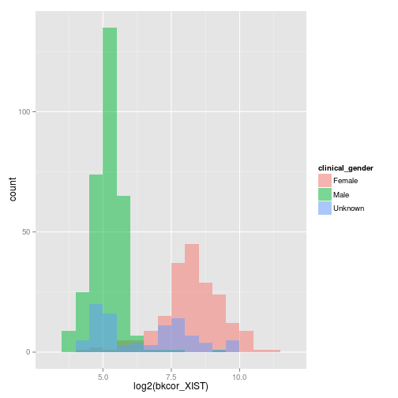
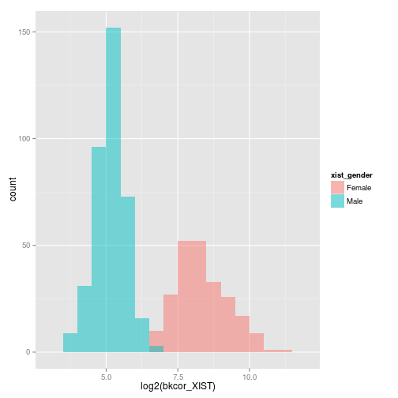
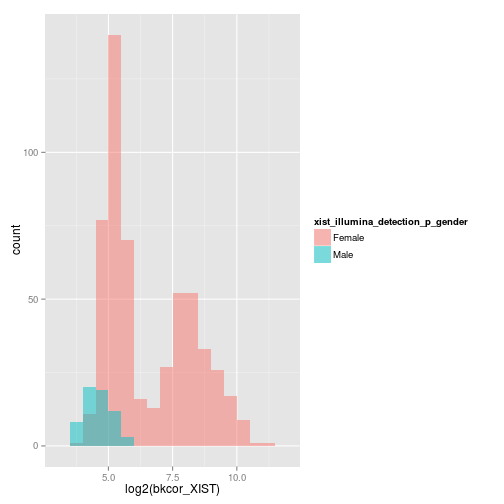
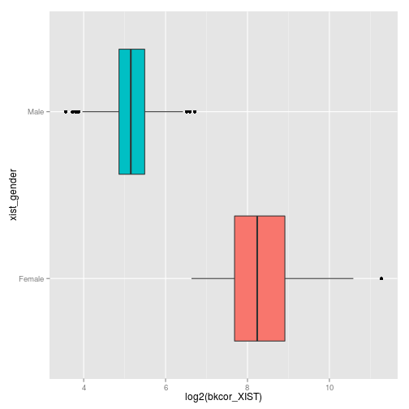
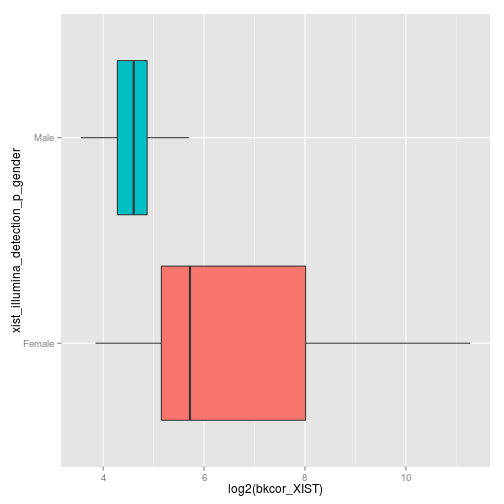

Microarry pre-processing for Illumina BeadArray data
=====================================================

## Project Directory and Files

```r

# Data Directory
"/media/D/expression/GAP_Expression"

# Data Files Exported from GenomeStudio
control_probe_profile_Final_Report.txt
Group_Probe_Profile_Final_Report.txt
probe_annotation_Final_Report.txt
sample_table_Final_Report.txt

# Input for lumiR
Sample_and_Control_Probe_Profile_FinalReport.txt

# User Provided Data Files Use NA to record missing values in batch_info.txt
# Use Unknown to record missing values in pheno_info.txt
pheno_info.txt  # REQUIRED COLUMNS (MATCH FORMAT SHOWN HERE ie SEX not Sex or Gender etc!):- 'Sample.ID','SEX','GROUPS','TISSUE','PHENOTYPE','Study_ID'
batch_info.txt  # REQUIRED COLUMNS:- 'Sample.ID','RIN','RNA_YIELD' and any other related batch info eg dates or processing. 
```


****

# Begin R
Start R and call the following


```r
rm(list = ls())
options(stringsAsFactors = FALSE)
```


## setwd
This is the full path to the directory where all the raw genomestudio output is stored


```r
setwd("/media/D/sjnewhouse/GENE_EXPRESSION")
```


## load libs

```r
# Load libraries
library(lumi)
```

```
## Loading required package: Biobase
## Loading required package: BiocGenerics
## Loading required package: parallel
## 
## Attaching package: 'BiocGenerics'
## 
## The following objects are masked from 'package:parallel':
## 
##     clusterApply, clusterApplyLB, clusterCall, clusterEvalQ,
##     clusterExport, clusterMap, parApply, parCapply, parLapply,
##     parLapplyLB, parRapply, parSapply, parSapplyLB
## 
## The following object is masked from 'package:stats':
## 
##     xtabs
## 
## The following objects are masked from 'package:base':
## 
##     anyDuplicated, append, as.data.frame, as.vector, cbind,
##     colnames, duplicated, eval, evalq, Filter, Find, get,
##     intersect, is.unsorted, lapply, Map, mapply, match, mget,
##     order, paste, pmax, pmax.int, pmin, pmin.int, Position, rank,
##     rbind, Reduce, rep.int, rownames, sapply, setdiff, sort,
##     table, tapply, union, unique, unlist
## 
## Welcome to Bioconductor
## 
##     Vignettes contain introductory material; view with
##     'browseVignettes()'. To cite Bioconductor, see
##     'citation("Biobase")', and for packages 'citation("pkgname")'.
```

```
## Warning: replacing previous import by 'graphics::image' when loading
## 'methylumi'
```

```
## KernSmooth 2.23 loaded
## Copyright M. P. Wand 1997-2009
```

```
## Warning: replacing previous import by 'nleqslv::nleqslv' when loading
## 'lumi'
```

```r
library(annotate)
```

```
## Loading required package: AnnotationDbi
```

```r
library(lumiHumanAll.db)
```

```
## Loading required package: org.Hs.eg.db
## Loading required package: DBI
## 
## 
## lumiHumanAll.db is using or is likely to need access to special
##   nuID identifiers.  Users can learn about these identifiers from
##   vignette documentation provided with the lumi package.
```

```r
library(affy)
```

```
## 
## Attaching package: 'affy'
## 
## The following objects are masked from 'package:lumi':
## 
##     MAplot, plotDensity
```

```r
library(cluster)
library(impute)
library(WGCNA)
```

```
## Loading required package: dynamicTreeCut
## Loading required package: flashClust
## 
## Attaching package: 'flashClust'
## 
## The following object is masked from 'package:stats':
## 
##     hclust
## 
## Loading required package: Hmisc
## Loading required package: grid
## Loading required package: lattice
## Loading required package: survival
## Loading required package: splines
## Loading required package: Formula
## Hmisc library by Frank E Harrell Jr
## 
## Type library(help='Hmisc'), ?Overview, or ?Hmisc.Overview')
## to see overall documentation.
## 
## 
## Attaching package: 'Hmisc'
## 
## The following object is masked from 'package:survival':
## 
##     untangle.specials
## 
## The following object is masked from 'package:AnnotationDbi':
## 
##     contents
## 
## The following object is masked from 'package:lumi':
## 
##     combine
## 
## The following objects are masked from 'package:Biobase':
## 
##     combine, contents
## 
## The following object is masked from 'package:BiocGenerics':
## 
##     combine
## 
## The following objects are masked from 'package:base':
## 
##     format.pval, round.POSIXt, trunc.POSIXt, units
```

```
## ==========================================================================
## *
## *  Package WGCNA 1.34 loaded.
## *
## *    Important note: It appears that your system supports multi-threading,
## *    but it is not enabled within WGCNA in R. 
## *    To allow multi-threading within WGCNA with all available cores, use 
## *
## *          allowWGCNAThreads()
## *
## *    within R. Use disableWGCNAThreads() to disable threading if necessary.
## *    Alternatively, set the following environment variable on your system:
## *
## *          ALLOW_WGCNA_THREADS=<number_of_processors>
## *
## *    for example 
## *
## *          ALLOW_WGCNA_THREADS=8
## *
## *    To set the environment variable in linux bash shell, type 
## *
## *           export ALLOW_WGCNA_THREADS=8
## *
## *     before running R. Other operating systems or shells will
## *     have a similar command to achieve the same aim.
## *
## ==========================================================================
```

```
## 
## Attaching package: 'WGCNA'
## 
## The following object is masked from 'package:stats':
## 
##     cor
```

```r
library(gplots)
```

```
## 
## Attaching package: 'gplots'
## 
## The following object is masked from 'package:stats':
## 
##     lowess
```

```r
library(limma)
```

```
## 
## Attaching package: 'limma'
## 
## The following object is masked from 'package:BiocGenerics':
## 
##     plotMA
```

```r
library(vsn)
library(MBCB)
```

```
## Loading required package: tcltk
## Loading required package: tcltk2
## 
## Attaching package: 'tcltk2'
## 
## The following objects are masked from 'package:Hmisc':
## 
##     label, label<-
```

```r
library(lumiHumanIDMapping)
library(scatterplot3d)
library(relaimpo)
```

```
## Loading required package: MASS
## 
## Attaching package: 'MASS'
## 
## The following object is masked from 'package:AnnotationDbi':
## 
##     select
## 
## Loading required package: boot
## 
## Attaching package: 'boot'
## 
## The following object is masked from 'package:survival':
## 
##     aml
## 
## The following object is masked from 'package:lattice':
## 
##     melanoma
## 
## Loading required package: survey
## 
## Attaching package: 'survey'
## 
## The following object is masked from 'package:Hmisc':
## 
##     deff
## 
## The following object is masked from 'package:graphics':
## 
##     dotchart
## 
## Loading required package: mitools
## Loading required package: foreign
## This is the global version of package relaimpo.
## 
## If you are a non-US user, a version with the interesting additional metric pmvd is available
## 
## from Ulrike Groempings web site at prof.beuth-hochschule.de/groemping.
```

```r
library(plyr)
```

```
## 
## Attaching package: 'plyr'
## 
## The following objects are masked from 'package:Hmisc':
## 
##     is.discrete, summarize
```

```r
library(ggplot2)
```


## load source file with some processing functions
email stephen.newhouse@kcl.ac.uk for code. Will all be on git soon

```r
# path to gene expression processing scripts
path_to_scripts <- "/media/D/sjnewhouse/GENE_EXPRESSION"
# load 'em
source(paste(path_to_scripts, "/sjnewhouse_misc_R.R", sep = ""))
ls()
```

```
##  [1] "basic_sampleNetwork"        "basic_sampleNetworkIterate"
##  [3] "bgcor_mbcb"                 "cv"                        
##  [5] "data_summary_plots"         "gx_qc_plots_lumi"          
##  [7] "has_var_probe"              "has_var_probe2"            
##  [9] "max_probe"                  "mean_probe"                
## [11] "min_probe"                  "negBeadOutlierRepMean"     
## [13] "outlierSamples"             "outlierSamplesIterate"     
## [15] "path_to_scripts"            "preProcess"                
## [17] "quantfun"                   "removeOutlierProbes"       
## [19] "removeOutlierProbesIterate" "removeSamples_eset_lumi"   
## [21] "removeTooManyNAs"           "runVSN"                    
## [23] "sd_probe"                   "shuffle_cols"              
## [25] "shuffle_rows"               "var_probe"                 
## [27] "write_expression_files"     "zero_var_probe"
```


## set project settings and I/O
User is asked to manually provide these options.  
This sets the working directoty, prjoect name, input and output files, along with qc options for transformation and normalisation methods. 


```r
# project directory
project_dir <- "/media/D/expression/GAP_Expression"

# set working dir again
setwd(project_dir)

# project name
project_name <- "GAP"

# output directory for lumi process and plots
processing_date <- format(Sys.Date(), "%d_%m_%Y")
out_dir <- paste(project_dir, "/", project_name, "_lumi_processing_", processing_date, 
    sep = "")

# make project pre-processing directory
make_dir_command <- paste(" if [ ! -e ", out_dir, " ]; then mkdir ", out_dir, 
    "; fi", sep = "")

system(make_dir_command)

# genomestudio reports
gs_report <- "/media/D/expression/GAP_Expression/final_reports_genomestudio/Sample_and_Control_Probe_Profile_FinalReport.txt"
gs_probe <- "/media/D/expression/GAP_Expression/final_reports_genomestudio/Group_Probe_Profile_Final_Report.txt"  # genomestudio report
gs_sample <- "/media/D/expression/GAP_Expression/final_reports_genomestudio/sample_table_Final_Report.txt"  # genomestudio report
gs_control <- "/media/D/expression/GAP_Expression/final_reports_genomestudio/control_probe_profile_Final_Report.txt"  # genomestudio report
anno_table <- "/media/D/expression/GAP_Expression/final_reports_genomestudio/probe_annotation_Final_Report.txt"

# sample information FILE NAME must contain :
# Sample.ID,SEX,GROUPS,TISSUE,PHENOTYPE,Study_ID
pheno_file <- "/media/D/expression/GAP_Expression/final_reports_genomestudio/pheno_info.txt"

# batch information
tech_pheno_file <- "/media/D/expression/GAP_Expression/final_reports_genomestudio/batch_info.txt"

# detection call rate threshold
probe_det <- 80
sample_det <- 80

# flag for gender and sampleNetwork
sex_check <- 1  # DO THIS!! I'm not providing an option to skip this
iac_check <- 1  # DO THIS!! I'm not providing an option to skip this
iac_sd_thrs <- 2  # 2 or 3

# Model based background correction method (MLE as default) All data should
# be background correceted. The recomended methods is MBCB (Model-based
# Background Correction for Beadarray) URL
# http://www.bioconductor.org/packages/release/bioc/html/MBCB.html
mbcb_method <- "MLE"

# Transformation method
transform_method <- "log2"  ## 'vst' # log2, vst or both

# Normalisation method
norm_method <- "rsn"  ## 'rsn' # quantile, rsn, or both

# write settings to file
project_settings <- data.frame(project_dir = project_dir, project_name = project_name, 
    out_dir = out_dir, gs_report = gs_report, gs_probe = gs_probe, gs_sample = gs_sample, 
    gs_control = gs_control, anno_table = anno_table, pheno_file = pheno_file, 
    tech_pheno_file = tech_pheno_file, probe_det = probe_det, sample_det = sample_det, 
    sex_check = sex_check, iac_check = iac_check, iac_sd_thrs = iac_sd_thrs, 
    mbcb_method = mbcb_method, transform_method = transform_method, norm_method = norm_method)

# some data wrangling
project_settings <- as.data.frame(t(project_settings))
colnames(project_settings) <- "Project_Setting"
project_settings$Project_Variable <- rownames(project_settings)
project_settings <- project_settings[, c("Project_Variable", "Project_Setting")]

# write table to out_dir
write.table(project_settings, file = paste(out_dir, "/", project_name, ".project_settings.csv", 
    sep = ""), row.names = FALSE, quote = FALSE, sep = ",")

# check settings
project_settings
```

```
##                  Project_Variable
## project_dir           project_dir
## project_name         project_name
## out_dir                   out_dir
## gs_report               gs_report
## gs_probe                 gs_probe
## gs_sample               gs_sample
## gs_control             gs_control
## anno_table             anno_table
## pheno_file             pheno_file
## tech_pheno_file   tech_pheno_file
## probe_det               probe_det
## sample_det             sample_det
## sex_check               sex_check
## iac_check               iac_check
## iac_sd_thrs           iac_sd_thrs
## mbcb_method           mbcb_method
## transform_method transform_method
## norm_method           norm_method
##                                                                                                                 Project_Setting
## project_dir                                                                                  /media/D/expression/GAP_Expression
## project_name                                                                                                                GAP
## out_dir                                                       /media/D/expression/GAP_Expression/GAP_lumi_processing_15_01_2014
## gs_report        /media/D/expression/GAP_Expression/final_reports_genomestudio/Sample_and_Control_Probe_Profile_FinalReport.txt
## gs_probe                     /media/D/expression/GAP_Expression/final_reports_genomestudio/Group_Probe_Profile_Final_Report.txt
## gs_sample                           /media/D/expression/GAP_Expression/final_reports_genomestudio/sample_table_Final_Report.txt
## gs_control                 /media/D/expression/GAP_Expression/final_reports_genomestudio/control_probe_profile_Final_Report.txt
## anno_table                      /media/D/expression/GAP_Expression/final_reports_genomestudio/probe_annotation_Final_Report.txt
## pheno_file                                         /media/D/expression/GAP_Expression/final_reports_genomestudio/pheno_info.txt
## tech_pheno_file                                    /media/D/expression/GAP_Expression/final_reports_genomestudio/batch_info.txt
## probe_det                                                                                                                    80
## sample_det                                                                                                                   80
## sex_check                                                                                                                     1
## iac_check                                                                                                                     1
## iac_sd_thrs                                                                                                                   2
## mbcb_method                                                                                                                 MLE
## transform_method                                                                                                           log2
## norm_method                                                                                                                 rsn
```

****

BEGIN PRE-PROCESSING
=====================

Raw Expression Set
-------------------

## 1. read raw gene expression data 

```r

# raw input This is the 1) Probe Profile, 2) Control Probe Profile and 3)
# Sample Table, Final Reports exported from GenomeStudio, all concatenated
gs_report
```

```
## [1] "/media/D/expression/GAP_Expression/final_reports_genomestudio/Sample_and_Control_Probe_Profile_FinalReport.txt"
```

```r

# read raw gene expression data from genomestudio reports and create
# ExpressionSet

eset_raw <- lumiR(paste(gs_report), lib.mapping = "lumiHumanIDMapping", checkDupId = TRUE, 
    detectionTh = 0.01, convertNuID = TRUE, inputAnnotation = TRUE, annotationColumn = c("PROBE_ID", 
        "CHROMOSOME", "SYMBOL", "DEFINITION", "ACCESSION", "ENTREZ_GENE_ID", 
        "PROBE_TYPE", "PROBE_START", "PROBE_SEQUENCE", "PROBE_CHR_ORIENTATION", 
        "PROBE_COORDINATES", "CHROMOSOME", "TRANSCRIPT", "ILMN_GENE", "REFSEQ_ID", 
        "UNIGENE_ID", "SYMBOL", "PROTEIN_PRODUCT"), QC = TRUE)
```

```
## Inputting the data ...
## Perform Quality Control assessment of the LumiBatch object ...
## Directly converting probe sequence to nuIDs ...
```

```r

# check it
eset_raw
```

```
## Summary of data information:
## 	 Data File Information:
## 		GSGX Version	1.9.0
## 		Report Date	29/10/2013 14:56:38
## 		Project	BRC_GAP_Expression_02
## 		Group Set	BRC_GAP_Expression
## 		Analysis	BRC_GAP_Expression_nonorm_nobkgd
## 		Normalization	none
## 
## Major Operation History:
##             submitted            finished
## 1 2014-01-15 18:33:44 2014-01-15 18:39:08
## 2 2014-01-15 18:33:44 2014-01-15 18:39:08
##                                                                                                                    command
## 1 lumiR("/media/D/expression/GAP_Expression/final_reports_genomestudio/Sample_and_Control_Probe_Profile_FinalReport.txt", 
## 2                                                       lib.mapping = "lumiHumanIDMapping", checkDupId = TRUE, QC = TRUE, 
##   lumiVersion
## 1      2.14.1
## 2      2.14.1
## ...
##             submitted            finished
## 8 2014-01-15 18:39:08 2014-01-15 18:43:40
## 9 2014-01-15 18:43:40 2014-01-15 18:43:46
##                                                                       command
## 8        lumiQ(x.lumi = x.lumi, detectionTh = detectionTh, verbose = verbose)
## 9 addNuID2lumi(x.lumi = x.lumi, lib.mapping = lib.mapping, verbose = verbose)
##   lumiVersion
## 8      2.14.1
## 9      2.14.1
## 
## Object Information:
## LumiBatch (storageMode: lockedEnvironment)
## assayData: 47231 features, 618 samples 
##   element names: beadNum, detection, exprs, se.exprs 
## protocolData: none
## phenoData
##   sampleNames: 9020374058_A 9020374058_B ... 9249907052_L (618
##     total)
##   varLabels: sampleID
##   varMetadata: labelDescription
## featureData
##   featureNames: Ku8QhfS0n_hIOABXuE fqPEquJRRlSVSfL.8A ...
##     N8t5EuJCr0Tk9.zHno (47231 total)
##   fvarLabels: ProbeID TargetID ... DEFINITION (17 total)
##   fvarMetadata: labelDescription
## experimentData: use 'experimentData(object)'
## Annotation: lumiHumanAll.db 
## Control Data: Available
## QC information: Please run summary(x, 'QC') for details!
```


## 2. read in sample and batch information

```r

# gs_sample
if (is.na(gs_sample)) stop(" WARNING!: YOU HAVENT PROVIDED ANY SAMPLE INFORMATION!!!")
gs_sample
```

```
## [1] "/media/D/expression/GAP_Expression/final_reports_genomestudio/sample_table_Final_Report.txt"
```

```r

gs_sample_data <- read.table(paste(gs_sample), skip = 8, as.is = T, fill = T, 
    head = T, sep = "\t")
rownames(gs_sample_data) <- gs_sample_data$Sample.ID
gs_sample_data <- gs_sample_data[, names(gs_sample_data) != "X"]  # added this as genomestudio likes to add mystery columns to the end of this report 
n_samples <- dim(gs_sample_data)[1]  # number of rows ie samples
save(gs_sample_data, file = paste(out_dir, "/", project_name, ".gs_sample_data.RData", 
    sep = ""))

# pheno_file
if (is.na(pheno_file)) stop(" WARNING!: YOU HAVENT PROVIDED ANY PHENOTYPE INFORMATION!!!")
pheno_file
```

```
## [1] "/media/D/expression/GAP_Expression/final_reports_genomestudio/pheno_info.txt"
```

```r

pheno_dat <- read.table(paste(pheno_file), as.is = T, fill = T, head = T, sep = "\t")
save(pheno_dat, file = paste(out_dir, "/", project_name, ".pheno_dat.RData", 
    sep = ""))
has_pheno_cols <- c("Sample.ID", "SEX", "GROUPS", "TISSUE", "PHENOTYPE", "Study_ID") %in% 
    names(pheno_dat)
missing_pheno_cols <- "FALSE" %in% has_pheno_cols
if (missing_pheno_cols == "TRUE") stop(" WARNING!: YOU ARE MISSING ESSENTIAL SAMPLE INFORMATION! MAKE SURE YOUR PHENO_FILE HAS:- Sample.ID,SEX,GROUPS,TISSUE,PHENOTYPE,Study_ID !!!")
raw_n_pheno_dat <- dim(pheno_dat)[1]  # number of rows ie samples

cat(" Running toupper() on PHENOTYPE, GROUP AND TISSUE variables to fix potential case issues", 
    "\r")
```

```
##  Running toupper() on PHENOTYPE, GROUP AND TISSUE variables to fix potential case issues 
```

```r
# fix case
pheno_dat$PHENOTYPE <- toupper(pheno_dat$PHENOTYPE)
pheno_dat$GROUPS <- toupper(pheno_dat$GROUPS)
pheno_dat$TISSUE <- toupper(pheno_dat$TISSUE)
# a quick looksee at counts
table(pheno_dat$PHENOTYPE)
```

```
## 
##    CASE CONTROL UNKNOWN 
##     393     190      25
```

```r
table(pheno_dat$GROUPS)
```

```
## 
##    CASE CONTROL UNKNOWN 
##     393     190      25
```

```r
table(pheno_dat$TISSUE)
```

```
## 
## BLOOD 
##   608
```

```r
table(pheno_dat$SEX)
```

```
## 
##  Female    Male Unknown 
##     196     319      93
```

```r

# tech_pheno_file
if (is.na(tech_pheno_file)) stop(" WARNING!: YOU HAVENT PROVIDED ANY BATCH INFORMATION!!!")
tech_pheno_file
```

```
## [1] "/media/D/expression/GAP_Expression/final_reports_genomestudio/batch_info.txt"
```

```r

tech_pheno <- read.table(paste(tech_pheno_file), head = T, sep = "\t")
tech_pheno$Sentrix.Barcode <- as.character(tech_pheno$Sentrix.Barcode)
rownames(tech_pheno) <- tech_pheno$Sample.ID
colnames(tech_pheno) <- paste("tech.", names(tech_pheno), sep = "")
colnames(tech_pheno) <- c("Sample.ID", names(tech_pheno[, -1]))
save(tech_pheno, file = paste(out_dir, "/", project_name, ".tech_pheno.RData", 
    sep = ""))

# get pData()
eset_samples <- pData(eset_raw)
# add chip order and flad for 'has expression data' to eset_samples (pData)
eset_samples$has_expression <- 1
eset_samples$chip_order <- 1:dim(eset_samples)[1]
save(eset_samples, file = paste(out_dir, "/", project_name, ".eset_samples.RData", 
    sep = ""))

# col names
names(eset_samples)
```

```
## [1] "sampleID"       "has_expression" "chip_order"
```

```r
names(gs_sample_data)
```

```
##  [1] "Index"                 "Sample.ID"            
##  [3] "Sample.Group"          "Sentrix.Barcode"      
##  [5] "Sample.Section"        "Detected.Genes..0.01."
##  [7] "Detected.Genes..0.05." "Signal.Average"       
##  [9] "Signal.P05"            "Signal.P25"           
## [11] "Signal.P50"            "Signal.P75"           
## [13] "Signal.P95"            "BIOTIN"               
## [15] "CY3_HYB"               "HOUSEKEEPING"         
## [17] "LABELING"              "LOW_STRINGENCY_HYB"   
## [19] "NEGATIVE..background." "Noise"
```

```r
names(pheno_dat)
```

```
## [1] "Sample.ID"       "SEX"             "GROUPS"          "TISSUE"         
## [5] "PHENOTYPE"       "Study_ID"        "Study_ID_Count"  "GROUPS_ORIGINAL"
```

```r
names(tech_pheno)
```

```
##  [1] "Sample.ID"                           
##  [2] "tech.Sentrix.Barcode"                
##  [3] "tech.SampleSection"                  
##  [4] "tech.Batch"                          
##  [5] "tech.Date_out"                       
##  [6] "tech.Date_extraction"                
##  [7] "tech.person"                         
##  [8] "tech.Conc_Nanodrop"                  
##  [9] "tech.Date_Dilutionand_Amplification" 
## [10] "tech.Date_cRNApurification"          
## [11] "tech.Date_Quantitation_by_RiboGreen" 
## [12] "tech.Eluted_Total_labelled_cRNA"     
## [13] "tech.labelled_cRNA_Yield"            
## [14] "tech.concentration_of_labelled_cRNA" 
## [15] "tech.Date_labelled_cRNA"             
## [16] "tech.Date_Hybridization_for_15_hours"
## [17] "tech.Date_Washing_and_scanning"
```

```r

# head
head(eset_samples)
```

```
##                  sampleID has_expression chip_order
## 9020374058_A 9020374058_A              1          1
## 9020374058_B 9020374058_B              1          2
## 9020374058_C 9020374058_C              1          3
## 9020374058_D 9020374058_D              1          4
## 9020374058_E 9020374058_E              1          5
## 9020374058_F 9020374058_F              1          6
```

```r
head(gs_sample_data)
```

```
##              Index    Sample.ID Sample.Group Sentrix.Barcode
## 9020374058_A     1 9020374058_A 9020374058_A        9.02e+09
## 9020374058_B     2 9020374058_B 9020374058_B        9.02e+09
## 9020374058_C     3 9020374058_C 9020374058_C        9.02e+09
## 9020374058_D     4 9020374058_D 9020374058_D        9.02e+09
## 9020374058_E     5 9020374058_E 9020374058_E        9.02e+09
## 9020374058_F     6 9020374058_F 9020374058_F        9.02e+09
##              Sample.Section Detected.Genes..0.01. Detected.Genes..0.05.
## 9020374058_A              A                  5416                 10351
## 9020374058_B              B                  7670                 11874
## 9020374058_C              C                  6186                 10444
## 9020374058_D              D                  7718                 12057
## 9020374058_E              E                  7877                 11742
## 9020374058_F              F                  8623                 12306
##              Signal.Average Signal.P05 Signal.P25 Signal.P50 Signal.P75
## 9020374058_A            148         79         83         88        101
## 9020374058_B            152         79         83         87        100
## 9020374058_C            119         75         78         82         90
## 9020374058_D            157         79         84         88        104
## 9020374058_E            140         77         81         85         96
## 9020374058_F            179         82         87         92        112
##              Signal.P95 BIOTIN CY3_HYB HOUSEKEEPING LABELING
## 9020374058_A        279   7315    4016         2714     84.7
## 9020374058_B        313   7178    3970         2844     83.6
## 9020374058_C        189   7129    3893         1769     80.1
## 9020374058_D        330   7181    3835         3144     82.7
## 9020374058_E        255   7195    3832         2275     81.2
## 9020374058_F        396   6936    3721         4006     91.0
##              LOW_STRINGENCY_HYB NEGATIVE..background. Noise
## 9020374058_A               3948                  85.5  16.8
## 9020374058_B               3880                  83.6   6.9
## 9020374058_C               3800                  79.5   6.9
## 9020374058_D               3737                  85.0   8.9
## 9020374058_E               3706                  81.8   6.1
## 9020374058_F               3704                  88.0   6.8
```

```r
head(pheno_dat)
```

```
##      Sample.ID     SEX  GROUPS TISSUE PHENOTYPE Study_ID Study_ID_Count
## 1 9020374058_A    Male CONTROL  BLOOD   CONTROL  SGAP393              1
## 2 9020374058_B Unknown CONTROL  BLOOD   CONTROL  SGAP377              1
## 3 9020374058_C  Female    CASE  BLOOD      CASE  SGAP464              1
## 4 9020374058_D    Male CONTROL  BLOOD   CONTROL  SGAP331              1
## 5 9020374058_E    Male CONTROL  BLOOD   CONTROL   GAP625              1
## 6 9020374058_F    Male    CASE  BLOOD      CASE  SGAP116              1
##   GROUPS_ORIGINAL
## 1        baseline
## 2        baseline
## 3        baseline
## 4        baseline
## 5        baseline
## 6        baseline
```

```r
head(tech_pheno)
```

```
##                 Sample.ID tech.Sentrix.Barcode tech.SampleSection
## 9020374058_A 9020374058_A           9020374058                  A
## 9020374058_B 9020374058_B           9020374058                  B
## 9020374058_C 9020374058_C           9020374058                  C
## 9020374058_D 9020374058_D           9020374058                  D
## 9020374058_E 9020374058_E           9020374058                  E
## 9020374058_F 9020374058_F           9020374058                  F
##              tech.Batch tech.Date_out tech.Date_extraction tech.person
## 9020374058_A          1    13/05/2013           14/05/2013           1
## 9020374058_B          1    13/05/2013           14/05/2013           1
## 9020374058_C          1    21/05/2013           22/05/2013           1
## 9020374058_D          1    21/05/2013           22/05/2013           1
## 9020374058_E          1    13/05/2013           14/05/2013           1
## 9020374058_F          1    13/05/2013           14/05/2013           1
##              tech.Conc_Nanodrop tech.Date_Dilutionand_Amplification
## 9020374058_A              62.89                          16/07/2013
## 9020374058_B              52.75                          16/07/2013
## 9020374058_C              98.97                          16/07/2013
## 9020374058_D              78.19                          16/07/2013
## 9020374058_E              56.07                          16/07/2013
## 9020374058_F              37.58                          16/07/2013
##              tech.Date_cRNApurification
## 9020374058_A                 17/07/2013
## 9020374058_B                 17/07/2013
## 9020374058_C                 17/07/2013
## 9020374058_D                 17/07/2013
## 9020374058_E                 17/07/2013
## 9020374058_F                 17/07/2013
##              tech.Date_Quantitation_by_RiboGreen
## 9020374058_A                          23/07/2013
## 9020374058_B                          23/07/2013
## 9020374058_C                          23/07/2013
## 9020374058_D                          23/07/2013
## 9020374058_E                          23/07/2013
## 9020374058_F                          23/07/2013
##              tech.Eluted_Total_labelled_cRNA tech.labelled_cRNA_Yield
## 9020374058_A                              40                     9884
## 9020374058_B                              40                    13085
## 9020374058_C                              40                    22013
## 9020374058_D                              40                    17625
## 9020374058_E                              40                    16468
## 9020374058_F                              40                    10738
##              tech.concentration_of_labelled_cRNA tech.Date_labelled_cRNA
## 9020374058_A                               247.1              25/07/2013
## 9020374058_B                               327.1              25/07/2013
## 9020374058_C                               550.3              25/07/2013
## 9020374058_D                               440.6              25/07/2013
## 9020374058_E                               411.7              25/07/2013
## 9020374058_F                               268.5              25/07/2013
##              tech.Date_Hybridization_for_15_hours
## 9020374058_A                           25/07/2013
## 9020374058_B                           25/07/2013
## 9020374058_C                           25/07/2013
## 9020374058_D                           25/07/2013
## 9020374058_E                           25/07/2013
## 9020374058_F                           25/07/2013
##              tech.Date_Washing_and_scanning
## 9020374058_A                     26/07/2013
## 9020374058_B                     26/07/2013
## 9020374058_C                     26/07/2013
## 9020374058_D                     26/07/2013
## 9020374058_E                     26/07/2013
## 9020374058_F                     26/07/2013
```

```r

# quick check these should all have the same number of rows or samples!
dim(eset_samples)
```

```
## [1] 618   3
```

```r
dim(gs_sample_data)
```

```
## [1] 618  20
```

```r
dim(pheno_dat)
```

```
## [1] 608   8
```

```r
dim(tech_pheno)
```

```
## [1] 641  17
```

```r

# Venn of Sample.ID
ex <- eset_samples$sampleID
pp <- pheno_dat$Sample.ID
tt <- tech_pheno$Sample.ID
venninput <- list(ArrayExpression = ex, Batch_Info = tt, Pheno_Info = pp)
venn(venninput)
```

 

```r
dev.off()
```

```
## null device 
##           1
```


## 2.1 check for duplicate Study_ID

```r
# check for duplicate Study_ID
tab_id <- table(pheno_dat$Study_ID)
tab_id_df <- as.data.frame(tab_id)
colnames(tab_id_df) <- c("Study_ID", "Freq")
dupe_samples <- subset(tab_id_df, tab_id_df$Freq >= 2)
cat("  WARNING!: You have duplicate Study_IDs. N=[", dim(dupe_samples)[1], "]", 
    "\r", "\n")
```

```
##   WARNING!: You have duplicate Study_IDs. N=[ 59 ] 
```

```r
dupe_samples
```

```
##     Study_ID Freq
## 7    CGAP130    2
## 32   EUGE237    2
## 63    GAP555    2
## 78   GAP584L    2
## 94    GAP619    2
## 98    GAP626    2
## 110   GAP645    2
## 117   GAP660    2
## 118   GAP661    2
## 119   GAP663    2
## 126  GAP674L    2
## 128   GAP680    2
## 132   GAP689    2
## 141   GAP712    2
## 144   GAP716    2
## 151   GAP729    2
## 163  GAP736L    2
## 165   GAP741    2
## 168  GAP743C    2
## 191  GAP796C    2
## 256   GAP863    2
## 267   GAP892    2
## 269  GAP893C    2
## 280   GAP902    2
## 283   GAP904    2
## 285  GAP906C    2
## 291  GAP909C    2
## 328   GAP959    2
## 330   GAP962    2
## 335   GAP970    2
## 344   GAP990    2
## 349  LGAP103    2
## 351  LGAP134    2
## 361  LGAP171    2
## 369  SGAP136    2
## 381  SGAP161    2
## 382  SGAP163    2
## 384  SGAP169    2
## 387  SGAP175    2
## 396  SGAP197    2
## 404  SGAP208    2
## 408  SGAP232    2
## 417  SGAP250    2
## 421  SGAP260    2
## 423  SGAP265    2
## 439  SGAP309    2
## 442  SGAP316    2
## 444  SGAP320    2
## 445  SGAP322    2
## 466  SGAP348    2
## 469  SGAP353    2
## 472  SGAP358    2
## 475  SGAP363    2
## 496  SGAP391    2
## 502  SGAP399    2
## 511  SGAP408    2
## 520  SGAP421    2
## 522  SGAP424    2
## 546  SGAP473    2
```

```r
write.table(dupe_samples, file = paste(out_dir, "/", project_name, ".dupe_Study_IDs.txt", 
    sep = ""), sep = "\t", quote = FALSE, row.names = FALSE)
```


## 3. check eset_samples, sample & batch info Sample.ID's match in names and numbers & merge all

```r

# 1. merge eset_samples with pheno_dat.  Keep ALL overlaps only
eset_pheno_merge <- merge(eset_samples, pheno_dat, by.x = "sampleID", by.y = "Sample.ID")
eset_pheno_merge <- eset_pheno_merge[order(eset_pheno_merge$chip_order), ]
dim(eset_samples)
```

```
## [1] 618   3
```

```r
dim(eset_pheno_merge)  # check size
```

```
## [1] 608  10
```

```r

# 2. merge eset_pheno_merge with tech_pheno
eset_pheno_batch_merge <- merge(eset_pheno_merge, tech_pheno, by.x = "sampleID", 
    by.y = "Sample.ID")
eset_pheno_batch_merge <- eset_pheno_batch_merge[order(eset_pheno_batch_merge$chip_order), 
    ]
dim(eset_samples)
```

```
## [1] 618   3
```

```r
dim(eset_pheno_merge)
```

```
## [1] 608  10
```

```r
dim(eset_pheno_batch_merge)  # check size
```

```
## [1] 608  26
```

```r

# 3. merge all with genomestudio final report
eset_pheno_batch_gs_merge <- merge(eset_pheno_batch_merge, gs_sample_data, by.x = "sampleID", 
    by.y = "Sample.ID")
eset_pheno_batch_gs_merge <- eset_pheno_batch_gs_merge[order(eset_pheno_batch_gs_merge$chip_order), 
    ]

# final look at numbers in each merged data set
dim(eset_samples)
```

```
## [1] 618   3
```

```r
dim(eset_pheno_merge)
```

```
## [1] 608  10
```

```r
dim(eset_pheno_batch_merge)
```

```
## [1] 608  26
```

```r
dim(eset_pheno_batch_gs_merge)
```

```
## [1] 608  45
```

```r

# names
names(eset_pheno_batch_gs_merge)
```

```
##  [1] "sampleID"                            
##  [2] "has_expression"                      
##  [3] "chip_order"                          
##  [4] "SEX"                                 
##  [5] "GROUPS"                              
##  [6] "TISSUE"                              
##  [7] "PHENOTYPE"                           
##  [8] "Study_ID"                            
##  [9] "Study_ID_Count"                      
## [10] "GROUPS_ORIGINAL"                     
## [11] "tech.Sentrix.Barcode"                
## [12] "tech.SampleSection"                  
## [13] "tech.Batch"                          
## [14] "tech.Date_out"                       
## [15] "tech.Date_extraction"                
## [16] "tech.person"                         
## [17] "tech.Conc_Nanodrop"                  
## [18] "tech.Date_Dilutionand_Amplification" 
## [19] "tech.Date_cRNApurification"          
## [20] "tech.Date_Quantitation_by_RiboGreen" 
## [21] "tech.Eluted_Total_labelled_cRNA"     
## [22] "tech.labelled_cRNA_Yield"            
## [23] "tech.concentration_of_labelled_cRNA" 
## [24] "tech.Date_labelled_cRNA"             
## [25] "tech.Date_Hybridization_for_15_hours"
## [26] "tech.Date_Washing_and_scanning"      
## [27] "Index"                               
## [28] "Sample.Group"                        
## [29] "Sentrix.Barcode"                     
## [30] "Sample.Section"                      
## [31] "Detected.Genes..0.01."               
## [32] "Detected.Genes..0.05."               
## [33] "Signal.Average"                      
## [34] "Signal.P05"                          
## [35] "Signal.P25"                          
## [36] "Signal.P50"                          
## [37] "Signal.P75"                          
## [38] "Signal.P95"                          
## [39] "BIOTIN"                              
## [40] "CY3_HYB"                             
## [41] "HOUSEKEEPING"                        
## [42] "LABELING"                            
## [43] "LOW_STRINGENCY_HYB"                  
## [44] "NEGATIVE..background."               
## [45] "Noise"
```


## 4. Subset raw ExpressionSet to matched/complete Sample.IDs & Update pData() slot.

```r

# samples in gene expression data
samples_eset <- pData(eset_raw)$sampleID
length(samples_eset)
```

```
## [1] 618
```

```r

# samples with complete data
samples_complete_data <- eset_pheno_batch_gs_merge$sampleID
length(samples_complete_data)
```

```
## [1] 608
```

```r

# samples to remove
samples_to_remove <- (samples_eset %in% samples_complete_data) == FALSE
samples_to_remove <- pData(eset_raw)$sampleID[samples_to_remove]
length(samples_to_remove)
```

```
## [1] 10
```

```r

# rename eset_raw & save
eset_raw_preqc <- eset_raw
save(eset_raw_preqc, file = paste(out_dir, "/", project_name, ".eset_raw_preqc.RData", 
    sep = ""))

# subset eset_raw
eset_raw <- removeSamples_eset_lumi(eset = eset_raw_preqc, sampleRemove = samples_to_remove)
```

```
## Warning: The controlData slot does not match the sampleNames.
## The subsetting did not execute on controlData.
```

```
## The sample names in the controlData don't match sampleNames(object).
```

```r
eset_raw
```

```
## Summary of data information:
## 	 Data File Information:
## 		GSGX Version	1.9.0
## 		Report Date	29/10/2013 14:56:38
## 		Project	BRC_GAP_Expression_02
## 		Group Set	BRC_GAP_Expression
## 		Analysis	BRC_GAP_Expression_nonorm_nobkgd
## 		Normalization	none
## 
## Major Operation History:
##             submitted            finished
## 1 2014-01-15 18:33:44 2014-01-15 18:39:08
## 2 2014-01-15 18:33:44 2014-01-15 18:39:08
##                                                                                                                    command
## 1 lumiR("/media/D/expression/GAP_Expression/final_reports_genomestudio/Sample_and_Control_Probe_Profile_FinalReport.txt", 
## 2                                                       lib.mapping = "lumiHumanIDMapping", checkDupId = TRUE, QC = TRUE, 
##   lumiVersion
## 1      2.14.1
## 2      2.14.1
## ...
##              submitted            finished
## 9  2014-01-15 18:43:40 2014-01-15 18:43:46
## 10 2014-01-15 18:44:33 2014-01-15 18:44:35
##                                                                        command
## 9  addNuID2lumi(x.lumi = x.lumi, lib.mapping = lib.mapping, verbose = verbose)
## 10                                                     Subsetting 618 samples.
##    lumiVersion
## 9       2.14.1
## 10      2.14.1
## 
## Object Information:
## LumiBatch (storageMode: lockedEnvironment)
## assayData: 47231 features, 608 samples 
##   element names: beadNum, detection, exprs, se.exprs 
## protocolData: none
## phenoData
##   sampleNames: 9020374058_A 9020374058_B ... 9249907052_L (608
##     total)
##   varLabels: sampleID
##   varMetadata: labelDescription
## featureData
##   featureNames: Ku8QhfS0n_hIOABXuE fqPEquJRRlSVSfL.8A ...
##     N8t5EuJCr0Tk9.zHno (47231 total)
##   fvarLabels: ProbeID TargetID ... DEFINITION (17 total)
##   fvarMetadata: labelDescription
## experimentData: use 'experimentData(object)'
## Annotation: lumiHumanAll.db 
## Control Data: Available
## QC information: Please run summary(x, 'QC') for details!
```

```r

# update pData
old_pdata <- pData(eset_raw)
old_pdata$old_order <- 1:dim(old_pdata)[1]

# merge with eset_pheno_batch_gs_merge
new_pdata <- merge(old_pdata, eset_pheno_batch_gs_merge, by.x = "sampleID", 
    by.y = "sampleID", all = TRUE, sort = FALSE)
new_pdata <- new_pdata[order(new_pdata$old_order), ]

# remove columns old_order has_expression chip_order
new_pdata <- new_pdata[, -c(2, 3, 4)]

# update rownames
rownames(new_pdata) <- new_pdata$sampleID

# update pData slot
pData(eset_raw) <- new_pdata
dim(pData(eset_raw))
```

```
## [1] 608  43
```

```r

eset_raw  # varLabels: sampleID SEX ... Noise (43 total)
```

```
## Summary of data information:
## 	 Data File Information:
## 		GSGX Version	1.9.0
## 		Report Date	29/10/2013 14:56:38
## 		Project	BRC_GAP_Expression_02
## 		Group Set	BRC_GAP_Expression
## 		Analysis	BRC_GAP_Expression_nonorm_nobkgd
## 		Normalization	none
## 
## Major Operation History:
##             submitted            finished
## 1 2014-01-15 18:33:44 2014-01-15 18:39:08
## 2 2014-01-15 18:33:44 2014-01-15 18:39:08
##                                                                                                                    command
## 1 lumiR("/media/D/expression/GAP_Expression/final_reports_genomestudio/Sample_and_Control_Probe_Profile_FinalReport.txt", 
## 2                                                       lib.mapping = "lumiHumanIDMapping", checkDupId = TRUE, QC = TRUE, 
##   lumiVersion
## 1      2.14.1
## 2      2.14.1
## ...
##              submitted            finished
## 9  2014-01-15 18:43:40 2014-01-15 18:43:46
## 10 2014-01-15 18:44:33 2014-01-15 18:44:35
##                                                                        command
## 9  addNuID2lumi(x.lumi = x.lumi, lib.mapping = lib.mapping, verbose = verbose)
## 10                                                     Subsetting 618 samples.
##    lumiVersion
## 9       2.14.1
## 10      2.14.1
## 
## Object Information:
## LumiBatch (storageMode: lockedEnvironment)
## assayData: 47231 features, 608 samples 
##   element names: beadNum, detection, exprs, se.exprs 
## protocolData: none
## phenoData
##   sampleNames: 9020374058_A 9020374058_B ... 9249907052_L (608
##     total)
##   varLabels: sampleID SEX ... Noise (43 total)
##   varMetadata: labelDescription
## featureData
##   featureNames: Ku8QhfS0n_hIOABXuE fqPEquJRRlSVSfL.8A ...
##     N8t5EuJCr0Tk9.zHno (47231 total)
##   fvarLabels: ProbeID TargetID ... DEFINITION (17 total)
##   fvarMetadata: labelDescription
## experimentData: use 'experimentData(object)'
## Annotation: lumiHumanAll.db 
## Control Data: Available
## QC information: Please run summary(x, 'QC') for details!
```


## 5. Add nuID to fData

```r
# Add nuID to fData
fData(eset_raw)$nuID <- rownames(fData(eset_raw))
head(fData(eset_raw))
```

```
##                    ProbeID TargetID  TRANSCRIPT ILMN_GENE   REFSEQ_ID
## Ku8QhfS0n_hIOABXuE 6450255      7A5 ILMN_183371       7A5 NM_182762.2
## fqPEquJRRlSVSfL.8A 2570615     A1BG ILMN_175569      A1BG NM_130786.2
## ckiehnugOno9d7vf1Q 6370619     A1BG  ILMN_18893      A1BG NM_130786.2
## x57Vw5B5Fbt5JUnQkI 2600039     A1CF  ILMN_18532      A1CF NM_138932.1
## ritxUH.kuHlYqjozpE 2650615     A1CF   ILMN_7300      A1CF NM_014576.2
## QpE5UiUgmJOJEkPXpc 5340672     A1CF ILMN_165661      A1CF NM_138933.1
##                    UNIGENE_ID ENTREZ_GENE_ID   ACCESSION SYMBOL
## Ku8QhfS0n_hIOABXuE                    346389 NM_182762.2    7A5
## fqPEquJRRlSVSfL.8A                         1 NM_130786.2   A1BG
## ckiehnugOno9d7vf1Q                         1 NM_130786.2   A1BG
## x57Vw5B5Fbt5JUnQkI                     29974 NM_138932.1   A1CF
## ritxUH.kuHlYqjozpE                     29974 NM_014576.2   A1CF
## QpE5UiUgmJOJEkPXpc                     29974 NM_138933.1   A1CF
##                    PROTEIN_PRODUCT     PROBE_ID PROBE_TYPE PROBE_START
## Ku8QhfS0n_hIOABXuE     NP_877439.2 ILMN_1762337          S        2725
## fqPEquJRRlSVSfL.8A     NP_570602.2 ILMN_2055271          S        3151
## ckiehnugOno9d7vf1Q     NP_570602.2 ILMN_1736007          S        2512
## x57Vw5B5Fbt5JUnQkI     NP_620310.1 ILMN_2383229          A        1826
## ritxUH.kuHlYqjozpE     NP_055391.2 ILMN_1806310          A        1893
## QpE5UiUgmJOJEkPXpc     NP_620311.1 ILMN_1779670          I         278
##                    CHROMOSOME PROBE_CHR_ORIENTATION PROBE_COORDINATES
## Ku8QhfS0n_hIOABXuE          7                     - 20147187-20147236
## fqPEquJRRlSVSfL.8A         19                     - 63548541-63548590
## ckiehnugOno9d7vf1Q         19                     - 63549180-63549229
## x57Vw5B5Fbt5JUnQkI         10                     - 52566586-52566635
## ritxUH.kuHlYqjozpE         10                     - 52566495-52566544
## QpE5UiUgmJOJEkPXpc         10                     - 52610479-52610528
##                                                                                         DEFINITION
## Ku8QhfS0n_hIOABXuE                          Homo sapiens putative binding protein 7a5 (7A5), mRNA.
## fqPEquJRRlSVSfL.8A                               Homo sapiens alpha-1-B glycoprotein (A1BG), mRNA.
## ckiehnugOno9d7vf1Q                               Homo sapiens alpha-1-B glycoprotein (A1BG), mRNA.
## x57Vw5B5Fbt5JUnQkI Homo sapiens APOBEC1 complementation factor (A1CF), transcript variant 2, mRNA.
## ritxUH.kuHlYqjozpE Homo sapiens APOBEC1 complementation factor (A1CF), transcript variant 1, mRNA.
## QpE5UiUgmJOJEkPXpc Homo sapiens APOBEC1 complementation factor (A1CF), transcript variant 3, mRNA.
##                                  nuID
## Ku8QhfS0n_hIOABXuE Ku8QhfS0n_hIOABXuE
## fqPEquJRRlSVSfL.8A fqPEquJRRlSVSfL.8A
## ckiehnugOno9d7vf1Q ckiehnugOno9d7vf1Q
## x57Vw5B5Fbt5JUnQkI x57Vw5B5Fbt5JUnQkI
## ritxUH.kuHlYqjozpE ritxUH.kuHlYqjozpE
## QpE5UiUgmJOJEkPXpc QpE5UiUgmJOJEkPXpc
```


## 6. Save updated raw ExpressionSet eset_raw

```r
# Save updated raw ExpressionSet eset_raw
save(eset_raw, file = paste(out_dir, "/", project_name, ".eset_raw.RData", sep = ""))
```


## 7. Write data files to out_dir for eset_raw

```r
# Write data files to out_dir for eset_raw
write_expression_files(eset = eset_raw, outfile = paste(out_dir, "/", project_name, 
    ".eset_raw", sep = ""))
```

```
##  Writing probe exprs matrix [ /media/D/expression/GAP_Expression/GAP_lumi_processing_15_01_2014/GAP.eset_raw.exprs_matrix.txt ] 
 
##  Writing probe se.exprs matrix [ /media/D/expression/GAP_Expression/GAP_lumi_processing_15_01_2014/GAP.eset_raw.se.exprs_matrix.txt ] 
 
##  Writing probe detection matrix [ /media/D/expression/GAP_Expression/GAP_lumi_processing_15_01_2014/GAP.eset_raw.detection_matrix.txt ] 
 
##  Writing probe beadNum matrix [ /media/D/expression/GAP_Expression/GAP_lumi_processing_15_01_2014/GAP.eset_raw.beadNum_matrix.txt ] 
 
##  Writing probe PCA matrix [ /media/D/expression/GAP_Expression/GAP_lumi_processing_15_01_2014/GAP.eset_raw.pca_matrix.txt ] 
 
##  Writing pData slot of eset and adding PCA data to [ /media/D/expression/GAP_Expression/GAP_lumi_processing_15_01_2014/GAP.eset_raw.pData.txt ] 
 
##  Writing fData slot of eset [ /media/D/expression/GAP_Expression/GAP_lumi_processing_15_01_2014/GAP.eset_raw.fData.txt ] 
```


## 8. Basic QC plots on eset_raw

```r
# Basic Plots
chip_col <- labels2colors(as.character(pData(eset_raw)$Sentrix.Barcode))
plot(eset_raw, what = "boxplot", col = chip_col)
```


```r
plot(eset_raw, what = "density")
```


```r
plot(eset_raw, what = "cv")
```


```r
plot(eset_raw, what = "outlier")
```


```r
# flashClust
datExprs <- exprs(eset_raw)
dist_exprs <- dist(t(datExprs), method = "e")
sampleTree <- flashClust(dist_exprs, method = "average")
plot(sampleTree)
```


## 9. SampleNetwork on all samples as a first pass

```r
# SampleNetwork on all samples as a first pass
samle_names <- sampleNames(eset_raw)
IAC = cor(datExprs, method = "p", use = "p")
diag(IAC) = 0
A.IAC = ((1 + IAC)/2)^2  ## ADJACENCY MATRIX
FNC = fundamentalNetworkConcepts(A.IAC)  ## WGCNA
K2 = FNC$ScaledConnectivity
Z.K = (K2 - mean(K2))/sd(K2)
Z.C = (FNC$ClusterCoef - mean(FNC$ClusterCoef))/sd(FNC$ClusterCoef)
Z.MAR = (FNC$MAR - mean(FNC$MAR))/sd(FNC$MAR)
rho <- signif(cor.test(Z.K, Z.C, method = "s")$estimate, 2)
rho_pvalue <- signif(cor.test(Z.K, Z.C, method = "s")$p.value, 2)
colorvec <- colorvec <- labels2colors(as.character(pData(eset_raw)$Sentrix.Barcode))
## OUTLIERS
Z.K_outliers <- Z.K < -sd_thrs
```

```
## Error: object 'sd_thrs' not found
```

```r
Z.K_outliers <- names(Z.K_outliers[Z.K_outliers == TRUE])
```

```
## Error: object 'Z.K_outliers' not found
```

```r
n_outliers <- length(Z.K_outliers)
```

```
## Error: object 'Z.K_outliers' not found
```

```r
mean_IAC <- mean(IAC[upper.tri(IAC)])
min_Z.K <- min(Z.K)
cat(" Number of Z.K outliers [", n_outliers, "]", "\r", "\n")
```

```
## Error: object 'n_outliers' not found
```

```r
cat(" mean_IAC [", mean_IAC, "]", "\r", "\n")
```

```
##  mean_IAC [ 0.9296 ] 
```

```r
# 
local({
    colLab <<- function(n, treeorder) {
        if (is.leaf(n)) {
            a <- attributes(n)
            i <<- i + 1
            attr(n, "nodePar") <- c(a$nodePar, list(lab.col = colorvec[treeorder][i], 
                lab.font = i%%3))
        }
        n
    }
    i <- 0
})
## Cluster for pics
meanIAC <- mean(IAC[upper.tri(IAC)], na.rm = T)
cluster1 <- hclust(as.dist(1 - A.IAC), method = "average")
cluster1order <- cluster1$order
cluster2 <- as.dendrogram(cluster1, hang = 0.1)
cluster3 <- dendrapply(cluster2, colLab, cluster1order)
## PLOTS cluster IAC
par(mfrow = c(2, 2))
par(mar = c(5, 6, 4, 2))
plot(cluster3, nodePar = list(lab.cex = 1, pch = NA), main = paste("Mean ISA = ", 
    signif(mean(A.IAC[upper.tri(A.IAC)]), 3), sep = ""), xlab = "", ylab = "1 - ISA", 
    sub = "", cex.main = 1.8, cex.lab = 1.4)
mtext(paste("distance: 1 - ISA ", sep = ""), cex = 0.8, line = 0.2)
## Connectivity
par(mar = c(5, 5, 4, 2))
plot(Z.K, main = "Connectivity", ylab = "Z.K", xaxt = "n", xlab = "Sample", 
    type = "n", cex.main = 1.8, cex.lab = 1.4)
text(Z.K, labels = samle_names, cex = 0.8, col = colorvec)
abline(h = -2)
abline(h = -3)
## ClusterCoef
par(mar = c(5, 5, 4, 2))
plot(Z.C, main = "ClusterCoef", ylab = "Z.C", xaxt = "n", xlab = "Sample", cex.main = 1.8, 
    cex.lab = 1.4, type = "n")
text(Z.C, labels = samle_names, cex = 0.8, col = colorvec)
abline(h = -2)
abline(h = -3)
## Connectivity vs ClusterCoef
par(mar = c(5, 5, 4, 2))
plot(Z.K, Z.C, main = "Connectivity vs ClusterCoef", xlab = "Z.K", ylab = "Z.C", 
    col = colorvec, cex.main = 1.8, cex.lab = 1.4)
abline(lm(Z.C ~ Z.K), col = "black", lwd = 2)
mtext(paste("rho = ", signif(cor.test(Z.K, Z.C, method = "s")$estimate, 2), 
    " p = ", signif(cor.test(Z.K, Z.C, method = "s")$p.value, 2), sep = ""), 
    cex = 0.8, line = 0.2)
abline(v = -2, lty = 2, col = "grey")
abline(h = -2, lty = 2, col = "grey")
```


```r
# 
dev.off()
```

```
## null device 
##           1
```


## 10. Some more advanced QC plots & PCA with Batch variables. 
Saved as pdf

```r
# Some more advanced QC plots & PCA with Batch variables PCA Plots, heatmaps
# and SampleNetwork Z.K plots Review these manually
gx_qc_plots_lumi(eset = eset_raw, outfile = paste(out_dir, "/", project_name, 
    ".eset_raw", sep = ""))
```

```
##  startin qc plots 
 
##  saving all plots to  /media/D/expression/GAP_Expression/GAP_lumi_processing_15_01_2014/GAP.eset_raw.qc_plots.pdf 
```

```
## pdf 
##   2
```


****

MBCB (Model-based Background Correction for Beadarray)
-------------------------------------------------------
Background correction! Do not skip this step.  
If you have data from Genomestudio you will have NEGATIVE BEAD expression levels to use for background correction.  
http://www.ncbi.nlm.nih.gov/pubmed/18450815.  
Nucleic Acids Res. 2008 Jun;36(10):e58. doi: 10.1093/nar/gkn234. Epub 2008 May 1.  
**Enhanced identification and biological validation of differential gene expression via Illumina whole-genome expression arrays through the use of the model-based background correction methodology**.Ding LH, Xie Y, Park S, Xiao G, Story MD.  
The alternative is Robust multi-array (RMA) if you dont have NEGATIVE BEAD expression levels.

## 1. Run mbcb.correct(signal,negCon,npBool=FALSE,mleBool=TRUE,isRawBead=FALSE)

```r
# Run Model-based Background Correction for Beadarray : method = MLE
# mbcb.correct(signal,negCon,npBool=FALSE,mleBool=TRUE, isRawBead=FALSE)
eset_bg <- bgcor_mbcb(eset = eset_raw, outfile = paste(out_dir, "/", project_name, 
    ".eset_bg", sep = ""))
```

```
##  Start background correction  
 
##  get negativeControl bead data  
 
##  get expression bead data  
 
##  set data for mbcb  
 
##  run background correct using mbcb.correct(method="MLE")   
```

```
## 1 / 608  complete.
## 2 / 608  complete.
## 3 / 608  complete.
## 4 / 608  complete.
## 5 / 608  complete.
## 6 / 608  complete.
## 7 / 608  complete.
## 8 / 608  complete.
## 9 / 608  complete.
## 10 / 608  complete.
## 11 / 608  complete.
## 12 / 608  complete.
## 13 / 608  complete.
## 14 / 608  complete.
## 15 / 608  complete.
## 16 / 608  complete.
## 17 / 608  complete.
## 18 / 608  complete.
## 19 / 608  complete.
## 20 / 608  complete.
## 21 / 608  complete.
## 22 / 608  complete.
## 23 / 608  complete.
## 24 / 608  complete.
## 25 / 608  complete.
## 26 / 608  complete.
## 27 / 608  complete.
## 28 / 608  complete.
## 29 / 608  complete.
## 30 / 608  complete.
## 31 / 608  complete.
## 32 / 608  complete.
## 33 / 608  complete.
## 34 / 608  complete.
## 35 / 608  complete.
## 36 / 608  complete.
## 37 / 608  complete.
## 38 / 608  complete.
## 39 / 608  complete.
## 40 / 608  complete.
## 41 / 608  complete.
## 42 / 608  complete.
## 43 / 608  complete.
## 44 / 608  complete.
## 45 / 608  complete.
## 46 / 608  complete.
## 47 / 608  complete.
## 48 / 608  complete.
## 49 / 608  complete.
## 50 / 608  complete.
## 51 / 608  complete.
## 52 / 608  complete.
## 53 / 608  complete.
## 54 / 608  complete.
## 55 / 608  complete.
## 56 / 608  complete.
## 57 / 608  complete.
## 58 / 608  complete.
## 59 / 608  complete.
## 60 / 608  complete.
## 61 / 608  complete.
## 62 / 608  complete.
## 63 / 608  complete.
## 64 / 608  complete.
## 65 / 608  complete.
## 66 / 608  complete.
## 67 / 608  complete.
## 68 / 608  complete.
## 69 / 608  complete.
## 70 / 608  complete.
## 71 / 608  complete.
## 72 / 608  complete.
## 73 / 608  complete.
## 74 / 608  complete.
## 75 / 608  complete.
## 76 / 608  complete.
## 77 / 608  complete.
## 78 / 608  complete.
## 79 / 608  complete.
## 80 / 608  complete.
## 81 / 608  complete.
## 82 / 608  complete.
## 83 / 608  complete.
## 84 / 608  complete.
## 85 / 608  complete.
## 86 / 608  complete.
## 87 / 608  complete.
## 88 / 608  complete.
## 89 / 608  complete.
## 90 / 608  complete.
## 91 / 608  complete.
## 92 / 608  complete.
## 93 / 608  complete.
## 94 / 608  complete.
## 95 / 608  complete.
## 96 / 608  complete.
## 97 / 608  complete.
## 98 / 608  complete.
## 99 / 608  complete.
## 100 / 608  complete.
## 101 / 608  complete.
## 102 / 608  complete.
## 103 / 608  complete.
## 104 / 608  complete.
## 105 / 608  complete.
## 106 / 608  complete.
## 107 / 608  complete.
## 108 / 608  complete.
## 109 / 608  complete.
## 110 / 608  complete.
## 111 / 608  complete.
## 112 / 608  complete.
## 113 / 608  complete.
## 114 / 608  complete.
## 115 / 608  complete.
## 116 / 608  complete.
## 117 / 608  complete.
## 118 / 608  complete.
## 119 / 608  complete.
## 120 / 608  complete.
## 121 / 608  complete.
## 122 / 608  complete.
## 123 / 608  complete.
## 124 / 608  complete.
## 125 / 608  complete.
## 126 / 608  complete.
## 127 / 608  complete.
## 128 / 608  complete.
## 129 / 608  complete.
## 130 / 608  complete.
## 131 / 608  complete.
## 132 / 608  complete.
## 133 / 608  complete.
## 134 / 608  complete.
## 135 / 608  complete.
## 136 / 608  complete.
## 137 / 608  complete.
## 138 / 608  complete.
## 139 / 608  complete.
## 140 / 608  complete.
## 141 / 608  complete.
## 142 / 608  complete.
## 143 / 608  complete.
## 144 / 608  complete.
## 145 / 608  complete.
## 146 / 608  complete.
## 147 / 608  complete.
## 148 / 608  complete.
## 149 / 608  complete.
## 150 / 608  complete.
## 151 / 608  complete.
## 152 / 608  complete.
## 153 / 608  complete.
## 154 / 608  complete.
## 155 / 608  complete.
## 156 / 608  complete.
## 157 / 608  complete.
## 158 / 608  complete.
## 159 / 608  complete.
## 160 / 608  complete.
## 161 / 608  complete.
## 162 / 608  complete.
## 163 / 608  complete.
## 164 / 608  complete.
## 165 / 608  complete.
## 166 / 608  complete.
## 167 / 608  complete.
## 168 / 608  complete.
## 169 / 608  complete.
## 170 / 608  complete.
## 171 / 608  complete.
## 172 / 608  complete.
## 173 / 608  complete.
## 174 / 608  complete.
## 175 / 608  complete.
## 176 / 608  complete.
## 177 / 608  complete.
## 178 / 608  complete.
## 179 / 608  complete.
## 180 / 608  complete.
## 181 / 608  complete.
## 182 / 608  complete.
## 183 / 608  complete.
## 184 / 608  complete.
## 185 / 608  complete.
## 186 / 608  complete.
## 187 / 608  complete.
## 188 / 608  complete.
## 189 / 608  complete.
## 190 / 608  complete.
## 191 / 608  complete.
## 192 / 608  complete.
## 193 / 608  complete.
## 194 / 608  complete.
## 195 / 608  complete.
## 196 / 608  complete.
## 197 / 608  complete.
## 198 / 608  complete.
## 199 / 608  complete.
## 200 / 608  complete.
## 201 / 608  complete.
## 202 / 608  complete.
## 203 / 608  complete.
## 204 / 608  complete.
## 205 / 608  complete.
## 206 / 608  complete.
## 207 / 608  complete.
## 208 / 608  complete.
## 209 / 608  complete.
## 210 / 608  complete.
## 211 / 608  complete.
## 212 / 608  complete.
## 213 / 608  complete.
## 214 / 608  complete.
## 215 / 608  complete.
## 216 / 608  complete.
## 217 / 608  complete.
## 218 / 608  complete.
## 219 / 608  complete.
## 220 / 608  complete.
## 221 / 608  complete.
## 222 / 608  complete.
## 223 / 608  complete.
## 224 / 608  complete.
## 225 / 608  complete.
## 226 / 608  complete.
## 227 / 608  complete.
## 228 / 608  complete.
## 229 / 608  complete.
## 230 / 608  complete.
## 231 / 608  complete.
## 232 / 608  complete.
## 233 / 608  complete.
## 234 / 608  complete.
## 235 / 608  complete.
## 236 / 608  complete.
## 237 / 608  complete.
## 238 / 608  complete.
## 239 / 608  complete.
## 240 / 608  complete.
## 241 / 608  complete.
## 242 / 608  complete.
## 243 / 608  complete.
## 244 / 608  complete.
## 245 / 608  complete.
## 246 / 608  complete.
## 247 / 608  complete.
## 248 / 608  complete.
## 249 / 608  complete.
## 250 / 608  complete.
## 251 / 608  complete.
## 252 / 608  complete.
## 253 / 608  complete.
## 254 / 608  complete.
## 255 / 608  complete.
## 256 / 608  complete.
## 257 / 608  complete.
## 258 / 608  complete.
## 259 / 608  complete.
## 260 / 608  complete.
## 261 / 608  complete.
## 262 / 608  complete.
## 263 / 608  complete.
## 264 / 608  complete.
## 265 / 608  complete.
## 266 / 608  complete.
## 267 / 608  complete.
## 268 / 608  complete.
## 269 / 608  complete.
## 270 / 608  complete.
## 271 / 608  complete.
## 272 / 608  complete.
## 273 / 608  complete.
## 274 / 608  complete.
## 275 / 608  complete.
## 276 / 608  complete.
## 277 / 608  complete.
## 278 / 608  complete.
## 279 / 608  complete.
## 280 / 608  complete.
## 281 / 608  complete.
## 282 / 608  complete.
## 283 / 608  complete.
## 284 / 608  complete.
## 285 / 608  complete.
## 286 / 608  complete.
## 287 / 608  complete.
## 288 / 608  complete.
## 289 / 608  complete.
## 290 / 608  complete.
## 291 / 608  complete.
## 292 / 608  complete.
## 293 / 608  complete.
## 294 / 608  complete.
## 295 / 608  complete.
## 296 / 608  complete.
## 297 / 608  complete.
## 298 / 608  complete.
## 299 / 608  complete.
## 300 / 608  complete.
## 301 / 608  complete.
## 302 / 608  complete.
## 303 / 608  complete.
## 304 / 608  complete.
## 305 / 608  complete.
## 306 / 608  complete.
## 307 / 608  complete.
## 308 / 608  complete.
## 309 / 608  complete.
## 310 / 608  complete.
## 311 / 608  complete.
## 312 / 608  complete.
## 313 / 608  complete.
## 314 / 608  complete.
## 315 / 608  complete.
## 316 / 608  complete.
## 317 / 608  complete.
## 318 / 608  complete.
## 319 / 608  complete.
## 320 / 608  complete.
## 321 / 608  complete.
## 322 / 608  complete.
## 323 / 608  complete.
## 324 / 608  complete.
## 325 / 608  complete.
## 326 / 608  complete.
## 327 / 608  complete.
## 328 / 608  complete.
## 329 / 608  complete.
## 330 / 608  complete.
## 331 / 608  complete.
## 332 / 608  complete.
## 333 / 608  complete.
## 334 / 608  complete.
## 335 / 608  complete.
## 336 / 608  complete.
## 337 / 608  complete.
## 338 / 608  complete.
## 339 / 608  complete.
## 340 / 608  complete.
## 341 / 608  complete.
## 342 / 608  complete.
## 343 / 608  complete.
## 344 / 608  complete.
## 345 / 608  complete.
## 346 / 608  complete.
## 347 / 608  complete.
## 348 / 608  complete.
## 349 / 608  complete.
## 350 / 608  complete.
## 351 / 608  complete.
## 352 / 608  complete.
## 353 / 608  complete.
## 354 / 608  complete.
## 355 / 608  complete.
## 356 / 608  complete.
## 357 / 608  complete.
## 358 / 608  complete.
## 359 / 608  complete.
## 360 / 608  complete.
## 361 / 608  complete.
## 362 / 608  complete.
## 363 / 608  complete.
## 364 / 608  complete.
## 365 / 608  complete.
## 366 / 608  complete.
## 367 / 608  complete.
## 368 / 608  complete.
## 369 / 608  complete.
## 370 / 608  complete.
## 371 / 608  complete.
## 372 / 608  complete.
## 373 / 608  complete.
## 374 / 608  complete.
## 375 / 608  complete.
## 376 / 608  complete.
## 377 / 608  complete.
## 378 / 608  complete.
## 379 / 608  complete.
## 380 / 608  complete.
## 381 / 608  complete.
## 382 / 608  complete.
## 383 / 608  complete.
## 384 / 608  complete.
## 385 / 608  complete.
## 386 / 608  complete.
## 387 / 608  complete.
## 388 / 608  complete.
## 389 / 608  complete.
## 390 / 608  complete.
## 391 / 608  complete.
## 392 / 608  complete.
## 393 / 608  complete.
## 394 / 608  complete.
## 395 / 608  complete.
## 396 / 608  complete.
## 397 / 608  complete.
## 398 / 608  complete.
## 399 / 608  complete.
## 400 / 608  complete.
## 401 / 608  complete.
## 402 / 608  complete.
## 403 / 608  complete.
## 404 / 608  complete.
## 405 / 608  complete.
## 406 / 608  complete.
## 407 / 608  complete.
## 408 / 608  complete.
## 409 / 608  complete.
## 410 / 608  complete.
## 411 / 608  complete.
## 412 / 608  complete.
## 413 / 608  complete.
## 414 / 608  complete.
## 415 / 608  complete.
## 416 / 608  complete.
## 417 / 608  complete.
## 418 / 608  complete.
## 419 / 608  complete.
## 420 / 608  complete.
## 421 / 608  complete.
## 422 / 608  complete.
## 423 / 608  complete.
## 424 / 608  complete.
## 425 / 608  complete.
## 426 / 608  complete.
## 427 / 608  complete.
## 428 / 608  complete.
## 429 / 608  complete.
## 430 / 608  complete.
## 431 / 608  complete.
## 432 / 608  complete.
## 433 / 608  complete.
## 434 / 608  complete.
## 435 / 608  complete.
## 436 / 608  complete.
## 437 / 608  complete.
## 438 / 608  complete.
## 439 / 608  complete.
## 440 / 608  complete.
## 441 / 608  complete.
## 442 / 608  complete.
## 443 / 608  complete.
## 444 / 608  complete.
## 445 / 608  complete.
## 446 / 608  complete.
## 447 / 608  complete.
## 448 / 608  complete.
## 449 / 608  complete.
## 450 / 608  complete.
## 451 / 608  complete.
## 452 / 608  complete.
## 453 / 608  complete.
## 454 / 608  complete.
## 455 / 608  complete.
## 456 / 608  complete.
## 457 / 608  complete.
## 458 / 608  complete.
## 459 / 608  complete.
## 460 / 608  complete.
## 461 / 608  complete.
## 462 / 608  complete.
## 463 / 608  complete.
## 464 / 608  complete.
## 465 / 608  complete.
## 466 / 608  complete.
## 467 / 608  complete.
## 468 / 608  complete.
## 469 / 608  complete.
## 470 / 608  complete.
## 471 / 608  complete.
## 472 / 608  complete.
## 473 / 608  complete.
## 474 / 608  complete.
## 475 / 608  complete.
## 476 / 608  complete.
## 477 / 608  complete.
## 478 / 608  complete.
## 479 / 608  complete.
## 480 / 608  complete.
## 481 / 608  complete.
## 482 / 608  complete.
## 483 / 608  complete.
## 484 / 608  complete.
## 485 / 608  complete.
## 486 / 608  complete.
## 487 / 608  complete.
## 488 / 608  complete.
## 489 / 608  complete.
## 490 / 608  complete.
## 491 / 608  complete.
## 492 / 608  complete.
## 493 / 608  complete.
## 494 / 608  complete.
## 495 / 608  complete.
## 496 / 608  complete.
## 497 / 608  complete.
## 498 / 608  complete.
## 499 / 608  complete.
## 500 / 608  complete.
## 501 / 608  complete.
## 502 / 608  complete.
## 503 / 608  complete.
## 504 / 608  complete.
## 505 / 608  complete.
## 506 / 608  complete.
## 507 / 608  complete.
## 508 / 608  complete.
## 509 / 608  complete.
## 510 / 608  complete.
## 511 / 608  complete.
## 512 / 608  complete.
## 513 / 608  complete.
## 514 / 608  complete.
## 515 / 608  complete.
## 516 / 608  complete.
## 517 / 608  complete.
## 518 / 608  complete.
## 519 / 608  complete.
## 520 / 608  complete.
## 521 / 608  complete.
## 522 / 608  complete.
## 523 / 608  complete.
## 524 / 608  complete.
## 525 / 608  complete.
## 526 / 608  complete.
## 527 / 608  complete.
## 528 / 608  complete.
## 529 / 608  complete.
## 530 / 608  complete.
## 531 / 608  complete.
## 532 / 608  complete.
## 533 / 608  complete.
## 534 / 608  complete.
## 535 / 608  complete.
## 536 / 608  complete.
## 537 / 608  complete.
## 538 / 608  complete.
## 539 / 608  complete.
## 540 / 608  complete.
## 541 / 608  complete.
## 542 / 608  complete.
## 543 / 608  complete.
## 544 / 608  complete.
## 545 / 608  complete.
## 546 / 608  complete.
## 547 / 608  complete.
## 548 / 608  complete.
## 549 / 608  complete.
## 550 / 608  complete.
## 551 / 608  complete.
## 552 / 608  complete.
## 553 / 608  complete.
## 554 / 608  complete.
## 555 / 608  complete.
## 556 / 608  complete.
## 557 / 608  complete.
## 558 / 608  complete.
## 559 / 608  complete.
## 560 / 608  complete.
## 561 / 608  complete.
## 562 / 608  complete.
## 563 / 608  complete.
## 564 / 608  complete.
## 565 / 608  complete.
## 566 / 608  complete.
## 567 / 608  complete.
## 568 / 608  complete.
## 569 / 608  complete.
## 570 / 608  complete.
## 571 / 608  complete.
## 572 / 608  complete.
## 573 / 608  complete.
## 574 / 608  complete.
## 575 / 608  complete.
## 576 / 608  complete.
## 577 / 608  complete.
## 578 / 608  complete.
## 579 / 608  complete.
## 580 / 608  complete.
## 581 / 608  complete.
## 582 / 608  complete.
## 583 / 608  complete.
## 584 / 608  complete.
## 585 / 608  complete.
## 586 / 608  complete.
## 587 / 608  complete.
## 588 / 608  complete.
## 589 / 608  complete.
## 590 / 608  complete.
## 591 / 608  complete.
## 592 / 608  complete.
## 593 / 608  complete.
## 594 / 608  complete.
## 595 / 608  complete.
## 596 / 608  complete.
## 597 / 608  complete.
## 598 / 608  complete.
## 599 / 608  complete.
## 600 / 608  complete.
## 601 / 608  complete.
## 602 / 608  complete.
## 603 / 608  complete.
## 604 / 608  complete.
## 605 / 608  complete.
## 606 / 608  complete.
## 607 / 608  complete.
## 608 / 608  complete.
```

```
##  mbcb complete  
 
##  saveing raw mbcb matrix to  /media/D/expression/GAP_Expression/GAP_lumi_processing_15_01_2014/GAP.eset_bg.mbcb.correct.output.RData 
 
##  Selected mbcb method:  MLE 
 
##  replace names with original sampleNames(eset_raw), as R adds X to numbers  
 
##  Creating Background Corrected Data set: eset_bg   
 
##  replace old exprs data with new mbcb Background corrected data  
 
##  returning new mbcb Background corrected data: eset_bg  
```

```r
eset_bg
```

```
## Summary of data information:
## 	 Data File Information:
## 		GSGX Version	1.9.0
## 		Report Date	29/10/2013 14:56:38
## 		Project	BRC_GAP_Expression_02
## 		Group Set	BRC_GAP_Expression
## 		Analysis	BRC_GAP_Expression_nonorm_nobkgd
## 		Normalization	none
## 
## Major Operation History:
##             submitted            finished
## 1 2014-01-15 18:33:44 2014-01-15 18:39:08
## 2 2014-01-15 18:33:44 2014-01-15 18:39:08
##                                                                                                                    command
## 1 lumiR("/media/D/expression/GAP_Expression/final_reports_genomestudio/Sample_and_Control_Probe_Profile_FinalReport.txt", 
## 2                                                       lib.mapping = "lumiHumanIDMapping", checkDupId = TRUE, QC = TRUE, 
##   lumiVersion
## 1      2.14.1
## 2      2.14.1
## ...
##              submitted            finished
## 9  2014-01-15 18:43:40 2014-01-15 18:43:46
## 10 2014-01-15 18:44:33 2014-01-15 18:44:35
##                                                                        command
## 9  addNuID2lumi(x.lumi = x.lumi, lib.mapping = lib.mapping, verbose = verbose)
## 10                                                     Subsetting 618 samples.
##    lumiVersion
## 9       2.14.1
## 10      2.14.1
## 
## Object Information:
## LumiBatch (storageMode: lockedEnvironment)
## assayData: 47231 features, 608 samples 
##   element names: beadNum, detection, exprs, se.exprs 
## protocolData: none
## phenoData
##   sampleNames: 9020374058_A 9020374058_B ... 9249907052_L (608
##     total)
##   varLabels: sampleID SEX ... Noise (43 total)
##   varMetadata: labelDescription
## featureData
##   featureNames: Ku8QhfS0n_hIOABXuE fqPEquJRRlSVSfL.8A ...
##     N8t5EuJCr0Tk9.zHno (47231 total)
##   fvarLabels: ProbeID TargetID ... nuID (18 total)
##   fvarMetadata: labelDescription
## experimentData: use 'experimentData(object)'
## Annotation: lumiHumanAll.db 
## Control Data: Available
## QC information: Please run summary(x, 'QC') for details!
```


## 2. SAVE BACKGROUND CORRECTED DATA 

```r
save(eset_bg, file = paste(out_dir, "/", project_name, ".eset_bg.RData", sep = ""), 
    compress = T)
```


## 3. Write data files to out_dir for eset_bg

```r
# Write data files to out_dir for eset_raw
write_expression_files(eset = eset_bg, outfile = paste(out_dir, "/", project_name, 
    ".eset_bg", sep = ""))
```

```
##  Writing probe exprs matrix [ /media/D/expression/GAP_Expression/GAP_lumi_processing_15_01_2014/GAP.eset_bg.exprs_matrix.txt ] 
 
##  Writing probe se.exprs matrix [ /media/D/expression/GAP_Expression/GAP_lumi_processing_15_01_2014/GAP.eset_bg.se.exprs_matrix.txt ] 
 
##  Writing probe detection matrix [ /media/D/expression/GAP_Expression/GAP_lumi_processing_15_01_2014/GAP.eset_bg.detection_matrix.txt ] 
 
##  Writing probe beadNum matrix [ /media/D/expression/GAP_Expression/GAP_lumi_processing_15_01_2014/GAP.eset_bg.beadNum_matrix.txt ] 
 
##  Writing probe PCA matrix [ /media/D/expression/GAP_Expression/GAP_lumi_processing_15_01_2014/GAP.eset_bg.pca_matrix.txt ] 
 
##  Writing pData slot of eset and adding PCA data to [ /media/D/expression/GAP_Expression/GAP_lumi_processing_15_01_2014/GAP.eset_bg.pData.txt ] 
 
##  Writing fData slot of eset [ /media/D/expression/GAP_Expression/GAP_lumi_processing_15_01_2014/GAP.eset_bg.fData.txt ] 
```

```r

# NB: SKIP QC PLOTS ETC. Not really needed at this point
```


****

Check Gender based on XIST gene expression
-------------------------------------------------------

```r
cat(" Checking Gender based on XIST gene expression", "\r", "\n")
```

```
##  Checking Gender based on XIST gene expression 
```

```r

## get neg control data from eset_bg
negativeControl <- getControlData(eset_bg)
negativeControl <- subset(negativeControl, negativeControl$controlType == "NEGATIVE")
negativeControl <- negativeControl[, c(3:dim(negativeControl)[2])]

## get neg control info mean,sd,max etc
neg_max <- apply(negativeControl, 2, max)
neg_sd <- apply(negativeControl, 2, sd)
neg_mean <- apply(negativeControl, 2, mean)
neg_2sd <- neg_mean + 2 * neg_sd

## get XIST gene postion
xist_raw <- fData(eset_raw)$ILMN_GENE == "XIST"
xist_bkcor <- fData(eset_bg)$ILMN_GENE == "XIST"

## get XIST gene expression signal
xist_gx_raw <- exprs(eset_raw[xist_raw, ])
xist_gx_raw <- as.data.frame(t(xist_gx_raw))
xist_gx_bkcor <- exprs(eset_bg[xist_bkcor, ])
xist_gx_bkcor <- as.data.frame(t(xist_gx_bkcor))

## cobine raw and bkCro gx data
xist_gx <- cbind(xist_gx_raw, xist_gx_bkcor)
colnames(xist_gx) <- c("raw_XIST", "bkcor_XIST")
xist_gx$neg_2sd <- neg_2sd
xist_gx$neg_max <- neg_max
xist_gx$neg_mean <- neg_mean
xist_gx$neg_sd <- neg_sd

## gender based on XIST expression 1=female , 0 = male
xist_gx$XIST_Gender_max <- ifelse(xist_gx$bkcor_XIST > xist_gx$neg_max, 1, 0)
xist_gx$XIST_Gender_2sd <- ifelse(xist_gx$bkcor_XIST > xist_gx$neg_2sd, 1, 0)  # THIS WORKS!! IF GENE IS > 2SD_NEG_BEAD THEN ITS EXPRESSED/DETECTED!
xist_gx$XIST_z <- (xist_gx$bkcor_XIST - xist_gx$neg_mean)/xist_gx$neg_sd
xist_gx$Sample.ID <- rownames(xist_gx)

# illumina detection p value for xist
xist_gx$xist_illumina_detection_p <- as.numeric(detection(eset_bg[fData(eset_bg)$ILMN_GENE == 
    "XIST", ]))
xist_gx$xist_illumina_detection_p <- ifelse(xist_gx$xist_illumina_detection_p == 
    0, 1e-05, xist_gx$xist_illumina_detection_p)

# gender based on bg cor expression > 2SD negatibe beads
xist_gx$xist_gender <- ifelse(xist_gx$bkcor_XIST > xist_gx$neg_2sd, "Female", 
    "Male")

# gender provided in database
xist_gx$clinical_gender <- pData(eset_bg)$SEX

# gender based on illumina detecetion p value
xist_gx$xist_illumina_detection_p_gender <- ifelse(xist_gx$xist_illumina_detection_p <= 
    0.01, "Female", "Male")  ## 0.05 makes them all female!

# flag gender missmatch
xist_gx$gender_missmatch <- ifelse(xist_gx$xist_gender == xist_gx$clinical_gender, 
    "PASS", "GENDER_MISSMATCH")
xist_gx$gender_missmatch_illumina_detection_p <- ifelse(xist_gx$xist_illumina_detection_p_gender == 
    xist_gx$clinical_gender, "PASS", "GENDER_MISSMATCH")
# head
head(xist_gx)
```

```
##              raw_XIST bkcor_XIST neg_2sd neg_max neg_mean neg_sd
## 9020374058_A    108.2      32.72  119.19   367.1    85.51 16.840
## 9020374058_B    105.8      30.18   97.51   186.4    83.64  6.935
## 9020374058_C    196.0     123.22   93.32   167.6    79.50  6.913
## 9020374058_D    114.3      38.18  102.94   212.7    85.04  8.949
## 9020374058_E     96.0      21.58   94.02   159.9    81.83  6.094
## 9020374058_F    109.9      31.32  101.60   164.4    87.96  6.824
##              XIST_Gender_max XIST_Gender_2sd XIST_z    Sample.ID
## 9020374058_A               0               0 -3.135 9020374058_A
## 9020374058_B               0               0 -7.709 9020374058_B
## 9020374058_C               0               1  6.325 9020374058_C
## 9020374058_D               0               0 -5.236 9020374058_D
## 9020374058_E               0               0 -9.887 9020374058_E
## 9020374058_F               0               0 -8.300 9020374058_F
##              xist_illumina_detection_p xist_gender clinical_gender
## 9020374058_A                   0.01429        Male            Male
## 9020374058_B                   0.00779        Male         Unknown
## 9020374058_C                   0.00001      Female          Female
## 9020374058_D                   0.00779        Male            Male
## 9020374058_E                   0.01169        Male            Male
## 9020374058_F                   0.00909        Male            Male
##              xist_illumina_detection_p_gender gender_missmatch
## 9020374058_A                             Male             PASS
## 9020374058_B                           Female GENDER_MISSMATCH
## 9020374058_C                           Female             PASS
## 9020374058_D                           Female             PASS
## 9020374058_E                             Male             PASS
## 9020374058_F                           Female             PASS
##              gender_missmatch_illumina_detection_p
## 9020374058_A                                  PASS
## 9020374058_B                      GENDER_MISSMATCH
## 9020374058_C                                  PASS
## 9020374058_D                      GENDER_MISSMATCH
## 9020374058_E                                  PASS
## 9020374058_F                      GENDER_MISSMATCH
```

```r

# table SEX
table(xist_gx$clinical_gender)
```

```
## 
##  Female    Male Unknown 
##     196     319      93
```

```r
table(xist_gx$xist_gender)
```

```
## 
## Female   Male 
##    228    380
```

```r
table(xist_gx$xist_illumina_detection_p_gender)
```

```
## 
## Female   Male 
##    546     62
```

```r

# tables SEX compare
table(xist_gx$xist_gender, xist_gx$clinical_gender)
```

```
##         
##          Female Male Unknown
##   Female    180    4      44
##   Male       16  315      49
```

```r
table(xist_gx$xist_illumina_detection_p_gender, xist_gx$clinical_gender)
```

```
##         
##          Female Male Unknown
##   Female    194  265      87
##   Male        2   54       6
```

```r

# Density plots with semi-transparent fill of SEX CALLS
df <- xist_gx[, c("bkcor_XIST", "clinical_gender", "xist_gender", "xist_illumina_detection_p_gender")]
head(df)
```

```
##              bkcor_XIST clinical_gender xist_gender
## 9020374058_A      32.72            Male        Male
## 9020374058_B      30.18         Unknown        Male
## 9020374058_C     123.22          Female      Female
## 9020374058_D      38.18            Male        Male
## 9020374058_E      21.58            Male        Male
## 9020374058_F      31.32            Male        Male
##              xist_illumina_detection_p_gender
## 9020374058_A                             Male
## 9020374058_B                           Female
## 9020374058_C                           Female
## 9020374058_D                           Female
## 9020374058_E                             Male
## 9020374058_F                           Female
```

```r

# Find the mean of each group library(plyr)
cdf_clinical_gender <- ddply(df, "clinical_gender", summarise, mean = mean(log2(bkcor_XIST)))
cdf_xist_gender <- ddply(df, "xist_gender", summarise, mean = mean(log2(bkcor_XIST)))
cdf_xist_illumina_detection_p_gender <- ddply(df, "xist_illumina_detection_p_gender", 
    summarise, mean = mean(log2(bkcor_XIST)))
cdf_clinical_gender
```

```
##   clinical_gender  mean
## 1          Female 8.224
## 2            Male 5.168
## 3         Unknown 6.483
```

```r
cdf_xist_gender
```

```
##   xist_gender  mean
## 1      Female 8.347
## 2        Male 5.158
```

```r
cdf_xist_illumina_detection_p_gender
```

```
##   xist_illumina_detection_p_gender  mean
## 1                           Female 6.554
## 2                             Male 4.593
```

```r

# ggplots
ggplot(df, aes(x = log2(bkcor_XIST), fill = clinical_gender)) + geom_histogram(binwidth = 0.5, 
    alpha = 0.5, position = "identity")
```



```r
ggplot(df, aes(x = log2(bkcor_XIST), fill = xist_gender)) + geom_histogram(binwidth = 0.5, 
    alpha = 0.5, position = "identity")
```



```r
ggplot(df, aes(x = log2(bkcor_XIST), fill = xist_illumina_detection_p_gender)) + 
    geom_histogram(binwidth = 0.5, alpha = 0.5, position = "identity")
```



```r

# Box plots With flipped axes
ggplot(df, aes(y = log2(bkcor_XIST), x = clinical_gender, fill = clinical_gender)) + 
    geom_boxplot() + guides(fill = FALSE) + coord_flip()
```


```r
ggplot(df, aes(y = log2(bkcor_XIST), x = xist_gender, fill = xist_gender)) + 
    geom_boxplot() + guides(fill = FALSE) + coord_flip()
```



```r
ggplot(df, aes(y = log2(bkcor_XIST), x = xist_illumina_detection_p_gender, fill = xist_illumina_detection_p_gender)) + 
    geom_boxplot() + guides(fill = FALSE) + coord_flip()
```



```r

# save plots to pdf
pdf(file = paste(out_dir, "/", project_name, ".eset_bg.XIST.Gender_plot.pdf", 
    sep = ""), height = 8, width = 11)

# some plots
boxplot(log2(bkcor_XIST) ~ clinical_gender, data = xist_gx, main = "bg XIST.gx ~ clinical_gender")
boxplot(log2(bkcor_XIST) ~ xist_gender, data = xist_gx, main = "bg XIST.gx ~ xist_gender")
boxplot(log2(bkcor_XIST) ~ xist_illumina_detection_p_gender, data = xist_gx, 
    main = "bg XIST.gx ~ xist_illumina_detection_p_gende")
plot(log2(xist_gx$bkcor_XIST), type = "p", col = 2 + xist_gx$XIST_Gender_2sd, 
    pch = 19, cex = 0.6)
points(log2(xist_gx$neg_2sd), col = "blue", type = "l")
plot(xist_gx$bkcor_XIST, type = "p", col = 2 + xist_gx$XIST_Gender_2sd, pch = 19, 
    cex = 0.6)
points(xist_gx$neg_2sd, col = "blue", type = "l")
dev.off()
```

```
## pdf 
##   2
```

```r

# save xist_gx data
save(xist_gx, file = paste(out_dir, "/", project_name, ".eset_bg.XIST.Gender.RData", 
    sep = ""))
write.table(xist_gx, file = paste(out_dir, "/", project_name, ".eset_bg.XIST.Gender.txt", 
    sep = ""), sep = "\t", row.names = F)
## check sex and add to pData

pheno_update <- merge(pData(eset_bg), xist_gx, by.x = "sampleID", by.y = "Sample.ID", 
    all.x = TRUE, sort = FALSE)
rownames(pheno_update) <- pheno_update$sampleID
pData(eset_bg) <- pheno_update
save(eset_bg, file = paste(out_dir, "/", project_name, ".eset_bg.RData", sep = ""))
# n_gender_fails
n_gender_fails <- sum(pData(eset_bg)$gender_missmatch == "GENDER_MISSMATCH")
if (n_gender_fails > 0) {
    cat(" WARNING: Youn have GENDER_MISSMATCH samples!!!!!!! N=[", n_gender_fails, 
        "]", "\r", "\n")
} else {
    cat(" Congratulations! \n All your Males are Male and Females are Female. \n You have NO GENDER_MISSMATCH samples!!!", 
        "\r", "\n")
}
```

```
##  WARNING: Youn have GENDER_MISSMATCH samples!!!!!!! N=[ 113 ] 
```

```r

## write file of sex fails
gender_missmatch_table <- subset(pData(eset_bg), pData(eset_bg)$gender_missmatch == 
    "GENDER_MISSMATCH")
write.table(gender_missmatch_table, file = paste(out_dir, "/", project_name, 
    ".eset_bg.XIST.gender_missmatch_table.txt", sep = ""), sep = "\t", row.names = F)

## SAVE BACKGROUND CORRECTED DATA sex checked
pData(eset_bg)$GROUPS <- toupper(pData(eset_bg)$GROUPS)  ## added as an extra check for those pesky 'case' issues!
pData(eset_bg)$PHENOTYPE <- toupper(pData(eset_bg)$PHENOTYPE)
save(eset_bg, file = paste(out_dir, "/", project_name, ".eset_bg.RData", sep = ""), 
    compress = T)

cat(" Writing eset_bg [beadNum, detection, exprs, se.exprs] data to file ", 
    paste(out_dir, "/", project_name, ".eset_bg.[beadNum, detection, exprs, se.exprs].txt", 
        sep = ""), "\r", "\n")
```

```
##  Writing eset_bg [beadNum, detection, exprs, se.exprs] data to file  /media/D/expression/GAP_Expression/GAP_lumi_processing_15_01_2014/GAP.eset_bg.[beadNum, detection, exprs, se.exprs].txt 
```

```r
write_expression_files(eset = eset_bg, outfile = paste(out_dir, "/", project_name, 
    ".eset_bg", sep = ""))
```

```
##  Writing probe exprs matrix [ /media/D/expression/GAP_Expression/GAP_lumi_processing_15_01_2014/GAP.eset_bg.exprs_matrix.txt ] 
 
##  Writing probe se.exprs matrix [ /media/D/expression/GAP_Expression/GAP_lumi_processing_15_01_2014/GAP.eset_bg.se.exprs_matrix.txt ] 
 
##  Writing probe detection matrix [ /media/D/expression/GAP_Expression/GAP_lumi_processing_15_01_2014/GAP.eset_bg.detection_matrix.txt ] 
 
##  Writing probe beadNum matrix [ /media/D/expression/GAP_Expression/GAP_lumi_processing_15_01_2014/GAP.eset_bg.beadNum_matrix.txt ] 
 
##  Writing probe PCA matrix [ /media/D/expression/GAP_Expression/GAP_lumi_processing_15_01_2014/GAP.eset_bg.pca_matrix.txt ] 
 
##  Writing pData slot of eset and adding PCA data to [ /media/D/expression/GAP_Expression/GAP_lumi_processing_15_01_2014/GAP.eset_bg.pData.txt ] 
 
##  Writing fData slot of eset [ /media/D/expression/GAP_Expression/GAP_lumi_processing_15_01_2014/GAP.eset_bg.fData.txt ] 
```


****

Id Detected Probes per GROUPS
-------------------------------------------------------
Here we are creating lists of probes that have expression levels >= 2SD of the mean intensity of the negative control beads.  
This seems to be a better measure of "expressed/detected" than Illumina's own detection p-values. You can see proof of that when looking at XIST expression levels versus Geneder using Illumina's own detection p-values for both p=0.05 and p=0.01!  
The expression levels are taken from the **background corrected** data \[eset_bg\].
This needs be be run after the gender check, as Y Chrom probe expression is determined in xist_males only. 


```r
## PROBE DETECTED 2SD ABOVE MEAN BACKGROUND ##
cat(" Calculating Probe Detection rates. \n Probe is seen as Detected if it has background corrected signal intensity >= 2SD of the mean intensity of the negative control beads", 
    "\r", "\n")
```

```
##  Calculating Probe Detection rates. 
##  Probe is seen as Detected if it has background corrected signal intensity >= 2SD of the mean intensity of the negative control beads 
```

```r
## get expression matrix
gx <- exprs(eset_bg)
## get negative bead ranges mean or max or >2SD mean of neg beads
neg_2sd <- neg_mean + 2 * neg_sd
## sweep through gx matrix to id probes > 2SD Mean of negative beads
det <- sweep(gx, 1, neg_2sd, ">=")
```

```
## Warning: STATS does not recycle exactly across MARGIN
```

```r
## Writing Probe Detection Calls to file #
det_tmp <- as.data.frame(det)
det_tmp$nuID <- rownames(det_tmp)
probe_detected <- merge(fData(eset_bg), det_tmp, by.x = "nuID", by.y = "nuID", 
    sort = FALSE)

cat(" Writing Probe Detection Calls to", paste(out_dir, "/", project_name, ".eset_bg.probe_detected.txt", 
    sep = ""), "\r", "\n")
```

```
##  Writing Probe Detection Calls to /media/D/expression/GAP_Expression/GAP_lumi_processing_15_01_2014/GAP.eset_bg.probe_detected.txt 
```

```r
write.table(probe_detected, file = paste(out_dir, "/", project_name, ".eset_bg.probe_detected.txt", 
    sep = ""), sep = "\t", row.names = FALSE, quote = FALSE)

## probe_detection counts
probe_detection <- rowSums(det)

## n samples
n_samples <- dim(gx)[2]

## probe annotations
probes_not_detected_in_any_sample <- probe_detection == 0
probes_detected_in_80_sample <- probe_detection >= n_samples * 0.8
probes_detected_in_all_sample <- probe_detection == n_samples
probe_annotations_0_detected <- fData(eset_bg[probes_not_detected_in_any_sample, 
    ])
probe_annotations_80_detected <- fData(eset_bg[probes_detected_in_80_sample, 
    ])
probe_annotations_100_detected <- fData(eset_bg[probes_detected_in_all_sample, 
    ])
cat(" Adding detetion call rate for all probes and samples to fData() slot for eset_bg", 
    "\r", "\n")
```

```
##  Adding detetion call rate for all probes and samples to fData() slot for eset_bg 
```

```r
fData(eset_bg)$n_detected <- probe_detection
fData(eset_bg)$n_detected_call_rate <- round(probe_detection/n_samples, 3)

## sample_detection counts
n_probes <- dim(eset_bg)[1]
sample_detection <- colSums(det)
pData(eset_bg)$n_probes_detected <- sample_detection
pData(eset_bg)$n_probes_detected_call_rate <- round(sample_detection/n_probes, 
    3)
save(eset_bg, file = paste(out_dir, "/", project_name, ".eset_bg.RData", sep = ""))

## get group information from pData() slot
group_names <- unique(pData(eset_bg)$GROUPS)
group_names
```

```
## [1] "CONTROL" "CASE"    "UNKNOWN"
```

```r
groups <- pData(eset_bg)$GROUPS
n_groups <- length(group_names)

## get expression matrix ##
gx <- exprs(eset_bg)
neg_2sd <- as.numeric(neg_2sd)

## loop through each group and id probes > 2SD mean neg beads in X% of
## samples/group
for (n in group_names) {
    cat(" Finding probes in ", probe_det, " of sample group [", n, "] with signal intensity >= 2SD mean intensity of the negative control beads ", 
        "\r", "\n")
    group_label <- paste(n)
    sel_samples <- pData(eset_bg)$GROUPS == n
    n_samples_in_group <- dim(gx[, sel_samples])[2]
    cat(" Number of samples in group [", n, "] = ", n_samples_in_group, "\r", 
        "\n")
    detection_matrix <- sweep(gx[, sel_samples], 1, neg_2sd[sel_samples], ">=")
    group_probe_detection <- rowSums(detection_matrix) >= (probe_det/100) * 
        n_samples_in_group
    group_probe_detection_nuID <- rownames(gx[group_probe_detection == TRUE, 
        ])
    cat(" Number of probes in group [", n, "] with signal intensity >= 2SD mean intensity of the negative control beads = ", 
        length(group_probe_detection_nuID), "\r", "\n")
    cat(" Writing probe list to ", paste(out_dir, "/", project_name, ".GROUP.", 
        group_label, ".detected_probes_nuID.txt", sep = ""), "\r", "\n")
    det_probes <- as.data.frame(group_probe_detection_nuID)
    colnames(det_probes) <- c("nuID")
    write.table(det_probes, file = paste(out_dir, "/", project_name, ".GROUP.", 
        group_label, ".detected_probes_nuID.txt", sep = ""), row.names = FALSE, 
        quote = FALSE, col.names = FALSE)
}
```

```
##  Finding probes in  80  of sample group [ CONTROL ] with signal intensity >= 2SD mean intensity of the negative control beads  
 
##  Number of samples in group [ CONTROL ] =  190 
```

```
## Warning: STATS does not recycle exactly across MARGIN
```

```
##  Number of probes in group [ CONTROL ] with signal intensity >= 2SD mean intensity of the negative control beads =  4152 
 
##  Writing probe list to  /media/D/expression/GAP_Expression/GAP_lumi_processing_15_01_2014/GAP.GROUP.CONTROL.detected_probes_nuID.txt 
 
##  Finding probes in  80  of sample group [ CASE ] with signal intensity >= 2SD mean intensity of the negative control beads  
 
##  Number of samples in group [ CASE ] =  393 
```

```
## Warning: STATS does not recycle exactly across MARGIN
```

```
##  Number of probes in group [ CASE ] with signal intensity >= 2SD mean intensity of the negative control beads =  4060 
 
##  Writing probe list to  /media/D/expression/GAP_Expression/GAP_lumi_processing_15_01_2014/GAP.GROUP.CASE.detected_probes_nuID.txt 
 
##  Finding probes in  80  of sample group [ UNKNOWN ] with signal intensity >= 2SD mean intensity of the negative control beads  
 
##  Number of samples in group [ UNKNOWN ] =  25 
```

```
## Warning: STATS does not recycle exactly across MARGIN
```

```
##  Number of probes in group [ UNKNOWN ] with signal intensity >= 2SD mean intensity of the negative control beads =  3958 
 
##  Writing probe list to  /media/D/expression/GAP_Expression/GAP_lumi_processing_15_01_2014/GAP.GROUP.UNKNOWN.detected_probes_nuID.txt 
```

```r

## Y CHROM EXPRESSION IN XIST MALES
cat(" Y Chromosome probe detection based on XIST males", "\r", "\n")
```

```
##  Y Chromosome probe detection based on XIST males 
```

```r
xist_males <- pData(eset_bg)$xist_gender == "Male"
gx_y <- exprs(eset_bg[fData(eset_bg)$CHR == "Y", ])
detection_matrix_y <- sweep(gx_y[, xist_males], 1, neg_2sd[xist_males], ">=")
```

```
## Warning: STATS is longer than the extent of 'dim(x)[MARGIN]'
```

```r
y_probe_detection <- rowSums(detection_matrix_y) >= probe_det * sum(xist_males == 
    TRUE)
y_probe_detection_nuID <- rownames(gx_y[y_probe_detection, ])
y_det_probes <- as.data.frame(y_probe_detection_nuID)
colnames(y_det_probes) <- c("nuID")
```

```
## Error: 'names' attribute [1] must be the same length as the vector [0]
```

```r
write.table(y_det_probes, file = paste(out_dir, "/", project_name, ".GROUP.Y.detected_probes_nuID.txt", 
    sep = ""), row.names = FALSE, quote = FALSE, col.names = FALSE)

## writing final good probe list
cat(" writing final good probe list to ", paste(out_dir, "/", project_name, 
    ".detected_probes_nuID_final.txt", sep = ""), "\r", "\n")
```

```
##  writing final good probe list to  /media/D/expression/GAP_Expression/GAP_lumi_processing_15_01_2014/GAP.detected_probes_nuID_final.txt 
```

```r
system(paste("cat ", out_dir, "/", project_name, "****.detected_probes_nuID.txt | sort | uniq >> ", 
    out_dir, "/", project_name, ".detected_probes_nuID_final.txt", sep = ""))
good_probes <- read.table(file = paste(out_dir, "/", project_name, ".detected_probes_nuID_final.txt", 
    sep = ""), head = FALSE)
```

```
## Error: line 1 did not have 38 elements
```

```r
good_probes <- paste(good_probes[, 1])
```

```
## Error: object 'good_probes' not found
```

```r
n_good_probes <- length(good_probes)
```

```
## Error: object 'good_probes' not found
```

```r
cat(" Total number of good probes = ", n_good_probes, "\n", "\r")
```

```
## Error: object 'n_good_probes' not found
```

```r
good_probes_annotation <- fData(eset_bg[paste(good_probes, sep = ""), ])
```

```
## Error: error in evaluating the argument 'object' in selecting a method for function 'fData': Error in eset_bg[paste(good_probes, sep = ""), ] : 
##   error in evaluating the argument 'i' in selecting a method for function '[': Error in eval(expr, envir, enclos) : object 'good_probes' not found
## Calls: paste -> standardGeneric -> eval -> eval -> eval
```

```r
good_probes_annotation$raw_mean <- apply(exprs(eset_bg[good_probes, ]), 1, mean)
```

```
## Error: error in evaluating the argument 'object' in selecting a method for function 'exprs': Error in eset_bg[good_probes, ] : 
##   error in evaluating the argument 'i' in selecting a method for function '[': Error: object 'good_probes' not found
```

```r
good_probes_annotation$raw_sd <- apply(exprs(eset_bg[good_probes, ]), 1, sd)
```

```
## Error: error in evaluating the argument 'object' in selecting a method for function 'exprs': Error in eset_bg[good_probes, ] : 
##   error in evaluating the argument 'i' in selecting a method for function '[': Error: object 'good_probes' not found
```

```r
good_probes_annotation$raw_var <- apply(exprs(eset_bg[good_probes, ]), 1, var)
```

```
## Error: error in evaluating the argument 'object' in selecting a method for function 'exprs': Error in eset_bg[good_probes, ] : 
##   error in evaluating the argument 'i' in selecting a method for function '[': Error: object 'good_probes' not found
```

```r
good_probes_annotation$raw_min <- apply(exprs(eset_bg[good_probes, ]), 1, min)
```

```
## Error: error in evaluating the argument 'object' in selecting a method for function 'exprs': Error in eset_bg[good_probes, ] : 
##   error in evaluating the argument 'i' in selecting a method for function '[': Error: object 'good_probes' not found
```

```r
good_probes_annotation$raw_max <- apply(exprs(eset_bg[good_probes, ]), 1, max)
```

```
## Error: error in evaluating the argument 'object' in selecting a method for function 'exprs': Error in eset_bg[good_probes, ] : 
##   error in evaluating the argument 'i' in selecting a method for function '[': Error: object 'good_probes' not found
```

```r
head(good_probes_annotation)
```

```
## Error: error in evaluating the argument 'x' in selecting a method for function 'head': Error: object 'good_probes_annotation' not found
```

```r

# Saving good probe annotations
cat(" saving good probe annotations to ", paste(out_dir, "/", project_name, 
    ".detected_probes_nuID_final.***", sep = ""), "\r", "\n")
```

```
##  saving good probe annotations to  /media/D/expression/GAP_Expression/GAP_lumi_processing_15_01_2014/GAP.detected_probes_nuID_final.*** 
```

```r
save(good_probes_annotation, file = paste(out_dir, "/", project_name, ".detected_probes_nuID_final.RData", 
    sep = ""))
```

```
## Error: object 'good_probes_annotation' not found
```

```r
write.table(good_probes_annotation, file = paste(out_dir, "/", project_name, 
    ".detected_probes_nuID_final.txt", sep = ""), quote = F, sep = "\t", row.names = F)
```

```
## Error: object 'good_probes_annotation' not found
```

```r

# looksee
table(good_probes_annotation$CHROMOSOME)
```

```
## Error: object 'good_probes_annotation' not found
```

```r
boxplot(log2(good_probes_annotation$raw_mean), main = "log2(mean_raw_expression)")
```

```
## Error: error in evaluating the argument 'x' in selecting a method for function 'boxplot': Error: object 'good_probes_annotation' not found
```

```r
plot(good_probes_annotation$n_detected_call_rate, ylim = c(0, 1), pch = 20)
```

```
## Error: error in evaluating the argument 'x' in selecting a method for function 'plot': Error: object 'good_probes_annotation' not found
```

```r
summary(good_probes_annotation$n_detected_call_rate)
```

```
## Error: error in evaluating the argument 'object' in selecting a method for function 'summary': Error: object 'good_probes_annotation' not found
```

```r
summary(log2(good_probes_annotation$raw_mean))
```

```
## Error: error in evaluating the argument 'object' in selecting a method for function 'summary': Error: object 'good_probes_annotation' not found
```


****

Transform and Normalise
-------------------------------------------------------
See **Comparison of normalization methods for Illumina BeadChip HumanHT-12 v3**
BMC Genomics. 2010; 11: 349. Ramona Schmid et al
http://www.pubmedcentral.nih.gov/articlerender.fcgi?artid=3091625&tool=pmcentrez&rendertype=abstract
Figure 10 Pearson correlation of log2 ratios for different normalization methods and qRT-PCR. 
This study selects bg_rma_log_rsn as the best.
Here we have used a better method for background correction, followed by log2 transformation and robust-splince normalisation (rsn).
The robust spline normalization (RSN) algorithm combines the features of quantile and loess normalization.


```r
# See Comparison of normalization methods for Illumina BeadChip HumanHT-12
# v3.  BMC Genomics. 2010; 11: 349.  Ramona Schmid et al Figure 10 Pearson
# correlation of log2 ratios for different normalization methods and
# qRT-PCR.  This study selects bg_rma_log_rsn as the best
# http://www.pubmedcentral.nih.gov/articlerender.fcgi?artid=3091625&tool=pmcentrez&rendertype=abstract

# log2 > rsn
eset_bg_log2_rsn_0 <- lumiExpresso(eset_bg, bg.correct = FALSE, variance.stabilize = TRUE, 
    varianceStabilize.param = list(method = "log2"), normalize.param = list(method = "rsn"), 
    verbose = FALSE)
```

```
## Perform log2 transformation ...
## Perform rsn normalization ...
## 2014-01-15 19:28:13 , processing array  1 
## 2014-01-15 19:28:14 , processing array  2 
## 2014-01-15 19:28:14 , processing array  3 
## 2014-01-15 19:28:14 , processing array  4 
## 2014-01-15 19:28:14 , processing array  5 
## 2014-01-15 19:28:14 , processing array  6 
## 2014-01-15 19:28:14 , processing array  7 
## 2014-01-15 19:28:15 , processing array  8 
## 2014-01-15 19:28:15 , processing array  9 
## 2014-01-15 19:28:15 , processing array  10 
## 2014-01-15 19:28:15 , processing array  11 
## 2014-01-15 19:28:15 , processing array  12 
## 2014-01-15 19:28:15 , processing array  13 
## 2014-01-15 19:28:15 , processing array  14 
## 2014-01-15 19:28:15 , processing array  15 
## 2014-01-15 19:28:15 , processing array  16 
## 2014-01-15 19:28:15 , processing array  17 
## 2014-01-15 19:28:16 , processing array  18 
## 2014-01-15 19:28:16 , processing array  19 
## 2014-01-15 19:28:16 , processing array  20 
## 2014-01-15 19:28:16 , processing array  21 
## 2014-01-15 19:28:16 , processing array  22 
## 2014-01-15 19:28:16 , processing array  23 
## 2014-01-15 19:28:16 , processing array  24 
## 2014-01-15 19:28:16 , processing array  25 
## 2014-01-15 19:28:16 , processing array  26 
## 2014-01-15 19:28:16 , processing array  27 
## 2014-01-15 19:28:17 , processing array  28 
## 2014-01-15 19:28:17 , processing array  29 
## 2014-01-15 19:28:17 , processing array  30 
## 2014-01-15 19:28:17 , processing array  31 
## 2014-01-15 19:28:17 , processing array  32 
## 2014-01-15 19:28:17 , processing array  33 
## 2014-01-15 19:28:17 , processing array  34 
## 2014-01-15 19:28:17 , processing array  35 
## 2014-01-15 19:28:17 , processing array  36 
## 2014-01-15 19:28:17 , processing array  37 
## 2014-01-15 19:28:18 , processing array  38 
## 2014-01-15 19:28:18 , processing array  39 
## 2014-01-15 19:28:18 , processing array  40 
## 2014-01-15 19:28:18 , processing array  41 
## 2014-01-15 19:28:18 , processing array  42 
## 2014-01-15 19:28:18 , processing array  43 
## 2014-01-15 19:28:18 , processing array  44 
## 2014-01-15 19:28:18 , processing array  45 
## 2014-01-15 19:28:18 , processing array  46 
## 2014-01-15 19:28:18 , processing array  47 
## 2014-01-15 19:28:19 , processing array  48 
## 2014-01-15 19:28:19 , processing array  49 
## 2014-01-15 19:28:19 , processing array  50 
## 2014-01-15 19:28:19 , processing array  51 
## 2014-01-15 19:28:19 , processing array  52 
## 2014-01-15 19:28:19 , processing array  53 
## 2014-01-15 19:28:19 , processing array  54 
## 2014-01-15 19:28:19 , processing array  55 
## 2014-01-15 19:28:19 , processing array  56 
## 2014-01-15 19:28:19 , processing array  57 
## 2014-01-15 19:28:20 , processing array  58 
## 2014-01-15 19:28:20 , processing array  59 
## 2014-01-15 19:28:20 , processing array  60 
## 2014-01-15 19:28:20 , processing array  61 
## 2014-01-15 19:28:20 , processing array  62 
## 2014-01-15 19:28:20 , processing array  63 
## 2014-01-15 19:28:20 , processing array  64 
## 2014-01-15 19:28:20 , processing array  65 
## 2014-01-15 19:28:20 , processing array  66 
## 2014-01-15 19:28:20 , processing array  67 
## 2014-01-15 19:28:21 , processing array  68 
## 2014-01-15 19:28:21 , processing array  69 
## 2014-01-15 19:28:21 , processing array  70 
## 2014-01-15 19:28:21 , processing array  71 
## 2014-01-15 19:28:21 , processing array  72 
## 2014-01-15 19:28:21 , processing array  73 
## 2014-01-15 19:28:21 , processing array  74 
## 2014-01-15 19:28:21 , processing array  75 
## 2014-01-15 19:28:21 , processing array  76 
## 2014-01-15 19:28:21 , processing array  77 
## 2014-01-15 19:28:22 , processing array  78 
## 2014-01-15 19:28:22 , processing array  79 
## 2014-01-15 19:28:22 , processing array  80 
## 2014-01-15 19:28:22 , processing array  81 
## 2014-01-15 19:28:22 , processing array  82 
## 2014-01-15 19:28:22 , processing array  83 
## 2014-01-15 19:28:22 , processing array  84 
## 2014-01-15 19:28:22 , processing array  85 
## 2014-01-15 19:28:22 , processing array  86 
## 2014-01-15 19:28:22 , processing array  87 
## 2014-01-15 19:28:22 , processing array  88 
## 2014-01-15 19:28:23 , processing array  89 
## 2014-01-15 19:28:23 , processing array  90 
## 2014-01-15 19:28:23 , processing array  91 
## 2014-01-15 19:28:23 , processing array  92 
## 2014-01-15 19:28:23 , processing array  93 
## 2014-01-15 19:28:23 , processing array  94 
## 2014-01-15 19:28:23 , processing array  95 
## 2014-01-15 19:28:23 , processing array  96 
## 2014-01-15 19:28:23 , processing array  97 
## 2014-01-15 19:28:23 , processing array  98 
## 2014-01-15 19:28:24 , processing array  99 
## 2014-01-15 19:28:24 , processing array  100 
## 2014-01-15 19:28:24 , processing array  101 
## 2014-01-15 19:28:24 , processing array  102 
## 2014-01-15 19:28:24 , processing array  103 
## 2014-01-15 19:28:24 , processing array  104 
## 2014-01-15 19:28:24 , processing array  105 
## 2014-01-15 19:28:24 , processing array  106 
## 2014-01-15 19:28:24 , processing array  107 
## 2014-01-15 19:28:24 , processing array  108 
## 2014-01-15 19:28:25 , processing array  109 
## 2014-01-15 19:28:25 , processing array  110 
## 2014-01-15 19:28:25 , processing array  111 
## 2014-01-15 19:28:25 , processing array  112 
## 2014-01-15 19:28:25 , processing array  113 
## 2014-01-15 19:28:25 , processing array  114 
## 2014-01-15 19:28:25 , processing array  115 
## 2014-01-15 19:28:25 , processing array  116 
## 2014-01-15 19:28:25 , processing array  117 
## 2014-01-15 19:28:25 , processing array  118 
## 2014-01-15 19:28:25 , processing array  119 
## 2014-01-15 19:28:26 , processing array  120 
## 2014-01-15 19:28:26 , processing array  121 
## 2014-01-15 19:28:26 , processing array  122 
## 2014-01-15 19:28:26 , processing array  123 
## 2014-01-15 19:28:26 , processing array  124 
## 2014-01-15 19:28:26 , processing array  125 
## 2014-01-15 19:28:26 , processing array  126 
## 2014-01-15 19:28:26 , processing array  127 
## 2014-01-15 19:28:26 , processing array  128 
## 2014-01-15 19:28:26 , processing array  129 
## 2014-01-15 19:28:27 , processing array  130 
## 2014-01-15 19:28:27 , processing array  131 
## 2014-01-15 19:28:27 , processing array  132 
## 2014-01-15 19:28:27 , processing array  133 
## 2014-01-15 19:28:27 , processing array  134 
## 2014-01-15 19:28:27 , processing array  135 
## 2014-01-15 19:28:27 , processing array  136 
## 2014-01-15 19:28:27 , processing array  137 
## 2014-01-15 19:28:27 , processing array  138 
## 2014-01-15 19:28:27 , processing array  139 
## 2014-01-15 19:28:28 , processing array  140 
## 2014-01-15 19:28:28 , processing array  141 
## 2014-01-15 19:28:28 , processing array  142 
## 2014-01-15 19:28:28 , processing array  143 
## 2014-01-15 19:28:28 , processing array  144 
## 2014-01-15 19:28:28 , processing array  145 
## 2014-01-15 19:28:28 , processing array  146 
## 2014-01-15 19:28:28 , processing array  147 
## 2014-01-15 19:28:28 , processing array  148 
## 2014-01-15 19:28:28 , processing array  149 
## 2014-01-15 19:28:29 , processing array  150 
## 2014-01-15 19:28:29 , processing array  151 
## 2014-01-15 19:28:29 , processing array  152 
## 2014-01-15 19:28:29 , processing array  153 
## 2014-01-15 19:28:29 , processing array  154 
## 2014-01-15 19:28:29 , processing array  155 
## 2014-01-15 19:28:29 , processing array  156 
## 2014-01-15 19:28:29 , processing array  157 
## 2014-01-15 19:28:29 , processing array  158 
## 2014-01-15 19:28:29 , processing array  159 
## 2014-01-15 19:28:29 , processing array  160 
## 2014-01-15 19:28:30 , processing array  161 
## 2014-01-15 19:28:30 , processing array  162 
## 2014-01-15 19:28:30 , processing array  163 
## 2014-01-15 19:28:30 , processing array  164 
## 2014-01-15 19:28:30 , processing array  165 
## 2014-01-15 19:28:30 , processing array  166 
## 2014-01-15 19:28:30 , processing array  167 
## 2014-01-15 19:28:30 , processing array  168 
## 2014-01-15 19:28:30 , processing array  169 
## 2014-01-15 19:28:30 , processing array  170 
## 2014-01-15 19:28:31 , processing array  171 
## 2014-01-15 19:28:31 , processing array  172 
## 2014-01-15 19:28:31 , processing array  173 
## 2014-01-15 19:28:31 , processing array  174 
## 2014-01-15 19:28:31 , processing array  175 
## 2014-01-15 19:28:31 , processing array  176 
## 2014-01-15 19:28:31 , processing array  177 
## 2014-01-15 19:28:31 , processing array  178 
## 2014-01-15 19:28:31 , processing array  179 
## 2014-01-15 19:28:31 , processing array  180 
## 2014-01-15 19:28:32 , processing array  181 
## 2014-01-15 19:28:32 , processing array  182 
## 2014-01-15 19:28:32 , processing array  183 
## 2014-01-15 19:28:32 , processing array  184 
## 2014-01-15 19:28:32 , processing array  185 
## 2014-01-15 19:28:32 , processing array  186 
## 2014-01-15 19:28:32 , processing array  187 
## 2014-01-15 19:28:32 , processing array  188 
## 2014-01-15 19:28:32 , processing array  189 
## 2014-01-15 19:28:32 , processing array  190 
## 2014-01-15 19:28:33 , processing array  191 
## 2014-01-15 19:28:33 , processing array  192 
## 2014-01-15 19:28:33 , processing array  193 
## 2014-01-15 19:28:33 , processing array  194 
## 2014-01-15 19:28:33 , processing array  195 
## 2014-01-15 19:28:33 , processing array  196 
## 2014-01-15 19:28:33 , processing array  197 
## 2014-01-15 19:28:33 , processing array  198 
## 2014-01-15 19:28:33 , processing array  199 
## 2014-01-15 19:28:33 , processing array  200 
## 2014-01-15 19:28:34 , processing array  201 
## 2014-01-15 19:28:34 , processing array  202 
## 2014-01-15 19:28:34 , processing array  203 
## 2014-01-15 19:28:34 , processing array  204 
## 2014-01-15 19:28:34 , processing array  205 
## 2014-01-15 19:28:34 , processing array  206 
## 2014-01-15 19:28:34 , processing array  207 
## 2014-01-15 19:28:34 , processing array  208 
## 2014-01-15 19:28:34 , processing array  209 
## 2014-01-15 19:28:34 , processing array  210 
## 2014-01-15 19:28:34 , processing array  211 
## 2014-01-15 19:28:35 , processing array  212 
## 2014-01-15 19:28:35 , processing array  213 
## 2014-01-15 19:28:35 , processing array  214 
## 2014-01-15 19:28:35 , processing array  215 
## 2014-01-15 19:28:35 , processing array  216 
## 2014-01-15 19:28:35 , processing array  217 
## 2014-01-15 19:28:35 , processing array  218 
## 2014-01-15 19:28:35 , processing array  219 
## 2014-01-15 19:28:35 , processing array  220 
## 2014-01-15 19:28:35 , processing array  221 
## 2014-01-15 19:28:36 , processing array  222 
## 2014-01-15 19:28:36 , processing array  223 
## 2014-01-15 19:28:36 , processing array  224 
## 2014-01-15 19:28:36 , processing array  225 
## 2014-01-15 19:28:36 , processing array  226 
## 2014-01-15 19:28:36 , processing array  227 
## 2014-01-15 19:28:36 , processing array  228 
## 2014-01-15 19:28:36 , processing array  229 
## 2014-01-15 19:28:36 , processing array  230 
## 2014-01-15 19:28:36 , processing array  231 
## 2014-01-15 19:28:37 , processing array  232 
## 2014-01-15 19:28:37 , processing array  233 
## 2014-01-15 19:28:37 , processing array  234 
## 2014-01-15 19:28:37 , processing array  235 
## 2014-01-15 19:28:37 , processing array  236 
## 2014-01-15 19:28:37 , processing array  237 
## 2014-01-15 19:28:37 , processing array  238 
## 2014-01-15 19:28:37 , processing array  239 
## 2014-01-15 19:28:37 , processing array  240 
## 2014-01-15 19:28:37 , processing array  241 
## 2014-01-15 19:28:38 , processing array  242 
## 2014-01-15 19:28:38 , processing array  243 
## 2014-01-15 19:28:38 , processing array  244 
## 2014-01-15 19:28:38 , processing array  245 
## 2014-01-15 19:28:38 , processing array  246 
## 2014-01-15 19:28:38 , processing array  247 
## 2014-01-15 19:28:38 , processing array  248 
## 2014-01-15 19:28:38 , processing array  249 
## 2014-01-15 19:28:38 , processing array  250 
## 2014-01-15 19:28:38 , processing array  251 
## 2014-01-15 19:28:38 , processing array  252 
## 2014-01-15 19:28:39 , processing array  253 
## 2014-01-15 19:28:39 , processing array  254 
## 2014-01-15 19:28:39 , processing array  255 
## 2014-01-15 19:28:39 , processing array  256 
## 2014-01-15 19:28:39 , processing array  257 
## 2014-01-15 19:28:39 , processing array  258 
## 2014-01-15 19:28:39 , processing array  259 
## 2014-01-15 19:28:39 , processing array  260 
## 2014-01-15 19:28:39 , processing array  261 
## 2014-01-15 19:28:39 , processing array  262 
## 2014-01-15 19:28:40 , processing array  263 
## 2014-01-15 19:28:40 , processing array  264 
## 2014-01-15 19:28:40 , processing array  265 
## 2014-01-15 19:28:40 , processing array  266 
## 2014-01-15 19:28:40 , processing array  267 
## 2014-01-15 19:28:40 , processing array  268 
## 2014-01-15 19:28:40 , processing array  269 
## 2014-01-15 19:28:40 , processing array  270 
## 2014-01-15 19:28:40 , processing array  271 
## 2014-01-15 19:28:40 , processing array  272 
## 2014-01-15 19:28:41 , processing array  273 
## 2014-01-15 19:28:41 , processing array  274 
## 2014-01-15 19:28:41 , processing array  275 
## 2014-01-15 19:28:41 , processing array  276 
## 2014-01-15 19:28:41 , processing array  277 
## 2014-01-15 19:28:41 , processing array  278 
## 2014-01-15 19:28:41 , processing array  279 
## 2014-01-15 19:28:41 , processing array  280 
## 2014-01-15 19:28:41 , processing array  281 
## 2014-01-15 19:28:41 , processing array  282 
## 2014-01-15 19:28:42 , processing array  283 
## 2014-01-15 19:28:42 , processing array  284 
## 2014-01-15 19:28:42 , processing array  285 
## 2014-01-15 19:28:42 , processing array  286 
## 2014-01-15 19:28:42 , processing array  287 
## 2014-01-15 19:28:42 , processing array  288 
## 2014-01-15 19:28:42 , processing array  289 
## 2014-01-15 19:28:42 , processing array  290 
## 2014-01-15 19:28:42 , processing array  291 
## 2014-01-15 19:28:42 , processing array  292 
## 2014-01-15 19:28:43 , processing array  293 
## 2014-01-15 19:28:43 , processing array  294 
## 2014-01-15 19:28:43 , processing array  295 
## 2014-01-15 19:28:43 , processing array  296 
## 2014-01-15 19:28:43 , processing array  297 
## 2014-01-15 19:28:43 , processing array  298 
## 2014-01-15 19:28:43 , processing array  299 
## 2014-01-15 19:28:43 , processing array  300 
## 2014-01-15 19:28:43 , processing array  301 
## 2014-01-15 19:28:43 , processing array  302 
## 2014-01-15 19:28:44 , processing array  303 
## 2014-01-15 19:28:44 , processing array  304 
## 2014-01-15 19:28:44 , processing array  305 
## 2014-01-15 19:28:44 , processing array  306 
## 2014-01-15 19:28:44 , processing array  307 
## 2014-01-15 19:28:44 , processing array  308 
## 2014-01-15 19:28:44 , processing array  309 
## 2014-01-15 19:28:44 , processing array  310 
## 2014-01-15 19:28:44 , processing array  311 
## 2014-01-15 19:28:44 , processing array  312 
## 2014-01-15 19:28:44 , processing array  313 
## 2014-01-15 19:28:45 , processing array  314 
## 2014-01-15 19:28:45 , processing array  315 
## 2014-01-15 19:28:45 , processing array  316 
## 2014-01-15 19:28:45 , processing array  317 
## 2014-01-15 19:28:45 , processing array  318 
## 2014-01-15 19:28:45 , processing array  319 
## 2014-01-15 19:28:45 , processing array  320 
## 2014-01-15 19:28:45 , processing array  321 
## 2014-01-15 19:28:45 , processing array  322 
## 2014-01-15 19:28:45 , processing array  323 
## 2014-01-15 19:28:46 , processing array  324 
## 2014-01-15 19:28:46 , processing array  325 
## 2014-01-15 19:28:46 , processing array  326 
## 2014-01-15 19:28:46 , processing array  327 
## 2014-01-15 19:28:46 , processing array  328 
## 2014-01-15 19:28:46 , processing array  329 
## 2014-01-15 19:28:46 , processing array  330 
## 2014-01-15 19:28:46 , processing array  331 
## 2014-01-15 19:28:46 , processing array  332 
## 2014-01-15 19:28:46 , processing array  333 
## 2014-01-15 19:28:46 , processing array  334 
## 2014-01-15 19:28:47 , processing array  335 
## 2014-01-15 19:28:47 , processing array  336 
## 2014-01-15 19:28:47 , processing array  337 
## 2014-01-15 19:28:47 , processing array  338 
## 2014-01-15 19:28:47 , processing array  339 
## 2014-01-15 19:28:47 , processing array  340 
## 2014-01-15 19:28:47 , processing array  341 
## 2014-01-15 19:28:47 , processing array  342 
## 2014-01-15 19:28:47 , processing array  343 
## 2014-01-15 19:28:47 , processing array  344 
## 2014-01-15 19:28:48 , processing array  345 
## 2014-01-15 19:28:48 , processing array  346 
## 2014-01-15 19:28:48 , processing array  347 
## 2014-01-15 19:28:48 , processing array  348 
## 2014-01-15 19:28:48 , processing array  349 
## 2014-01-15 19:28:48 , processing array  350 
## 2014-01-15 19:28:48 , processing array  351 
## 2014-01-15 19:28:48 , processing array  352 
## 2014-01-15 19:28:48 , processing array  353 
## 2014-01-15 19:28:48 , processing array  354 
## 2014-01-15 19:28:49 , processing array  355 
## 2014-01-15 19:28:49 , processing array  356 
## 2014-01-15 19:28:49 , processing array  357 
## 2014-01-15 19:28:49 , processing array  358 
## 2014-01-15 19:28:49 , processing array  359 
## 2014-01-15 19:28:49 , processing array  360 
## 2014-01-15 19:28:49 , processing array  361 
## 2014-01-15 19:28:49 , processing array  362 
## 2014-01-15 19:28:49 , processing array  363 
## 2014-01-15 19:28:49 , processing array  364 
## 2014-01-15 19:28:50 , processing array  365 
## 2014-01-15 19:28:50 , processing array  366 
## 2014-01-15 19:28:50 , processing array  367 
## 2014-01-15 19:28:50 , processing array  368 
## 2014-01-15 19:28:50 , processing array  369 
## 2014-01-15 19:28:50 , processing array  370 
## 2014-01-15 19:28:50 , processing array  371 
## 2014-01-15 19:28:50 , processing array  372 
## 2014-01-15 19:28:50 , processing array  373 
## 2014-01-15 19:28:50 , processing array  374 
## 2014-01-15 19:28:50 , processing array  375 
## 2014-01-15 19:28:51 , processing array  376 
## 2014-01-15 19:28:51 , processing array  377 
## 2014-01-15 19:28:51 , processing array  378 
## 2014-01-15 19:28:51 , processing array  379 
## 2014-01-15 19:28:51 , processing array  380 
## 2014-01-15 19:28:51 , processing array  381 
## 2014-01-15 19:28:51 , processing array  382 
## 2014-01-15 19:28:51 , processing array  383 
## 2014-01-15 19:28:51 , processing array  384 
## 2014-01-15 19:28:51 , processing array  385 
## 2014-01-15 19:28:52 , processing array  386 
## 2014-01-15 19:28:52 , processing array  387 
## 2014-01-15 19:28:52 , processing array  388 
## 2014-01-15 19:28:52 , processing array  389 
## 2014-01-15 19:28:52 , processing array  390 
## 2014-01-15 19:28:52 , processing array  391 
## 2014-01-15 19:28:52 , processing array  392 
## 2014-01-15 19:28:52 , processing array  393 
## 2014-01-15 19:28:52 , processing array  394 
## 2014-01-15 19:28:52 , processing array  395 
## 2014-01-15 19:28:53 , processing array  396 
## 2014-01-15 19:28:53 , processing array  397 
## 2014-01-15 19:28:53 , processing array  398 
## 2014-01-15 19:28:53 , processing array  399 
## 2014-01-15 19:28:53 , processing array  400 
## 2014-01-15 19:28:53 , processing array  401 
## 2014-01-15 19:28:53 , processing array  402 
## 2014-01-15 19:28:53 , processing array  403 
## 2014-01-15 19:28:53 , processing array  404 
## 2014-01-15 19:28:53 , processing array  405 
## 2014-01-15 19:28:54 , processing array  406 
## 2014-01-15 19:28:54 , processing array  407 
## 2014-01-15 19:28:54 , processing array  408 
## 2014-01-15 19:28:54 , processing array  409 
## 2014-01-15 19:28:54 , processing array  410 
## 2014-01-15 19:28:54 , processing array  411 
## 2014-01-15 19:28:54 , processing array  412 
## 2014-01-15 19:28:54 , processing array  413 
## 2014-01-15 19:28:54 , processing array  414 
## 2014-01-15 19:28:54 , processing array  415 
## 2014-01-15 19:28:55 , processing array  416 
## 2014-01-15 19:28:55 , processing array  417 
## 2014-01-15 19:28:55 , processing array  418 
## 2014-01-15 19:28:55 , processing array  419 
## 2014-01-15 19:28:55 , processing array  420 
## 2014-01-15 19:28:55 , processing array  421 
## 2014-01-15 19:28:55 , processing array  422 
## 2014-01-15 19:28:55 , processing array  423 
## 2014-01-15 19:28:55 , processing array  424 
## 2014-01-15 19:28:55 , processing array  425 
## 2014-01-15 19:28:56 , processing array  426 
## 2014-01-15 19:28:56 , processing array  427 
## 2014-01-15 19:28:56 , processing array  428 
## 2014-01-15 19:28:56 , processing array  429 
## 2014-01-15 19:28:56 , processing array  430 
## 2014-01-15 19:28:56 , processing array  431 
## 2014-01-15 19:28:56 , processing array  432 
## 2014-01-15 19:28:56 , processing array  433 
## 2014-01-15 19:28:56 , processing array  434 
## 2014-01-15 19:28:56 , processing array  435 
## 2014-01-15 19:28:56 , processing array  436 
## 2014-01-15 19:28:57 , processing array  437 
## 2014-01-15 19:28:57 , processing array  438 
## 2014-01-15 19:28:57 , processing array  439 
## 2014-01-15 19:28:57 , processing array  440 
## 2014-01-15 19:28:57 , processing array  441 
## 2014-01-15 19:28:57 , processing array  442 
## 2014-01-15 19:28:57 , processing array  443 
## 2014-01-15 19:28:57 , processing array  444 
## 2014-01-15 19:28:57 , processing array  445 
## 2014-01-15 19:28:58 , processing array  446 
## 2014-01-15 19:28:58 , processing array  447 
## 2014-01-15 19:28:58 , processing array  448 
## 2014-01-15 19:28:58 , processing array  449 
## 2014-01-15 19:28:58 , processing array  450 
## 2014-01-15 19:28:58 , processing array  451 
## 2014-01-15 19:28:58 , processing array  452 
## 2014-01-15 19:28:58 , processing array  453 
## 2014-01-15 19:28:58 , processing array  454 
## 2014-01-15 19:28:58 , processing array  455 
## 2014-01-15 19:28:58 , processing array  456 
## 2014-01-15 19:28:59 , processing array  457 
## 2014-01-15 19:28:59 , processing array  458 
## 2014-01-15 19:28:59 , processing array  459 
## 2014-01-15 19:28:59 , processing array  460 
## 2014-01-15 19:28:59 , processing array  461 
## 2014-01-15 19:28:59 , processing array  462 
## 2014-01-15 19:28:59 , processing array  463 
## 2014-01-15 19:28:59 , processing array  464 
## 2014-01-15 19:28:59 , processing array  465 
## 2014-01-15 19:28:59 , processing array  466 
## 2014-01-15 19:29:00 , processing array  467 
## 2014-01-15 19:29:00 , processing array  468 
## 2014-01-15 19:29:00 , processing array  469 
## 2014-01-15 19:29:00 , processing array  470 
## 2014-01-15 19:29:00 , processing array  471 
## 2014-01-15 19:29:00 , processing array  472 
## 2014-01-15 19:29:00 , processing array  473 
## 2014-01-15 19:29:00 , processing array  474 
## 2014-01-15 19:29:00 , processing array  475 
## 2014-01-15 19:29:00 , processing array  476 
## 2014-01-15 19:29:01 , processing array  477 
## 2014-01-15 19:29:01 , processing array  478 
## 2014-01-15 19:29:01 , processing array  479 
## 2014-01-15 19:29:01 , processing array  480 
## 2014-01-15 19:29:01 , processing array  481 
## 2014-01-15 19:29:01 , processing array  482 
## 2014-01-15 19:29:01 , processing array  483 
## 2014-01-15 19:29:01 , processing array  484 
## 2014-01-15 19:29:01 , processing array  485 
## 2014-01-15 19:29:01 , processing array  486 
## 2014-01-15 19:29:02 , processing array  487 
## 2014-01-15 19:29:02 , processing array  488 
## 2014-01-15 19:29:02 , processing array  489 
## 2014-01-15 19:29:02 , processing array  490 
## 2014-01-15 19:29:02 , processing array  491 
## 2014-01-15 19:29:02 , processing array  492 
## 2014-01-15 19:29:02 , processing array  493 
## 2014-01-15 19:29:02 , processing array  494 
## 2014-01-15 19:29:02 , processing array  495 
## 2014-01-15 19:29:02 , processing array  496 
## 2014-01-15 19:29:02 , processing array  497 
## 2014-01-15 19:29:03 , processing array  498 
## 2014-01-15 19:29:03 , processing array  499 
## 2014-01-15 19:29:03 , processing array  500 
## 2014-01-15 19:29:03 , processing array  501 
## 2014-01-15 19:29:03 , processing array  502 
## 2014-01-15 19:29:03 , processing array  503 
## 2014-01-15 19:29:03 , processing array  504 
## 2014-01-15 19:29:03 , processing array  505 
## 2014-01-15 19:29:03 , processing array  506 
## 2014-01-15 19:29:03 , processing array  507 
## 2014-01-15 19:29:04 , processing array  508 
## 2014-01-15 19:29:04 , processing array  509 
## 2014-01-15 19:29:04 , processing array  510 
## 2014-01-15 19:29:04 , processing array  511 
## 2014-01-15 19:29:04 , processing array  512 
## 2014-01-15 19:29:04 , processing array  513 
## 2014-01-15 19:29:04 , processing array  514 
## 2014-01-15 19:29:04 , processing array  515 
## 2014-01-15 19:29:04 , processing array  516 
## 2014-01-15 19:29:04 , processing array  517 
## 2014-01-15 19:29:04 , processing array  518 
## 2014-01-15 19:29:05 , processing array  519 
## 2014-01-15 19:29:05 , processing array  520 
## 2014-01-15 19:29:05 , processing array  521 
## 2014-01-15 19:29:05 , processing array  522 
## 2014-01-15 19:29:05 , processing array  523 
## 2014-01-15 19:29:05 , processing array  524 
## 2014-01-15 19:29:05 , processing array  525 
## 2014-01-15 19:29:05 , processing array  526 
## 2014-01-15 19:29:05 , processing array  527 
## 2014-01-15 19:29:05 , processing array  528 
## 2014-01-15 19:29:05 , processing array  529 
## 2014-01-15 19:29:06 , processing array  530 
## 2014-01-15 19:29:06 , processing array  531 
## 2014-01-15 19:29:06 , processing array  532 
## 2014-01-15 19:29:06 , processing array  533 
## 2014-01-15 19:29:06 , processing array  534 
## 2014-01-15 19:29:06 , processing array  535 
## 2014-01-15 19:29:06 , processing array  536 
## 2014-01-15 19:29:06 , processing array  537 
## 2014-01-15 19:29:06 , processing array  538 
## 2014-01-15 19:29:06 , processing array  539 
## 2014-01-15 19:29:07 , processing array  540 
## 2014-01-15 19:29:07 , processing array  541 
## 2014-01-15 19:29:07 , processing array  542 
## 2014-01-15 19:29:07 , processing array  543 
## 2014-01-15 19:29:07 , processing array  544 
## 2014-01-15 19:29:07 , processing array  545 
## 2014-01-15 19:29:07 , processing array  546 
## 2014-01-15 19:29:07 , processing array  547 
## 2014-01-15 19:29:07 , processing array  548 
## 2014-01-15 19:29:07 , processing array  549 
## 2014-01-15 19:29:08 , processing array  550 
## 2014-01-15 19:29:08 , processing array  551 
## 2014-01-15 19:29:08 , processing array  552 
## 2014-01-15 19:29:08 , processing array  553 
## 2014-01-15 19:29:08 , processing array  554 
## 2014-01-15 19:29:08 , processing array  555 
## 2014-01-15 19:29:08 , processing array  556 
## 2014-01-15 19:29:08 , processing array  557 
## 2014-01-15 19:29:08 , processing array  558 
## 2014-01-15 19:29:08 , processing array  559 
## 2014-01-15 19:29:09 , processing array  560 
## 2014-01-15 19:29:09 , processing array  561 
## 2014-01-15 19:29:09 , processing array  562 
## 2014-01-15 19:29:09 , processing array  563 
## 2014-01-15 19:29:09 , processing array  564 
## 2014-01-15 19:29:09 , processing array  565 
## 2014-01-15 19:29:09 , processing array  566 
## 2014-01-15 19:29:09 , processing array  567 
## 2014-01-15 19:29:09 , processing array  568 
## 2014-01-15 19:29:09 , processing array  569 
## 2014-01-15 19:29:09 , processing array  570 
## 2014-01-15 19:29:10 , processing array  571 
## 2014-01-15 19:29:10 , processing array  572 
## 2014-01-15 19:29:10 , processing array  573 
## 2014-01-15 19:29:10 , processing array  574 
## 2014-01-15 19:29:10 , processing array  575 
## 2014-01-15 19:29:10 , processing array  576 
## 2014-01-15 19:29:10 , processing array  577 
## 2014-01-15 19:29:10 , processing array  578 
## 2014-01-15 19:29:10 , processing array  579 
## 2014-01-15 19:29:10 , processing array  580 
## 2014-01-15 19:29:11 , processing array  581 
## 2014-01-15 19:29:11 , processing array  582 
## 2014-01-15 19:29:11 , processing array  583 
## 2014-01-15 19:29:11 , processing array  584 
## 2014-01-15 19:29:11 , processing array  585 
## 2014-01-15 19:29:11 , processing array  586 
## 2014-01-15 19:29:11 , processing array  587 
## 2014-01-15 19:29:11 , processing array  588 
## 2014-01-15 19:29:11 , processing array  589 
## 2014-01-15 19:29:11 , processing array  590 
## 2014-01-15 19:29:12 , processing array  591 
## 2014-01-15 19:29:12 , processing array  592 
## 2014-01-15 19:29:12 , processing array  593 
## 2014-01-15 19:29:12 , processing array  594 
## 2014-01-15 19:29:12 , processing array  595 
## 2014-01-15 19:29:12 , processing array  596 
## 2014-01-15 19:29:12 , processing array  597 
## 2014-01-15 19:29:12 , processing array  598 
## 2014-01-15 19:29:12 , processing array  599 
## 2014-01-15 19:29:12 , processing array  600 
## 2014-01-15 19:29:12 , processing array  601 
## 2014-01-15 19:29:13 , processing array  602 
## 2014-01-15 19:29:13 , processing array  603 
## 2014-01-15 19:29:13 , processing array  604 
## 2014-01-15 19:29:13 , processing array  605 
## 2014-01-15 19:29:13 , processing array  606 
## 2014-01-15 19:29:13 , processing array  607 
## 2014-01-15 19:29:13 , processing array  608 
## Perform Quality Control assessment of the LumiBatch object ...
```


```r
# save log2 > rsn
save(eset_bg_log2_rsn_0, file = paste(out_dir, "/", project_name, ".eset_bg_log2_rsn_0.RData", 
    sep = ""), compress = T)
```


```r
# Basic Plots
chip_col <- labels2colors(as.character(pData(eset_bg_log2_rsn_0)$Sentrix.Barcode))
plot(eset_bg_log2_rsn_0, what = "boxplot", col = chip_col)
```


```r
plot(eset_bg_log2_rsn_0, what = "density")
```


```r
plot(eset_bg_log2_rsn_0, what = "cv")
```


```r
plot(eset_bg_log2_rsn_0, what = "outlier")
```


```r
# flashClust
datExprs <- exprs(eset_bg_log2_rsn_0)
dist_exprs <- dist(t(datExprs), method = "e")
sampleTree <- flashClust(dist_exprs, method = "average")
plot(sampleTree)
```


```r
# QC Plots of Transformed and Normalised data
gx_qc_plots_lumi(eset = eset_bg_log2_rsn_0, outfile = paste(out_dir, "/", project_name, 
    ".eset_bg_log2_rsn_0", sep = ""))
```

```
##  startin qc plots 
 
##  saving all plots to  /media/D/expression/GAP_Expression/GAP_lumi_processing_15_01_2014/GAP.eset_bg_log2_rsn_0.qc_plots.pdf 
```

```
## pdf 
##   2
```


```r
# write_expression_files
write_expression_files(eset = eset_bg_log2_rsn_0, outfile = paste(out_dir, "/", 
    project_name, ".eset_bg_log2_rsn_0", sep = ""))
```

```
##  Writing probe exprs matrix [ /media/D/expression/GAP_Expression/GAP_lumi_processing_15_01_2014/GAP.eset_bg_log2_rsn_0.exprs_matrix.txt ] 
 
##  Writing probe se.exprs matrix [ /media/D/expression/GAP_Expression/GAP_lumi_processing_15_01_2014/GAP.eset_bg_log2_rsn_0.se.exprs_matrix.txt ] 
 
##  Writing probe detection matrix [ /media/D/expression/GAP_Expression/GAP_lumi_processing_15_01_2014/GAP.eset_bg_log2_rsn_0.detection_matrix.txt ] 
 
##  Writing probe beadNum matrix [ /media/D/expression/GAP_Expression/GAP_lumi_processing_15_01_2014/GAP.eset_bg_log2_rsn_0.beadNum_matrix.txt ] 
 
##  Writing probe PCA matrix [ /media/D/expression/GAP_Expression/GAP_lumi_processing_15_01_2014/GAP.eset_bg_log2_rsn_0.pca_matrix.txt ] 
 
##  Writing pData slot of eset and adding PCA data to [ /media/D/expression/GAP_Expression/GAP_lumi_processing_15_01_2014/GAP.eset_bg_log2_rsn_0.pData.txt ] 
 
##  Writing fData slot of eset [ /media/D/expression/GAP_Expression/GAP_lumi_processing_15_01_2014/GAP.eset_bg_log2_rsn_0.fData.txt ] 
```


SampleNetwork : Id outlier samples 
-------------------------------------------------------
Adapted from : ***Network methods for describing sample relationships in genomic datasets: application to Huntington's disease. Michael C Oldham et al.***
BMC Syst Biol. 2012; 6: 63.
http://www.ncbi.nlm.nih.gov/pmc/articles/PMC3441531/?tool=pmcentrez&report=abstract

```r
# Id outlier samples Adapted from : Network methods for describing sample
# relationships in genomic datasets: application to Huntington's disease.
# Michael C Oldham et al.  BMC Syst Biol. 2012; 6: 63.
# http://www.ncbi.nlm.nih.gov/pmc/articles/PMC3441531/?tool=pmcentrez&report=abstract
# Oginal Code :

# basic_sampleNetworkIterate
ISAoutliers <- basic_sampleNetworkIterate(eset = eset_bg_log2_rsn_0, col_by_chip = 0, 
    groups = "byGroup", outfile = paste(out_dir, "/", project_name, ".eset_bg_log2_rsn_0.", 
        sep = ""), IACthresh = 0.95, sd_thrs = 2)
```

```
##  Number of Groups [ 3 ]
## Group Names [ CONTROL CASE UNKNOWN ] 
 
## The sample names in the controlData don't match sampleNames(object).
##  Subset eset to group [ CONTROL ] 
```

```
## Warning: The controlData slot does not match the sampleNames.
## The subsetting did not execute on controlData.
```

```
## The sample names in the controlData don't match sampleNames(object).
##  doing group [ CONTROL ] 
 
##  Groups [ CONTROL ] 
 
##  doing group [ CONTROL ] 
 
## The sample names in the controlData don't match sampleNames(object).
## The sample names in the controlData don't match sampleNames(object).
## The sample names in the controlData don't match sampleNames(object).
##  Calculating fundamentalNetworkConcepts Metrics  
 
##  Number of Z.K outliers [ 6 ] 
 
##  mean_IAC [ 0.9367 ] 
 
##  Making Data fram of fundamentalNetworkConcepts Metrics  
 
##  Saving Data fram of fundamentalNetworkConcepts Metrics [ /media/D/expression/GAP_Expression/GAP_lumi_processing_15_01_2014/GAP.eset_bg_log2_rsn_0..group.CONTROL.round.1.SampleNetwork_Stats.txt ] 
 
##  Saving Data fram of fundamentalNetworkConcepts Z.K outliers [ /media/D/expression/GAP_Expression/GAP_lumi_processing_15_01_2014/GAP.eset_bg_log2_rsn_0..group.CONTROL.round.1.SampleNetwork_Stats_Z.K_outliers.txt ] 
 
## The sample names in the controlData don't match sampleNames(object).
##  Plotting SampleNetwork Metrics [ /media/D/expression/GAP_Expression/GAP_lumi_processing_15_01_2014/GAP.eset_bg_log2_rsn_0..group.CONTROL.round.1.group.CONTROL.SampleNetwork.qc.pdf ] 
```

```
## Warning: The controlData slot does not match the sampleNames.
## The subsetting did not execute on controlData.
```

```
## The sample names in the controlData don't match sampleNames(object).
##  Number of outliers after round [ 1 ] = [ 6 ].  Percentage [ 0.032 ]. Mean IAC [ 0.9367 ]. Min Z.K [ -8.495 ]. KvC [ -0.085 ] [ 0.24 ] N SAMPLE LEFT [ 184 ] 
 
##  Groups [ CONTROL ] 
 
##  doing group [ CONTROL ] 
 
##  Calculating fundamentalNetworkConcepts Metrics  
 
##  Number of Z.K outliers [ 9 ] 
 
##  mean_IAC [ 0.9444 ] 
 
##  Making Data fram of fundamentalNetworkConcepts Metrics  
 
##  Saving Data fram of fundamentalNetworkConcepts Metrics [ /media/D/expression/GAP_Expression/GAP_lumi_processing_15_01_2014/GAP.eset_bg_log2_rsn_0..group.CONTROL.round.2.SampleNetwork_Stats.txt ] 
 
##  Saving Data fram of fundamentalNetworkConcepts Z.K outliers [ /media/D/expression/GAP_Expression/GAP_lumi_processing_15_01_2014/GAP.eset_bg_log2_rsn_0..group.CONTROL.round.2.SampleNetwork_Stats_Z.K_outliers.txt ] 
 
##  Plotting SampleNetwork Metrics [ /media/D/expression/GAP_Expression/GAP_lumi_processing_15_01_2014/GAP.eset_bg_log2_rsn_0..group.CONTROL.round.2.group.CONTROL.SampleNetwork.qc.pdf ] 
```

```
## Warning: The controlData slot does not match the sampleNames.
## The subsetting did not execute on controlData.
```

```
## The sample names in the controlData don't match sampleNames(object).
##  Number of outliers after round [ 2 ] = [ 15 ].  Percentage [ 0.079 ]. Mean IAC [ 0.944448740834014 ]. Min Z.K [ -4.64852033180321 ]. KvC [ -0.89 ] [ 0 ] N SAMPLE LEFT [ 175 ] 
 
##  Groups [ CONTROL ] 
 
##  doing group [ CONTROL ] 
 
##  Calculating fundamentalNetworkConcepts Metrics  
 
##  Number of Z.K outliers [ 9 ] 
 
##  mean_IAC [ 0.9469 ] 
 
##  Making Data fram of fundamentalNetworkConcepts Metrics  
 
##  Saving Data fram of fundamentalNetworkConcepts Metrics [ /media/D/expression/GAP_Expression/GAP_lumi_processing_15_01_2014/GAP.eset_bg_log2_rsn_0..group.CONTROL.round.3.SampleNetwork_Stats.txt ] 
 
##  Saving Data fram of fundamentalNetworkConcepts Z.K outliers [ /media/D/expression/GAP_Expression/GAP_lumi_processing_15_01_2014/GAP.eset_bg_log2_rsn_0..group.CONTROL.round.3.SampleNetwork_Stats_Z.K_outliers.txt ] 
 
##  Plotting SampleNetwork Metrics [ /media/D/expression/GAP_Expression/GAP_lumi_processing_15_01_2014/GAP.eset_bg_log2_rsn_0..group.CONTROL.round.3.group.CONTROL.SampleNetwork.qc.pdf ] 
```

```
## Warning: The controlData slot does not match the sampleNames.
## The subsetting did not execute on controlData.
```

```
## The sample names in the controlData don't match sampleNames(object).
##  Number of outliers after round [ 3 ] = [ 24 ].  Percentage [ 0.126 ]. Mean IAC [ 0.946931379288785 ]. Min Z.K [ -3.17310724020499 ]. KvC [ -0.98 ] [ 0 ] N SAMPLE LEFT [ 166 ] 
 
##  Groups [ CONTROL ] 
 
##  doing group [ CONTROL ] 
 
##  Calculating fundamentalNetworkConcepts Metrics  
 
##  Number of Z.K outliers [ 7 ] 
 
##  mean_IAC [ 0.9484 ] 
 
##  Making Data fram of fundamentalNetworkConcepts Metrics  
 
##  Saving Data fram of fundamentalNetworkConcepts Metrics [ /media/D/expression/GAP_Expression/GAP_lumi_processing_15_01_2014/GAP.eset_bg_log2_rsn_0..group.CONTROL.round.4.SampleNetwork_Stats.txt ] 
 
##  Saving Data fram of fundamentalNetworkConcepts Z.K outliers [ /media/D/expression/GAP_Expression/GAP_lumi_processing_15_01_2014/GAP.eset_bg_log2_rsn_0..group.CONTROL.round.4.SampleNetwork_Stats_Z.K_outliers.txt ] 
 
##  Plotting SampleNetwork Metrics [ /media/D/expression/GAP_Expression/GAP_lumi_processing_15_01_2014/GAP.eset_bg_log2_rsn_0..group.CONTROL.round.4.group.CONTROL.SampleNetwork.qc.pdf ] 
```

```
## Warning: The controlData slot does not match the sampleNames.
## The subsetting did not execute on controlData.
```

```
## The sample names in the controlData don't match sampleNames(object).
##  Number of outliers after round [ 4 ] = [ 31 ].  Percentage [ 0.163 ]. Mean IAC [ 0.948358616518966 ]. Min Z.K [ -2.5128059930234 ]. KvC [ -0.99 ] [ 0 ] N SAMPLE LEFT [ 159 ] 
 
##  Groups [ CONTROL ] 
 
##  doing group [ CONTROL ] 
 
##  Calculating fundamentalNetworkConcepts Metrics  
 
##  Number of Z.K outliers [ 7 ] 
 
##  mean_IAC [ 0.9493 ] 
 
##  Making Data fram of fundamentalNetworkConcepts Metrics  
 
##  Saving Data fram of fundamentalNetworkConcepts Metrics [ /media/D/expression/GAP_Expression/GAP_lumi_processing_15_01_2014/GAP.eset_bg_log2_rsn_0..group.CONTROL.round.5.SampleNetwork_Stats.txt ] 
 
##  Saving Data fram of fundamentalNetworkConcepts Z.K outliers [ /media/D/expression/GAP_Expression/GAP_lumi_processing_15_01_2014/GAP.eset_bg_log2_rsn_0..group.CONTROL.round.5.SampleNetwork_Stats_Z.K_outliers.txt ] 
 
##  Plotting SampleNetwork Metrics [ /media/D/expression/GAP_Expression/GAP_lumi_processing_15_01_2014/GAP.eset_bg_log2_rsn_0..group.CONTROL.round.5.group.CONTROL.SampleNetwork.qc.pdf ] 
```

```
## Warning: The controlData slot does not match the sampleNames.
## The subsetting did not execute on controlData.
```

```
## The sample names in the controlData don't match sampleNames(object).
##  Number of outliers after round [ 5 ] = [ 38 ].  Percentage [ 0.2 ]. Mean IAC [ 0.949258970025425 ]. Min Z.K [ -2.35715887222676 ]. KvC [ -0.99 ] [ 0 ] N SAMPLE LEFT [ 152 ] 
 
##  Groups [ CONTROL ] 
 
##  doing group [ CONTROL ] 
 
##  Calculating fundamentalNetworkConcepts Metrics  
 
##  Number of Z.K outliers [ 3 ] 
 
##  mean_IAC [ 0.9501 ] 
 
##  Making Data fram of fundamentalNetworkConcepts Metrics  
 
##  Saving Data fram of fundamentalNetworkConcepts Metrics [ /media/D/expression/GAP_Expression/GAP_lumi_processing_15_01_2014/GAP.eset_bg_log2_rsn_0..group.CONTROL.round.6.SampleNetwork_Stats.txt ] 
 
##  Saving Data fram of fundamentalNetworkConcepts Z.K outliers [ /media/D/expression/GAP_Expression/GAP_lumi_processing_15_01_2014/GAP.eset_bg_log2_rsn_0..group.CONTROL.round.6.SampleNetwork_Stats_Z.K_outliers.txt ] 
 
##  Plotting SampleNetwork Metrics [ /media/D/expression/GAP_Expression/GAP_lumi_processing_15_01_2014/GAP.eset_bg_log2_rsn_0..group.CONTROL.round.6.group.CONTROL.SampleNetwork.qc.pdf ] 
```

```
## Warning: The controlData slot does not match the sampleNames.
## The subsetting did not execute on controlData.
```

```
## The sample names in the controlData don't match sampleNames(object).
##  Number of outliers after round [ 6 ] = [ 41 ].  Percentage [ 0.216 ]. Mean IAC [ 0.950096745373111 ]. Min Z.K [ -2.23853066296205 ]. KvC [ -1 ] [ 0 ] N SAMPLE LEFT [ 149 ] 
 
##  Groups [ CONTROL ] 
 
##  doing group [ CONTROL ] 
 
##  Calculating fundamentalNetworkConcepts Metrics  
 
##  Number of Z.K outliers [ 0 ] 
 
##  mean_IAC [ 0.9504 ] 
 
##  Making Data fram of fundamentalNetworkConcepts Metrics  
 
##  Saving Data fram of fundamentalNetworkConcepts Metrics [ /media/D/expression/GAP_Expression/GAP_lumi_processing_15_01_2014/GAP.eset_bg_log2_rsn_0..group.CONTROL.round.7.SampleNetwork_Stats.txt ] 
 
##  Saving Data fram of fundamentalNetworkConcepts Z.K outliers [ /media/D/expression/GAP_Expression/GAP_lumi_processing_15_01_2014/GAP.eset_bg_log2_rsn_0..group.CONTROL.round.7.SampleNetwork_Stats_Z.K_outliers.txt ] 
 
##  Plotting SampleNetwork Metrics [ /media/D/expression/GAP_Expression/GAP_lumi_processing_15_01_2014/GAP.eset_bg_log2_rsn_0..group.CONTROL.round.7.group.CONTROL.SampleNetwork.qc.pdf ] 
```

```
## Warning: The controlData slot does not match the sampleNames.
## The subsetting did not execute on controlData.
```

```
##  Number of outliers after round [ 7 ] = [ 41 ].  Percentage [ 0.216 ]. Mean IAC [ 0.950408529336045 ]. Min Z.K [ -1.99750890199823 ]. KvC [ -1 ] [ 0 ] N SAMPLE LEFT [ 149 ] 
 
## The sample names in the controlData don't match sampleNames(object).
##  Subset eset to group [ CASE ] 
```

```
## Warning: The controlData slot does not match the sampleNames.
## The subsetting did not execute on controlData.
```

```
## The sample names in the controlData don't match sampleNames(object).
##  doing group [ CASE ] 
 
##  Groups [ CASE ] 
 
##  doing group [ CASE ] 
 
## The sample names in the controlData don't match sampleNames(object).
## The sample names in the controlData don't match sampleNames(object).
## The sample names in the controlData don't match sampleNames(object).
##  Calculating fundamentalNetworkConcepts Metrics  
 
##  Number of Z.K outliers [ 16 ] 
 
##  mean_IAC [ 0.9385 ] 
 
##  Making Data fram of fundamentalNetworkConcepts Metrics  
 
##  Saving Data fram of fundamentalNetworkConcepts Metrics [ /media/D/expression/GAP_Expression/GAP_lumi_processing_15_01_2014/GAP.eset_bg_log2_rsn_0..group.CASE.round.8.SampleNetwork_Stats.txt ] 
 
##  Saving Data fram of fundamentalNetworkConcepts Z.K outliers [ /media/D/expression/GAP_Expression/GAP_lumi_processing_15_01_2014/GAP.eset_bg_log2_rsn_0..group.CASE.round.8.SampleNetwork_Stats_Z.K_outliers.txt ] 
 
## The sample names in the controlData don't match sampleNames(object).
##  Plotting SampleNetwork Metrics [ /media/D/expression/GAP_Expression/GAP_lumi_processing_15_01_2014/GAP.eset_bg_log2_rsn_0..group.CASE.round.8.group.CASE.SampleNetwork.qc.pdf ] 
```

```
## Warning: The controlData slot does not match the sampleNames.
## The subsetting did not execute on controlData.
```

```
## The sample names in the controlData don't match sampleNames(object).
##  Number of outliers after round [ 8 ] = [ 57 ].  Percentage [ 0.145 ]. Mean IAC [ 0.9385 ]. Min Z.K [ -8.669 ]. KvC [ -0.11 ] [ 0.037 ] N SAMPLE LEFT [ 377 ] 
 
##  Groups [ CASE ] 
 
##  doing group [ CASE ] 
 
##  Calculating fundamentalNetworkConcepts Metrics  
 
##  Number of Z.K outliers [ 19 ] 
 
##  mean_IAC [ 0.9424 ] 
 
##  Making Data fram of fundamentalNetworkConcepts Metrics  
 
##  Saving Data fram of fundamentalNetworkConcepts Metrics [ /media/D/expression/GAP_Expression/GAP_lumi_processing_15_01_2014/GAP.eset_bg_log2_rsn_0..group.CASE.round.9.SampleNetwork_Stats.txt ] 
 
##  Saving Data fram of fundamentalNetworkConcepts Z.K outliers [ /media/D/expression/GAP_Expression/GAP_lumi_processing_15_01_2014/GAP.eset_bg_log2_rsn_0..group.CASE.round.9.SampleNetwork_Stats_Z.K_outliers.txt ] 
 
##  Plotting SampleNetwork Metrics [ /media/D/expression/GAP_Expression/GAP_lumi_processing_15_01_2014/GAP.eset_bg_log2_rsn_0..group.CASE.round.9.group.CASE.SampleNetwork.qc.pdf ] 
```

```
## Warning: The controlData slot does not match the sampleNames.
## The subsetting did not execute on controlData.
```

```
## The sample names in the controlData don't match sampleNames(object).
##  Number of outliers after round [ 9 ] = [ 76 ].  Percentage [ 0.193 ]. Mean IAC [ 0.942441732161442 ]. Min Z.K [ -3.76080052698399 ]. KvC [ -0.6 ] [ 0 ] N SAMPLE LEFT [ 358 ] 
 
##  Groups [ CASE ] 
 
##  doing group [ CASE ] 
 
##  Calculating fundamentalNetworkConcepts Metrics  
 
##  Number of Z.K outliers [ 21 ] 
 
##  mean_IAC [ 0.9445 ] 
 
##  Making Data fram of fundamentalNetworkConcepts Metrics  
 
##  Saving Data fram of fundamentalNetworkConcepts Metrics [ /media/D/expression/GAP_Expression/GAP_lumi_processing_15_01_2014/GAP.eset_bg_log2_rsn_0..group.CASE.round.10.SampleNetwork_Stats.txt ] 
 
##  Saving Data fram of fundamentalNetworkConcepts Z.K outliers [ /media/D/expression/GAP_Expression/GAP_lumi_processing_15_01_2014/GAP.eset_bg_log2_rsn_0..group.CASE.round.10.SampleNetwork_Stats_Z.K_outliers.txt ] 
 
##  Plotting SampleNetwork Metrics [ /media/D/expression/GAP_Expression/GAP_lumi_processing_15_01_2014/GAP.eset_bg_log2_rsn_0..group.CASE.round.10.group.CASE.SampleNetwork.qc.pdf ] 
```

```
## Warning: The controlData slot does not match the sampleNames.
## The subsetting did not execute on controlData.
```

```
## The sample names in the controlData don't match sampleNames(object).
##  Number of outliers after round [ 10 ] = [ 97 ].  Percentage [ 0.247 ]. Mean IAC [ 0.944472206099395 ]. Min Z.K [ -2.86092605166004 ]. KvC [ -0.82 ] [ 0 ] N SAMPLE LEFT [ 337 ] 
 
##  Groups [ CASE ] 
 
##  doing group [ CASE ] 
 
##  Calculating fundamentalNetworkConcepts Metrics  
 
##  Number of Z.K outliers [ 10 ] 
 
##  mean_IAC [ 0.9461 ] 
 
##  Making Data fram of fundamentalNetworkConcepts Metrics  
 
##  Saving Data fram of fundamentalNetworkConcepts Metrics [ /media/D/expression/GAP_Expression/GAP_lumi_processing_15_01_2014/GAP.eset_bg_log2_rsn_0..group.CASE.round.11.SampleNetwork_Stats.txt ] 
 
##  Saving Data fram of fundamentalNetworkConcepts Z.K outliers [ /media/D/expression/GAP_Expression/GAP_lumi_processing_15_01_2014/GAP.eset_bg_log2_rsn_0..group.CASE.round.11.SampleNetwork_Stats_Z.K_outliers.txt ] 
 
##  Plotting SampleNetwork Metrics [ /media/D/expression/GAP_Expression/GAP_lumi_processing_15_01_2014/GAP.eset_bg_log2_rsn_0..group.CASE.round.11.group.CASE.SampleNetwork.qc.pdf ] 
```

```
## Warning: The controlData slot does not match the sampleNames.
## The subsetting did not execute on controlData.
```

```
## The sample names in the controlData don't match sampleNames(object).
##  Number of outliers after round [ 11 ] = [ 107 ].  Percentage [ 0.272 ]. Mean IAC [ 0.946130720011881 ]. Min Z.K [ -2.65810627002055 ]. KvC [ -0.92 ] [ 0 ] N SAMPLE LEFT [ 327 ] 
 
##  Groups [ CASE ] 
 
##  doing group [ CASE ] 
 
##  Calculating fundamentalNetworkConcepts Metrics  
 
##  Number of Z.K outliers [ 9 ] 
 
##  mean_IAC [ 0.9468 ] 
 
##  Making Data fram of fundamentalNetworkConcepts Metrics  
 
##  Saving Data fram of fundamentalNetworkConcepts Metrics [ /media/D/expression/GAP_Expression/GAP_lumi_processing_15_01_2014/GAP.eset_bg_log2_rsn_0..group.CASE.round.12.SampleNetwork_Stats.txt ] 
 
##  Saving Data fram of fundamentalNetworkConcepts Z.K outliers [ /media/D/expression/GAP_Expression/GAP_lumi_processing_15_01_2014/GAP.eset_bg_log2_rsn_0..group.CASE.round.12.SampleNetwork_Stats_Z.K_outliers.txt ] 
 
##  Plotting SampleNetwork Metrics [ /media/D/expression/GAP_Expression/GAP_lumi_processing_15_01_2014/GAP.eset_bg_log2_rsn_0..group.CASE.round.12.group.CASE.SampleNetwork.qc.pdf ] 
```

```
## Warning: The controlData slot does not match the sampleNames.
## The subsetting did not execute on controlData.
```

```
## The sample names in the controlData don't match sampleNames(object).
##  Number of outliers after round [ 12 ] = [ 116 ].  Percentage [ 0.295 ]. Mean IAC [ 0.94681441290225 ]. Min Z.K [ -2.19840486440801 ]. KvC [ -0.95 ] [ 0 ] N SAMPLE LEFT [ 318 ] 
 
##  Groups [ CASE ] 
 
##  doing group [ CASE ] 
 
##  Calculating fundamentalNetworkConcepts Metrics  
 
##  Number of Z.K outliers [ 6 ] 
 
##  mean_IAC [ 0.9473 ] 
 
##  Making Data fram of fundamentalNetworkConcepts Metrics  
 
##  Saving Data fram of fundamentalNetworkConcepts Metrics [ /media/D/expression/GAP_Expression/GAP_lumi_processing_15_01_2014/GAP.eset_bg_log2_rsn_0..group.CASE.round.13.SampleNetwork_Stats.txt ] 
 
##  Saving Data fram of fundamentalNetworkConcepts Z.K outliers [ /media/D/expression/GAP_Expression/GAP_lumi_processing_15_01_2014/GAP.eset_bg_log2_rsn_0..group.CASE.round.13.SampleNetwork_Stats_Z.K_outliers.txt ] 
 
##  Plotting SampleNetwork Metrics [ /media/D/expression/GAP_Expression/GAP_lumi_processing_15_01_2014/GAP.eset_bg_log2_rsn_0..group.CASE.round.13.group.CASE.SampleNetwork.qc.pdf ] 
```

```
## Warning: The controlData slot does not match the sampleNames.
## The subsetting did not execute on controlData.
```

```
## The sample names in the controlData don't match sampleNames(object).
##  Number of outliers after round [ 13 ] = [ 122 ].  Percentage [ 0.31 ]. Mean IAC [ 0.947322640901016 ]. Min Z.K [ -2.24066703909045 ]. KvC [ -0.96 ] [ 0 ] N SAMPLE LEFT [ 312 ] 
 
##  Groups [ CASE ] 
 
##  doing group [ CASE ] 
 
##  Calculating fundamentalNetworkConcepts Metrics  
 
##  Number of Z.K outliers [ 5 ] 
 
##  mean_IAC [ 0.9477 ] 
 
##  Making Data fram of fundamentalNetworkConcepts Metrics  
 
##  Saving Data fram of fundamentalNetworkConcepts Metrics [ /media/D/expression/GAP_Expression/GAP_lumi_processing_15_01_2014/GAP.eset_bg_log2_rsn_0..group.CASE.round.14.SampleNetwork_Stats.txt ] 
 
##  Saving Data fram of fundamentalNetworkConcepts Z.K outliers [ /media/D/expression/GAP_Expression/GAP_lumi_processing_15_01_2014/GAP.eset_bg_log2_rsn_0..group.CASE.round.14.SampleNetwork_Stats_Z.K_outliers.txt ] 
 
##  Plotting SampleNetwork Metrics [ /media/D/expression/GAP_Expression/GAP_lumi_processing_15_01_2014/GAP.eset_bg_log2_rsn_0..group.CASE.round.14.group.CASE.SampleNetwork.qc.pdf ] 
```

```
## Warning: The controlData slot does not match the sampleNames.
## The subsetting did not execute on controlData.
```

```
## The sample names in the controlData don't match sampleNames(object).
##  Number of outliers after round [ 14 ] = [ 127 ].  Percentage [ 0.323 ]. Mean IAC [ 0.947655003578372 ]. Min Z.K [ -2.09889311176724 ]. KvC [ -0.97 ] [ 0 ] N SAMPLE LEFT [ 307 ] 
 
##  Groups [ CASE ] 
 
##  doing group [ CASE ] 
 
##  Calculating fundamentalNetworkConcepts Metrics  
 
##  Number of Z.K outliers [ 1 ] 
 
##  mean_IAC [ 0.9479 ] 
 
##  Making Data fram of fundamentalNetworkConcepts Metrics  
 
##  Saving Data fram of fundamentalNetworkConcepts Metrics [ /media/D/expression/GAP_Expression/GAP_lumi_processing_15_01_2014/GAP.eset_bg_log2_rsn_0..group.CASE.round.15.SampleNetwork_Stats.txt ] 
 
##  Saving Data fram of fundamentalNetworkConcepts Z.K outliers [ /media/D/expression/GAP_Expression/GAP_lumi_processing_15_01_2014/GAP.eset_bg_log2_rsn_0..group.CASE.round.15.SampleNetwork_Stats_Z.K_outliers.txt ] 
 
##  Plotting SampleNetwork Metrics [ /media/D/expression/GAP_Expression/GAP_lumi_processing_15_01_2014/GAP.eset_bg_log2_rsn_0..group.CASE.round.15.group.CASE.SampleNetwork.qc.pdf ] 
```

```
## Warning: The controlData slot does not match the sampleNames.
## The subsetting did not execute on controlData.
```

```
## The sample names in the controlData don't match sampleNames(object).
##  Number of outliers after round [ 15 ] = [ 128 ].  Percentage [ 0.326 ]. Mean IAC [ 0.947923333530769 ]. Min Z.K [ -2.11161713902733 ]. KvC [ -0.97 ] [ 0 ] N SAMPLE LEFT [ 306 ] 
 
##  Groups [ CASE ] 
 
##  doing group [ CASE ] 
 
##  Calculating fundamentalNetworkConcepts Metrics  
 
##  Number of Z.K outliers [ 2 ] 
 
##  mean_IAC [ 0.948 ] 
 
##  Making Data fram of fundamentalNetworkConcepts Metrics  
 
##  Saving Data fram of fundamentalNetworkConcepts Metrics [ /media/D/expression/GAP_Expression/GAP_lumi_processing_15_01_2014/GAP.eset_bg_log2_rsn_0..group.CASE.round.16.SampleNetwork_Stats.txt ] 
 
##  Saving Data fram of fundamentalNetworkConcepts Z.K outliers [ /media/D/expression/GAP_Expression/GAP_lumi_processing_15_01_2014/GAP.eset_bg_log2_rsn_0..group.CASE.round.16.SampleNetwork_Stats_Z.K_outliers.txt ] 
 
##  Plotting SampleNetwork Metrics [ /media/D/expression/GAP_Expression/GAP_lumi_processing_15_01_2014/GAP.eset_bg_log2_rsn_0..group.CASE.round.16.group.CASE.SampleNetwork.qc.pdf ] 
```

```
## Warning: The controlData slot does not match the sampleNames.
## The subsetting did not execute on controlData.
```

```
## The sample names in the controlData don't match sampleNames(object).
##  Number of outliers after round [ 16 ] = [ 130 ].  Percentage [ 0.331 ]. Mean IAC [ 0.947977101206475 ]. Min Z.K [ -2.00604906666202 ]. KvC [ -0.97 ] [ 0 ] N SAMPLE LEFT [ 304 ] 
 
##  Groups [ CASE ] 
 
##  doing group [ CASE ] 
 
##  Calculating fundamentalNetworkConcepts Metrics  
 
##  Number of Z.K outliers [ 3 ] 
 
##  mean_IAC [ 0.9481 ] 
 
##  Making Data fram of fundamentalNetworkConcepts Metrics  
 
##  Saving Data fram of fundamentalNetworkConcepts Metrics [ /media/D/expression/GAP_Expression/GAP_lumi_processing_15_01_2014/GAP.eset_bg_log2_rsn_0..group.CASE.round.17.SampleNetwork_Stats.txt ] 
 
##  Saving Data fram of fundamentalNetworkConcepts Z.K outliers [ /media/D/expression/GAP_Expression/GAP_lumi_processing_15_01_2014/GAP.eset_bg_log2_rsn_0..group.CASE.round.17.SampleNetwork_Stats_Z.K_outliers.txt ] 
 
##  Plotting SampleNetwork Metrics [ /media/D/expression/GAP_Expression/GAP_lumi_processing_15_01_2014/GAP.eset_bg_log2_rsn_0..group.CASE.round.17.group.CASE.SampleNetwork.qc.pdf ] 
```

```
## Warning: The controlData slot does not match the sampleNames.
## The subsetting did not execute on controlData.
```

```
## The sample names in the controlData don't match sampleNames(object).
##  Number of outliers after round [ 17 ] = [ 133 ].  Percentage [ 0.338 ]. Mean IAC [ 0.948079522069556 ]. Min Z.K [ -2.0320757165053 ]. KvC [ -0.98 ] [ 0 ] N SAMPLE LEFT [ 301 ] 
 
##  Groups [ CASE ] 
 
##  doing group [ CASE ] 
 
##  Calculating fundamentalNetworkConcepts Metrics  
 
##  Number of Z.K outliers [ 1 ] 
 
##  mean_IAC [ 0.9482 ] 
 
##  Making Data fram of fundamentalNetworkConcepts Metrics  
 
##  Saving Data fram of fundamentalNetworkConcepts Metrics [ /media/D/expression/GAP_Expression/GAP_lumi_processing_15_01_2014/GAP.eset_bg_log2_rsn_0..group.CASE.round.18.SampleNetwork_Stats.txt ] 
 
##  Saving Data fram of fundamentalNetworkConcepts Z.K outliers [ /media/D/expression/GAP_Expression/GAP_lumi_processing_15_01_2014/GAP.eset_bg_log2_rsn_0..group.CASE.round.18.SampleNetwork_Stats_Z.K_outliers.txt ] 
 
##  Plotting SampleNetwork Metrics [ /media/D/expression/GAP_Expression/GAP_lumi_processing_15_01_2014/GAP.eset_bg_log2_rsn_0..group.CASE.round.18.group.CASE.SampleNetwork.qc.pdf ] 
```

```
## Warning: The controlData slot does not match the sampleNames.
## The subsetting did not execute on controlData.
```

```
## The sample names in the controlData don't match sampleNames(object).
##  Number of outliers after round [ 18 ] = [ 134 ].  Percentage [ 0.341 ]. Mean IAC [ 0.948235458965206 ]. Min Z.K [ -2.05263491944305 ]. KvC [ -0.98 ] [ 0 ] N SAMPLE LEFT [ 300 ] 
 
##  Groups [ CASE ] 
 
##  doing group [ CASE ] 
 
##  Calculating fundamentalNetworkConcepts Metrics  
 
##  Number of Z.K outliers [ 0 ] 
 
##  mean_IAC [ 0.9483 ] 
 
##  Making Data fram of fundamentalNetworkConcepts Metrics  
 
##  Saving Data fram of fundamentalNetworkConcepts Metrics [ /media/D/expression/GAP_Expression/GAP_lumi_processing_15_01_2014/GAP.eset_bg_log2_rsn_0..group.CASE.round.19.SampleNetwork_Stats.txt ] 
 
##  Saving Data fram of fundamentalNetworkConcepts Z.K outliers [ /media/D/expression/GAP_Expression/GAP_lumi_processing_15_01_2014/GAP.eset_bg_log2_rsn_0..group.CASE.round.19.SampleNetwork_Stats_Z.K_outliers.txt ] 
 
##  Plotting SampleNetwork Metrics [ /media/D/expression/GAP_Expression/GAP_lumi_processing_15_01_2014/GAP.eset_bg_log2_rsn_0..group.CASE.round.19.group.CASE.SampleNetwork.qc.pdf ] 
```

```
## Warning: The controlData slot does not match the sampleNames.
## The subsetting did not execute on controlData.
```

```
##  Number of outliers after round [ 19 ] = [ 134 ].  Percentage [ 0.341 ]. Mean IAC [ 0.948287479072386 ]. Min Z.K [ -1.99434799987402 ]. KvC [ -0.98 ] [ 0 ] N SAMPLE LEFT [ 300 ] 
 
## The sample names in the controlData don't match sampleNames(object).
##  Subset eset to group [ UNKNOWN ] 
```

```
## Warning: The controlData slot does not match the sampleNames.
## The subsetting did not execute on controlData.
```

```
## The sample names in the controlData don't match sampleNames(object).
##  doing group [ UNKNOWN ] 
 
##  Groups [ UNKNOWN ] 
 
##  doing group [ UNKNOWN ] 
 
## The sample names in the controlData don't match sampleNames(object).
## The sample names in the controlData don't match sampleNames(object).
## The sample names in the controlData don't match sampleNames(object).
##  Calculating fundamentalNetworkConcepts Metrics  
 
##  Number of Z.K outliers [ 1 ] 
 
##  mean_IAC [ 0.9351 ] 
 
##  Making Data fram of fundamentalNetworkConcepts Metrics  
 
##  Saving Data fram of fundamentalNetworkConcepts Metrics [ /media/D/expression/GAP_Expression/GAP_lumi_processing_15_01_2014/GAP.eset_bg_log2_rsn_0..group.UNKNOWN.round.20.SampleNetwork_Stats.txt ] 
 
##  Saving Data fram of fundamentalNetworkConcepts Z.K outliers [ /media/D/expression/GAP_Expression/GAP_lumi_processing_15_01_2014/GAP.eset_bg_log2_rsn_0..group.UNKNOWN.round.20.SampleNetwork_Stats_Z.K_outliers.txt ] 
 
## The sample names in the controlData don't match sampleNames(object).
##  Plotting SampleNetwork Metrics [ /media/D/expression/GAP_Expression/GAP_lumi_processing_15_01_2014/GAP.eset_bg_log2_rsn_0..group.UNKNOWN.round.20.group.UNKNOWN.SampleNetwork.qc.pdf ] 
```

```
## Warning: The controlData slot does not match the sampleNames.
## The subsetting did not execute on controlData.
```

```
## The sample names in the controlData don't match sampleNames(object).
##  Number of outliers after round [ 20 ] = [ 135 ].  Percentage [ 5.4 ]. Mean IAC [ 0.9351 ]. Min Z.K [ -4.518 ]. KvC [ -0.98 ] [ 6.3e-07 ] N SAMPLE LEFT [ 24 ] 
 
##  Groups [ UNKNOWN ] 
 
##  doing group [ UNKNOWN ] 
 
##  Calculating fundamentalNetworkConcepts Metrics  
 
##  Number of Z.K outliers [ 0 ] 
 
##  mean_IAC [ 0.9421 ] 
 
##  Making Data fram of fundamentalNetworkConcepts Metrics  
 
##  Saving Data fram of fundamentalNetworkConcepts Metrics [ /media/D/expression/GAP_Expression/GAP_lumi_processing_15_01_2014/GAP.eset_bg_log2_rsn_0..group.UNKNOWN.round.21.SampleNetwork_Stats.txt ] 
 
##  Saving Data fram of fundamentalNetworkConcepts Z.K outliers [ /media/D/expression/GAP_Expression/GAP_lumi_processing_15_01_2014/GAP.eset_bg_log2_rsn_0..group.UNKNOWN.round.21.SampleNetwork_Stats_Z.K_outliers.txt ] 
 
##  Plotting SampleNetwork Metrics [ /media/D/expression/GAP_Expression/GAP_lumi_processing_15_01_2014/GAP.eset_bg_log2_rsn_0..group.UNKNOWN.round.21.group.UNKNOWN.SampleNetwork.qc.pdf ] 
```

```
## Warning: The controlData slot does not match the sampleNames.
## The subsetting did not execute on controlData.
```

```
##  Number of outliers after round [ 21 ] = [ 135 ].  Percentage [ 5.4 ]. Mean IAC [ 0.942064095780359 ]. Min Z.K [ -1.81188980567162 ]. KvC [ -1 ] [ 7.4e-07 ] N SAMPLE LEFT [ 24 ] 
```

```r

# Outliers
outlier_samples <- ISAoutliers$iac_outlier_samples
cat(" number of outlier samples =", length(outlier_samples), "/", dim(eset_bg)["Samples"], 
    "=", length(outlier_samples)/dim(eset_bg)["Samples"], "\r", "\n")
```

```
##  number of outlier samples = 135 / 608 = 0.222 
```

```r

save(outlier_samples, file = paste(out_dir, "/", project_name, ".eset_bg_log2_rsn_0_outlier_samples.RData", 
    sep = ""))

ISAoutliers$iac_outlier_samples
```

```
##   [1] "9031356100_K" "9020374069_E" "9031356100_G" "9234921094_H"
##   [5] "9235792089_C" "9031356100_A" "9234921061_A" "9234921061_J"
##   [9] "9234921074_E" "9234921082_G" "9235792082_K" "9249907031_D"
##  [13] "9249907052_H" "9031356056_F" "9031356062_K" "9234921066_H"
##  [17] "9234921082_F" "9249896045_D" "9249896073_A" "9020374071_F"
##  [21] "9031356054_B" "9216457014_J" "9234921065_L" "9234921094_C"
##  [25] "9235792091_L" "9249896073_F" "9249907031_B" "9249907045_F"
##  [29] "9020374058_G" "9031356068_B" "9216457009_A" "9216457029_D"
##  [33] "9216457029_H" "9234921065_I" "9234921074_D" "9234921082_D"
##  [37] "9234921083_H" "9249907044_A" "9020374072_D" "9020374079_E"
##  [41] "9031356054_C" "9031356054_J" "9031356062_D" "9031356062_I"
##  [45] "9031356100_J" "9216457008_A" "9216457009_K" "9216457012_J"
##  [49] "9216457014_L" "9216457023_H" "9216457033_A" "9234921059_A"
##  [53] "9234921077_L" "9235792061_B" "9235792082_G" "9235792089_J"
##  [57] "9235792091_B" "9249907045_G" "9249907052_D" "9020374058_C"
##  [61] "9020374058_I" "9020374058_L" "9020374069_B" "9031356062_C"
##  [65] "9031356062_G" "9031356070_C" "9216457009_L" "9216457014_F"
##  [69] "9216457023_I" "9234921070_G" "9234921077_A" "9234921083_L"
##  [73] "9234921101_D" "9249896045_I" "9249896067_C" "9249896091_A"
##  [77] "9249907045_C" "9249907045_L" "9020374069_L" "9020374071_E"
##  [81] "9020374071_K" "9020374072_F" "9020374079_B" "9031356054_E"
##  [85] "9031356056_C" "9216457008_L" "9216457029_K" "9216457033_L"
##  [89] "9234921077_J" "9234921082_J" "9234921083_J" "9235792061_J"
##  [93] "9249907052_K" "9249907052_L" "9031356068_G" "9216457012_C"
##  [97] "9234921074_F" "9020374058_E" "9020374058_H" "9020374071_G"
## [101] "9031356070_E" "9216457029_I" "9234921083_K" "9249896045_B"
## [105] "9020374058_J" "9020374069_K" "9031356068_A" "9234921065_C"
## [109] "9234921094_K" "9249896073_B" "9249907031_J" "9020374058_K"
## [113] "9020374069_A" "9020374071_A" "9020374071_B" "9020374079_I"
## [117] "9031356056_G" "9031356056_H" "9235792082_C" "9235792088_C"
## [121] "9020374058_A" "9020374069_G" "9020374071_I" "9031356056_B"
## [125] "9031356056_J" "9031356070_G" "9235792095_E" "9249896091_C"
## [129] "9249907044_K" "9031356054_A" "9031356100_H" "9234921070_L"
## [133] "9234921090_J" "9234921100_E" "9249907011_A"
```


SampleNetwork : Remove outlier samples 
-------------------------------------------------------

```r
# remove outlier_samples
eset_bg_log2_rsn <- removeSamples_eset_lumi(eset = eset_bg_log2_rsn_0, sampleRemove = outlier_samples)
```

```
## Warning: The controlData slot does not match the sampleNames.
## The subsetting did not execute on controlData.
```

```
## The sample names in the controlData don't match sampleNames(object).
```

```r
eset_bg_log2_rsn
```

```
## Summary of data information:
## 	 Data File Information:
## 		GSGX Version	1.9.0
## 		Report Date	29/10/2013 14:56:38
## 		Project	BRC_GAP_Expression_02
## 		Group Set	BRC_GAP_Expression
## 		Analysis	BRC_GAP_Expression_nonorm_nobkgd
## 		Normalization	none
## 
## Major Operation History:
##             submitted            finished
## 1 2014-01-15 18:33:44 2014-01-15 18:39:08
## 2 2014-01-15 18:33:44 2014-01-15 18:39:08
##                                                                                                                    command
## 1 lumiR("/media/D/expression/GAP_Expression/final_reports_genomestudio/Sample_and_Control_Probe_Profile_FinalReport.txt", 
## 2                                                       lib.mapping = "lumiHumanIDMapping", checkDupId = TRUE, QC = TRUE, 
##   lumiVersion
## 1      2.14.1
## 2      2.14.1
## ...
##               submitted            finished                 command
## 253 2014-01-15 19:29:15 2014-01-15 19:32:58  })(x.lumi = lumiBatch)
## 254 2014-01-15 19:58:25 2014-01-15 19:58:27 Subsetting 608 samples.
##     lumiVersion
## 253      2.14.1
## 254      2.14.1
## 
## Object Information:
## LumiBatch (storageMode: lockedEnvironment)
## assayData: 47231 features, 473 samples 
##   element names: beadNum, detection, exprs, se.exprs 
## protocolData: none
## phenoData
##   sampleNames: 9020374058_B 9020374058_D ... 9249907052_J (473
##     total)
##   varLabels: sampleID SEX ... n_probes_detected_call_rate (60
##     total)
##   varMetadata: labelDescription
## featureData
##   featureNames: Ku8QhfS0n_hIOABXuE fqPEquJRRlSVSfL.8A ...
##     N8t5EuJCr0Tk9.zHno (47231 total)
##   fvarLabels: ProbeID TargetID ... n_detected_call_rate (20 total)
##   fvarMetadata: labelDescription
## experimentData: use 'experimentData(object)'
## Annotation: lumiHumanAll.db 
## Control Data: Available
## QC information: Please run summary(x, 'QC') for details!
```

```r
save(eset_bg_log2_rsn, file = paste(out_dir, "/", project_name, ".eset_bg_log2_rsn.RData", 
    sep = ""), compress = T)
```


QC Plots of Transformed and Normalised data after outlier removal
------------------------------------------------------------------

```r

# Basic Plots
chip_col <- labels2colors(as.character(pData(eset_bg_log2_rsn)$Sentrix.Barcode))
plot(eset_bg_log2_rsn, what = "boxplot", col = chip_col)
```


```r
plot(eset_bg_log2_rsn, what = "density")
```


```r
plot(eset_bg_log2_rsn, what = "cv")
```


```r
plot(eset_bg_log2_rsn, what = "outlier")
```


```r

# flashClust
datExprs <- exprs(eset_bg_log2_rsn)
dist_exprs <- dist(t(datExprs), method = "e")
sampleTree <- flashClust(dist_exprs, method = "average")
plot(sampleTree)
```


```r

# SampleNetwork on all samples as a first pass
samle_names <- sampleNames(eset_bg_log2_rsn)
IAC = cor(datExprs, method = "p", use = "p")
diag(IAC) = 0
A.IAC = ((1 + IAC)/2)^2  ## ADJACENCY MATRIX
FNC = fundamentalNetworkConcepts(A.IAC)  ## WGCNA
K2 = FNC$ScaledConnectivity
Z.K = (K2 - mean(K2))/sd(K2)
Z.C = (FNC$ClusterCoef - mean(FNC$ClusterCoef))/sd(FNC$ClusterCoef)
Z.MAR = (FNC$MAR - mean(FNC$MAR))/sd(FNC$MAR)
rho <- signif(cor.test(Z.K, Z.C, method = "s")$estimate, 2)
rho_pvalue <- signif(cor.test(Z.K, Z.C, method = "s")$p.value, 2)
colorvec <- colorvec <- labels2colors(as.character(pData(eset_raw)$Sentrix.Barcode))
## OUTLIERS
Z.K_outliers <- Z.K < -sd_thrs
```

```
## Error: object 'sd_thrs' not found
```

```r
Z.K_outliers <- names(Z.K_outliers[Z.K_outliers == TRUE])
```

```
## Error: object 'Z.K_outliers' not found
```

```r
n_outliers <- length(Z.K_outliers)
```

```
## Error: object 'Z.K_outliers' not found
```

```r
mean_IAC <- mean(IAC[upper.tri(IAC)])
min_Z.K <- min(Z.K)
cat(" Number of Z.K outliers [", n_outliers, "]", "\r", "\n")
```

```
## Error: object 'n_outliers' not found
```

```r
cat(" mean_IAC [", mean_IAC, "]", "\r", "\n")
```

```
##  mean_IAC [ 0.9478 ] 
```

```r
# 
local({
    colLab <<- function(n, treeorder) {
        if (is.leaf(n)) {
            a <- attributes(n)
            i <<- i + 1
            attr(n, "nodePar") <- c(a$nodePar, list(lab.col = colorvec[treeorder][i], 
                lab.font = i%%3))
        }
        n
    }
    i <- 0
})
## Cluster for pics
meanIAC <- mean(IAC[upper.tri(IAC)], na.rm = T)
cluster1 <- hclust(as.dist(1 - A.IAC), method = "average")
cluster1order <- cluster1$order
cluster2 <- as.dendrogram(cluster1, hang = 0.1)
cluster3 <- dendrapply(cluster2, colLab, cluster1order)
## PLOTS cluster IAC
par(mfrow = c(2, 2))
par(mar = c(5, 6, 4, 2))
plot(cluster3, nodePar = list(lab.cex = 1, pch = NA), main = paste("Mean ISA = ", 
    signif(mean(A.IAC[upper.tri(A.IAC)]), 3), sep = ""), xlab = "", ylab = "1 - ISA", 
    sub = "", cex.main = 1.8, cex.lab = 1.4)
mtext(paste("distance: 1 - ISA ", sep = ""), cex = 0.8, line = 0.2)
## Connectivity
par(mar = c(5, 5, 4, 2))
plot(Z.K, main = "Connectivity", ylab = "Z.K", xaxt = "n", xlab = "Sample", 
    type = "n", cex.main = 1.8, cex.lab = 1.4)
text(Z.K, labels = samle_names, cex = 0.8, col = colorvec)
abline(h = -2)
abline(h = -3)
## ClusterCoef
par(mar = c(5, 5, 4, 2))
plot(Z.C, main = "ClusterCoef", ylab = "Z.C", xaxt = "n", xlab = "Sample", cex.main = 1.8, 
    cex.lab = 1.4, type = "n")
text(Z.C, labels = samle_names, cex = 0.8, col = colorvec)
abline(h = -2)
abline(h = -3)
## Connectivity vs ClusterCoef
par(mar = c(5, 5, 4, 2))
plot(Z.K, Z.C, main = "Connectivity vs ClusterCoef", xlab = "Z.K", ylab = "Z.C", 
    col = colorvec, cex.main = 1.8, cex.lab = 1.4)
abline(lm(Z.C ~ Z.K), col = "black", lwd = 2)
mtext(paste("rho = ", signif(cor.test(Z.K, Z.C, method = "s")$estimate, 2), 
    " p = ", signif(cor.test(Z.K, Z.C, method = "s")$p.value, 2), sep = ""), 
    cex = 0.8, line = 0.2)
abline(v = -2, lty = 2, col = "grey")
abline(h = -2, lty = 2, col = "grey")
```


```r
# 
dev.off()
```

```
## null device 
##           1
```

```r

# QC Plots of Transformed and Normalised data
gx_qc_plots_lumi(eset = eset_bg_log2_rsn, outfile = paste(out_dir, "/", project_name, 
    ".eset_bg_log2_rsn", sep = ""))
```

```
##  startin qc plots 
 
##  saving all plots to  /media/D/expression/GAP_Expression/GAP_lumi_processing_15_01_2014/GAP.eset_bg_log2_rsn.qc_plots.pdf 
```

```
## null device 
##           1
```

```r

# write_expression_files
write_expression_files(eset = eset_bg_log2_rsn, outfile = paste(out_dir, "/", 
    project_name, ".eset_bg_log2_rsn", sep = ""))
```

```
##  Writing probe exprs matrix [ /media/D/expression/GAP_Expression/GAP_lumi_processing_15_01_2014/GAP.eset_bg_log2_rsn.exprs_matrix.txt ] 
 
##  Writing probe se.exprs matrix [ /media/D/expression/GAP_Expression/GAP_lumi_processing_15_01_2014/GAP.eset_bg_log2_rsn.se.exprs_matrix.txt ] 
 
##  Writing probe detection matrix [ /media/D/expression/GAP_Expression/GAP_lumi_processing_15_01_2014/GAP.eset_bg_log2_rsn.detection_matrix.txt ] 
 
##  Writing probe beadNum matrix [ /media/D/expression/GAP_Expression/GAP_lumi_processing_15_01_2014/GAP.eset_bg_log2_rsn.beadNum_matrix.txt ] 
 
##  Writing probe PCA matrix [ /media/D/expression/GAP_Expression/GAP_lumi_processing_15_01_2014/GAP.eset_bg_log2_rsn.pca_matrix.txt ] 
 
##  Writing pData slot of eset and adding PCA data to [ /media/D/expression/GAP_Expression/GAP_lumi_processing_15_01_2014/GAP.eset_bg_log2_rsn.pData.txt ] 
 
##  Writing fData slot of eset [ /media/D/expression/GAP_Expression/GAP_lumi_processing_15_01_2014/GAP.eset_bg_log2_rsn.fData.txt ] 
```


****

PCA Batch Regressions
-------------------------------------------------------
making this a requirement ie if [tech_pheno_file] exits then test for assoc of with PC1 and batches etc

## 1. Set up data for batch regressions

```r
# a little fix/renaming
eset_lumiN <- eset_bg_log2_rsn
cat(" Starting batch versus PC1 and PHENOTYPE Rregressions [PC1 ~ batch_var]", 
    "\r")
cat(" Getting Gene expression matrix ", "\r")
gx <- exprs(eset_lumiN)
gx <- t(gx)
cat(" Reading in technical information on eg [Sample.ID, RIN, RNA_YIELD, BATCH, CHIP, DATE_CHIP_RUN, DATE_RNA_EXTRACTED] ", 
    tech_pheno_file, "\r")
tech_pheno <- read.table(paste(tech_pheno_file), head = TRUE, sep = "\t")  ## Sample.ID,RIN,RNA_YIELD,BATCH,CHIP, DATE_CHIP_RUN,DATE_RNA_EXTRACTED
tech_pheno$Sentrix.Barcode <- as.factor(tech_pheno$Sentrix.Barcode)
pdata <- pData(eset_lumiN)
pdata <- as.data.frame(pdata[, c("sampleID", "Index")])
colnames(pdata) <- c("sampleID", "Index")
tech_batch <- merge(pdata, tech_pheno, by.x = "sampleID", by.y = "Sample.ID", 
    sort = FALSE, all.x = TRUE)
tech_batch <- tech_batch[order(tech_batch$Index), ]
tech_batch <- tech_batch[, 3:dim(tech_batch)[2]]
head(tech_batch)
# get names of var
cat(" get names of var ", "\r")
batch_var_names <- names(tech_batch)
date_vars <- grep("Date", batch_var_names)  # which ones are dates
batch_var_names
## Run PCA
cat(" Running PCA on t(exprs(eset)) ", "\r")
pca_gx <- prcomp(gx)$x
pca_gx <- pca_gx[, "PC1"]
# PHENOTYPES FOR REGRESSIONS
cat(" setting up phenotypes PC1,PHENOTYPE & GROUPS for regressions ", "\r")
PC1 <- as.numeric(pca_gx)
PHENOTYPE <- as.numeric(as.factor(toupper(pData(eset_lumiN)$PHENOTYPE)))  # toupper() called because of pesky 'case' issues
GROUPS <- as.numeric(as.factor(toupper(pData(eset_lumiN)$GROUPS)))  # toupper() called because of pesky 'case' issues
# df <- cbind(tech_batch,PC1,PHENOTYPE,GROUPS) df_z <- apply(df,2,as.factor)
# df_z <- apply(df_z,2,as.numeric)
```


## 2. multivariate model

```r
# Test for association of batch vars with PC1 multivariate full model
multivariate_model_terms <- paste(batch_var_names, collapse = "+")
# PC1 is run last
for (pheno in c("PHENOTYPE", "GROUPS", "PC1")) {
    # make model for lm
    multivariate_model <- paste(pheno, "~", multivariate_model_terms, sep = "")  ## prot ~ c1+c2+c3...
    multivariate_model <- as.formula(multivariate_model)
    # multivariate lm
    cat(" running full multivariate models ", pheno, " ~ multivariate_model ", 
        "\r", "\n")
    lm_batch <- lm(multivariate_model, data = tech_batch)
    
    # RSQUARED summary lm
    lm_r2 <- round(summary(lm_batch)$adj.r.squared, 3)
    
    # summary lm
    summary_lm_batch <- summary(lm_batch)$coef
    summary_lm_batch <- as.data.frame(summary_lm_batch)
    summary_lm_batch$terms <- rownames(summary_lm_batch)
    summary_lm_batch$significant <- ifelse(summary_lm_batch$"Pr(>|t|)" <= 0.05, 
        1, 0)
    summary_lm_batch$model_rsq <- lm_r2
    
    # save summary lm
    write.table(summary_lm_batch, file = paste(out_dir, "/", project_name, ".eset_bg_log2_rsn.", 
        pheno, ".multivariate_model_batch_variables.csv", sep = ""), row.names = FALSE, 
        quote = FALSE, sep = ",")
    
    # multivariate ANOVA
    anova_lm_batch <- anova(lm_batch)
    anova_lm_data <- as.data.frame(anova_lm_batch)
    anova_lm_data$terms <- rownames(anova_lm_data)
    anova_lm_data <- subset(anova_lm_data, anova_lm_data$terms != "Residuals")
    
    ## plot ANOVA P
    par(mar = c(15, 5, 4, 2))
    barplot(-log10(anova_lm_data$"Pr(>F)"), srt = 45, las = 3, names = c(anova_lm_data$terms), 
        ylab = "ANOVA -log10(P)", main = paste(pheno, "~multivariate_model. R2=", 
            lm_r2, sep = ""), cex.names = 0.8, cex.main = 0.8, cex.lab = 1)
    abline(h = -log10(0.05), col = "blue")
    abline(h = -log10(0.05/dim(anova_lm_data)[1]), col = "red")
    
    ## plot to pdf
    pdf(file = paste(out_dir, "/", project_name, ".eset_bg_log2_rsn.", pheno, 
        ".ANOVA_multivariate_model_batch_variables.pdf", sep = ""), width = 8, 
        height = 6)
    par(mar = c(15, 5, 4, 2))
    barplot(-log10(anova_lm_data$"Pr(>F)"), srt = 45, las = 3, names = c(anova_lm_data$terms), 
        ylab = "ANOVA -log10(P)", main = paste(pheno, "~ multivariate_model. R2=", 
            lm_r2, sep = ""), cex.names = 0.8, cex.main = 0.8, cex.lab = 1)
    abline(h = -log10(0.05), col = "blue")
    abline(h = -log10(0.05/dim(anova_lm_data)[1]), col = "red")
    dev.off()
    
    ## save ANOVA
    write.table(anova_lm_data, file = paste(out_dir, "/", project_name, ".eset_bg_log2_rsn.", 
        pheno, ".ANOVA_multivariate_model_batch_variables.csv", sep = ""), row.names = FALSE, 
        quote = FALSE, sep = ",")
    
    # are there any sig ANOVA terms
    min_anova_p <- min(anova_lm_data$"Pr(>F)")
    
    # if sig ANOVA terms then do this:-
    if (min_anova_p <= 0.05) {
        sig_anova_lm_data <- subset(anova_lm_data, anova_lm_data$"Pr(>F)" <= 
            0.05)
        most_sig_term <- sig_anova_lm_data$terms[sig_anova_lm_data$"Pr(>F)" == 
            min_anova_p]
        sig_terms <- sig_anova_lm_data$terms
        sig_terms <- paste(sig_terms, collapse = " + ")
        cat(" WARNING!: SIGNIFICANT ASSOCIATION BETWEEN [ ", pheno, " ] ~ [", 
            sig_terms, " ]. R2=", lm_r2, " [", most_sig_term, "] MIN_P=", min_anova_p, 
            ". YOU MAY WANT TO CORRECT FOR THIS BEFORE THE FINAL ANLYSIS ", 
            "\r", "\n")
        ## STEP find best terms
        cat(" Finding a best model by AIC in a Stepwise Algorithm ", "\r", "\n")
        step_lm_batch <- stepAIC(lm_batch, direction = "both")
        # summary step lm
        summary_step_lm_batch <- summary(step_lm_batch)$coef
        summary_step_lm_batch <- as.data.frame(summary_step_lm_batch)
        summary_step_lm_batch$terms <- rownames(summary_step_lm_batch)
        # save summary step lm
        write.table(summary_step_lm_batch, file = paste(out_dir, "/", project_name, 
            ".eset_bg_log2_rsn.stepAIC_multivariate_model_batch_variables.csv", 
            sep = ""), row.names = FALSE, quote = FALSE, sep = ",")
        ## anova step #
        anova_step_lm_batch <- anova(step_lm_batch)
        anova_data <- as.data.frame(anova_step_lm_batch)
        anova_data$terms <- rownames(anova_data)
        anova_data <- subset(anova_data, anova_data$terms != "Residuals")
        # best model
        best_model <- paste(anova_data$terms, collapse = " + ")
        best_model <- as.formula(paste(pheno, "~", best_model, sep = ""))
        best_model
        # RSQ anova step
        anova_step_r2 <- round(summary(step_lm_batch)$adj.r.squared, 3)
        
        ## plot
        par(mar = c(15, 5, 4, 2))
        barplot(-log10(anova_data$"Pr(>F)"), las = 3, names = c(anova_data$terms), 
            ylab = "ANOVA -log10(P)", main = paste(step_lm_batch$call[2], " R2=", 
                anova_step_r2, sep = ""), cex.names = 0.8, cex.main = 0.6, cex.lab = 1)
        abline(h = -log10(0.05), col = "blue")
        abline(h = -log10(0.05/dim(anova_data)[1]), col = "red")
        
        ## plot ANOVA step P #
        pdf(file = paste(out_dir, "/", project_name, ".eset_bg_log2_rsn.", pheno, 
            ".stepANOVA_multivariate_model_batch_variables.pdf", sep = ""), 
            width = 8, height = 6)
        par(mar = c(15, 5, 4, 2))
        barplot(-log10(anova_data$"Pr(>F)"), las = 3, names = c(anova_data$terms), 
            ylab = "ANOVA -log10(P)", main = paste(step_lm_batch$call[2], " R2=", 
                anova_step_r2, sep = ""), cex.names = 0.8, cex.main = 0.6, cex.lab = 1)
        abline(h = -log10(0.05), col = "blue")
        abline(h = -log10(0.05/dim(anova_data)[1]), col = "red")
        dev.off()
        
        ## save stepANOVA
        write.table(anova_data, file = paste(out_dir, "/", project_name, ".eset_bg_log2_rsn.", 
            pheno, ".stepANOVA_multivariate_model_batch_variables.csv", sep = ""), 
            row.names = FALSE, quote = FALSE, sep = ",")
        cat(" BEST MODEL BASED ON stepAIC [", pheno, "] ~ [", paste(best_model)[3], 
            "] ", "\r", "\n")
    } else {
        cat(" NICE!: NO SIGNIFICANT ASSOCIATION BETWEEN [ ", pheno, " ] ~ [ BATCH PHENOTYPES ]", 
            "\r", "\n")
    }
}

## 
```


Batch Correction using linear models
-------------------------------------------------------

```r

if (pheno != "PC1") stop(" WARNING!: model terms are not from the PC1 ~ batch regressions")

# get gene expressuion
gx <- exprs(eset_bg_log2_rsn)
n_probes <- dim(gx)[1]
gx <- t(gx)
dim(gx)
gx[1:10, 1:10]

# probe nuID names
probe_names <- paste("p_", colnames(gx), sep = "")  # ADD p as some nuID start with a number
head(probe_names)
colnames(gx) <- probe_names
gx[1:10, 1:10]

# make new matrix to write adjusted values to
adj_gx <- gx * 0
adj_gx[1:10, 1:10]

# best_model
best_model <- paste(anova_data$terms, collapse = " + ")

# get batch phenos
batch_pheno <- tech_pheno[, anova_data$terms]
batch_pheno <- cbind(batch_pheno, gx)
batch_pheno[1:10, 1:10]

# loop through each probe and adjust for sig batches
pn <- 1
for (probe in probe_names) {
    
    lm_model <- as.formula(paste(probe, "~", best_model, sep = ""))
    lm_probe <- lm(lm_model, data = batch_pheno)
    rsq <- round(summary(lm_probe)$adj.r.squared, 3)
    residual_probe <- lm_probe$residual
    mean_probe_level <- mean(batch_pheno[, probe])
    adjusted_probe_level <- residual_probe + mean_probe_level
    adj_gx[, probe] <- adjusted_probe_level
    
    sink(file = paste(out_dir, "/", project_name, ".lm_probe_progress_rsq.txt", 
        sep = ""))
    cat(" doing [", probe, "] ~ [", best_model, "].RSQ=", rsq, ". Progress:", 
        round(pn/n_probes, 3), "\r", "\n")
    sink()
    
    pn <- pn + 1
}

# update names and transform back to probe x sample matrix
colnames(adj_gx) <- colnames(gx)
adj_gx <- t(adj_gx)
adj_gx[1:10, 1:10]
```


## Make Batch Adjusted Data Set


```r
# make new eset and replace exprs() matrix with new batch adjusted data
eset_bg_log2_rsn_adj <- eset_bg_log2_rsn
exprs(eset_bg_log2_rsn_adj) <- adj_gx
```

```
## Error: object 'adj_gx' not found
```

```r

# save eset_bg_log2_rsn_adj
save(eset_bg_log2_rsn_adj, file = paste(out_dir, "/", project_name, ".eset_bg_log2_rsn_adj.RData", 
    sep = ""), compress = T)

# QC Plots of eset_bg_log2_rsn_adj
gx_qc_plots_lumi(eset = eset_bg_log2_rsn_adj, outfile = paste(out_dir, "/", 
    project_name, ".eset_bg_log2_rsn_adj", sep = ""))
```

```
##  startin qc plots 
 
##  saving all plots to  /media/D/expression/GAP_Expression/GAP_lumi_processing_15_01_2014/GAP.eset_bg_log2_rsn_adj.qc_plots.pdf 
```

```
## pdf 
##   2
```

```r

# write_expression_files eset_bg_log2_rsn_adj
write_expression_files(eset = eset_bg_log2_rsn_adj, outfile = paste(out_dir, 
    "/", project_name, ".eset_bg_log2_rsn_adj", sep = ""))
```

```
##  Writing probe exprs matrix [ /media/D/expression/GAP_Expression/GAP_lumi_processing_15_01_2014/GAP.eset_bg_log2_rsn_adj.exprs_matrix.txt ] 
 
##  Writing probe se.exprs matrix [ /media/D/expression/GAP_Expression/GAP_lumi_processing_15_01_2014/GAP.eset_bg_log2_rsn_adj.se.exprs_matrix.txt ] 
 
##  Writing probe detection matrix [ /media/D/expression/GAP_Expression/GAP_lumi_processing_15_01_2014/GAP.eset_bg_log2_rsn_adj.detection_matrix.txt ] 
 
##  Writing probe beadNum matrix [ /media/D/expression/GAP_Expression/GAP_lumi_processing_15_01_2014/GAP.eset_bg_log2_rsn_adj.beadNum_matrix.txt ] 
 
##  Writing probe PCA matrix [ /media/D/expression/GAP_Expression/GAP_lumi_processing_15_01_2014/GAP.eset_bg_log2_rsn_adj.pca_matrix.txt ] 
 
##  Writing pData slot of eset and adding PCA data to [ /media/D/expression/GAP_Expression/GAP_lumi_processing_15_01_2014/GAP.eset_bg_log2_rsn_adj.pData.txt ] 
 
##  Writing fData slot of eset [ /media/D/expression/GAP_Expression/GAP_lumi_processing_15_01_2014/GAP.eset_bg_log2_rsn_adj.fData.txt ] 
```


****

Create Final QC'd Expression data set: Good Probes & Good Samples
------------------------------------------------------------------
Subset data to good_probes. At this stage we have already removed sample outliers. 

```r

# subset to good probes
eset_final <- eset_bg_log2_rsn_adj[good_probes, ]

eset_final

# save eset_final
save(eset_final, file = paste(out_dir, "/", project_name, ".eset_final.RData", 
    sep = ""), compress = T)

# QC Plots of eset_final
gx_qc_plots_lumi(eset = eset_final, outfile = paste(out_dir, "/", project_name, 
    ".eset_final", sep = ""))

# write_expression_files eset_final
write_expression_files(eset = eset_final, outfile = paste(out_dir, "/", project_name, 
    ".eset_final", sep = ""))


# Basic Plots
chip_col <- labels2colors(as.character(pData(eset_bg_log2_rsn)$Sentrix.Barcode))
plot(eset_bg_log2_rsn, what = "boxplot", col = chip_col)
plot(eset_bg_log2_rsn, what = "density")
plot(eset_bg_log2_rsn, what = "cv")
plot(eset_bg_log2_rsn, what = "outlier")

# flashClust
datExprs <- exprs(eset_bg_log2_rsn)
dist_exprs <- dist(t(datExprs), method = "e")
sampleTree <- flashClust(dist_exprs, method = "average")
plot(sampleTree)

# SampleNetwork on all samples as a first pass
samle_names <- sampleNames(eset_bg_log2_rsn)
IAC = cor(datExprs, method = "p", use = "p")
diag(IAC) = 0
A.IAC = ((1 + IAC)/2)^2  ## ADJACENCY MATRIX
FNC = fundamentalNetworkConcepts(A.IAC)  ## WGCNA
K2 = FNC$ScaledConnectivity
Z.K = (K2 - mean(K2))/sd(K2)
Z.C = (FNC$ClusterCoef - mean(FNC$ClusterCoef))/sd(FNC$ClusterCoef)
Z.MAR = (FNC$MAR - mean(FNC$MAR))/sd(FNC$MAR)
rho <- signif(cor.test(Z.K, Z.C, method = "s")$estimate, 2)
rho_pvalue <- signif(cor.test(Z.K, Z.C, method = "s")$p.value, 2)
colorvec <- colorvec <- labels2colors(as.character(pData(eset_raw)$Sentrix.Barcode))
## OUTLIERS
Z.K_outliers <- Z.K < -sd_thrs
Z.K_outliers <- names(Z.K_outliers[Z.K_outliers == TRUE])
n_outliers <- length(Z.K_outliers)
mean_IAC <- mean(IAC[upper.tri(IAC)])
min_Z.K <- min(Z.K)
cat(" Number of Z.K outliers [", n_outliers, "]", "\r", "\n")
cat(" mean_IAC [", mean_IAC, "]", "\r", "\n")
# 
local({
    colLab <<- function(n, treeorder) {
        if (is.leaf(n)) {
            a <- attributes(n)
            i <<- i + 1
            attr(n, "nodePar") <- c(a$nodePar, list(lab.col = colorvec[treeorder][i], 
                lab.font = i%%3))
        }
        n
    }
    i <- 0
})
## Cluster for pics
meanIAC <- mean(IAC[upper.tri(IAC)], na.rm = T)
cluster1 <- hclust(as.dist(1 - A.IAC), method = "average")
cluster1order <- cluster1$order
cluster2 <- as.dendrogram(cluster1, hang = 0.1)
cluster3 <- dendrapply(cluster2, colLab, cluster1order)
## PLOTS cluster IAC
par(mfrow = c(2, 2))
par(mar = c(5, 6, 4, 2))
plot(cluster3, nodePar = list(lab.cex = 1, pch = NA), main = paste("Mean ISA = ", 
    signif(mean(A.IAC[upper.tri(A.IAC)]), 3), sep = ""), xlab = "", ylab = "1 - ISA", 
    sub = "", cex.main = 1.8, cex.lab = 1.4)
mtext(paste("distance: 1 - ISA ", sep = ""), cex = 0.8, line = 0.2)
## Connectivity
par(mar = c(5, 5, 4, 2))
plot(Z.K, main = "Connectivity", ylab = "Z.K", xaxt = "n", xlab = "Sample", 
    type = "n", cex.main = 1.8, cex.lab = 1.4)
text(Z.K, labels = samle_names, cex = 0.8, col = colorvec)
abline(h = -2)
abline(h = -3)
## ClusterCoef
par(mar = c(5, 5, 4, 2))
plot(Z.C, main = "ClusterCoef", ylab = "Z.C", xaxt = "n", xlab = "Sample", cex.main = 1.8, 
    cex.lab = 1.4, type = "n")
text(Z.C, labels = samle_names, cex = 0.8, col = colorvec)
abline(h = -2)
abline(h = -3)
## Connectivity vs ClusterCoef
par(mar = c(5, 5, 4, 2))
plot(Z.K, Z.C, main = "Connectivity vs ClusterCoef", xlab = "Z.K", ylab = "Z.C", 
    col = colorvec, cex.main = 1.8, cex.lab = 1.4)
abline(lm(Z.C ~ Z.K), col = "black", lwd = 2)
mtext(paste("rho = ", signif(cor.test(Z.K, Z.C, method = "s")$estimate, 2), 
    " p = ", signif(cor.test(Z.K, Z.C, method = "s")$p.value, 2), sep = ""), 
    cex = 0.8, line = 0.2)
abline(v = -2, lty = 2, col = "grey")
abline(h = -2, lty = 2, col = "grey")
# 
dev.off()

```


****

Create and Write Project Summary
------------------------------------------------------------------
Just making a dataframe of all project settings, input, output files, saved \*.RData files and numbers of samples and probes after various stages ot processing.


```r
project_summary <- data.frame(project_dir = project_dir, project_name = project_name, 
    out_dir = out_dir, gs_report = gs_report, gs_probe = gs_probe, gs_sample = gs_sample, 
    gs_control = gs_control, anno_table = anno_table, pheno_file = pheno_file, 
    tech_pheno_file = tech_pheno_file, probe_det = probe_det, sample_det = sample_det, 
    sex_check = sex_check, iac_check = iac_check, iac_sd_thrs = iac_sd_thrs, 
    mbcb_method = mbcb_method, transform_method = transform_method, norm_method = norm_method, 
    n_samples = dim(eset_raw)[2], n_samples_final = dim(eset_bg_log2_rsn)[2], 
    n_samples_dupe = dim(dupe_samples)[1], n_xist_gender_fails = n_gender_fails, 
    n_outliers = length(outlier_samples), n_probes = dim(eset_raw)[1], n_probes_detected = dim(eset_final)[1], 
    raw_RData = paste(out_dir, "/", project_name, ".eset_raw.RData", sep = ""), 
    bg_corrected_RData = paste(out_dir, "/", project_name, ".eset_bg.RData", 
        sep = ""), bg_log2_rsn_0_RData = paste(out_dir, "/", project_name, ".eset_bg_log2_rsn_0.RData", 
        sep = ""), bg_log2_rsn_RData = paste(out_dir, "/", project_name, ".eset_bg_log2_rsn.RData", 
        sep = ""), bg_log2_rsn_adjusted_RData = paste(out_dir, "/", project_name, 
        ".eset_bg_log2_rsn_adj.RData", sep = ""), final_RData = paste(out_dir, 
        "/", project_name, ".eset_final.RData", sep = ""))

# looksee
t(project_summary)
# some data wrangling
project_summary <- as.data.frame(t(project_summary))
colnames(project_summary) <- "Project_Setting"
project_summary$Project_Variable <- rownames(project_summary)
project_summary <- project_settings[, c("Project_Variable", "Project_Setting")]

# write table to out_dir
write.table(project_summary, file = paste(out_dir, "/", project_name, ".project_summary.csv", 
    sep = ""), row.names = FALSE, quote = FALSE, sep = ",")
```


```r
# clean up SampleNetwork output
system(paste(" mkdir ", out_dir, "/SampleNetwork_out; mv -v ", out_dir, "/*.SampleNetwork* ", 
    out_dir, "/SampleNetwork_out/", sep = ""))
system(paste(" mv -v ", out_dir, "/*sampleNetworkIterate* ", out_dir, "/SampleNetwork_out/", 
    sep = ""))

# clean up linear model output
system(paste(" mkdir ", out_dir, "/batch_regresions; mv -v ", out_dir, "/*multivariate_model* ", 
    out_dir, "/batch_regresions/", sep = ""))

# clean up plots
system(paste(" mkdir ", out_dir, "/plots; mv -v ", out_dir, "/*.pdf ", out_dir, 
    "/plots/", sep = ""))

# clean up data for final_data (END) & raw (START)
system(paste(" mkdir ", out_dir, "/raw_data; cp -v ", out_dir, "/*eset_raw* ", 
    out_dir, "/raw_data/", sep = ""))
system(paste(" mkdir ", out_dir, "/final_data; cp -v ", out_dir, "/*eset_final* ", 
    out_dir, "/final_data/", sep = ""))
```


****

The End!
------------------------------------------------------------------

```r
# report_name <- paste(out_dir,'/',project_name,'.report',sep='')
# knit(paste(report_name,'.Rmd',sep='')) system(paste(' pandoc -s -t beamer
# --slide-level 1 ',report_name,'.md -o ',report_name,'.tex',sep=''))
```


```r
system(paste(" chmod 776 ", out_dir, "/", project_name, "***", sep = ""))
sessionInfo()
```

```
## R version 3.0.2 (2013-09-25)
## Platform: x86_64-pc-linux-gnu (64-bit)
## 
## locale:
##  [1] LC_CTYPE=en_GB.UTF-8       LC_NUMERIC=C              
##  [3] LC_TIME=en_GB.UTF-8        LC_COLLATE=en_GB.UTF-8    
##  [5] LC_MONETARY=en_GB.UTF-8    LC_MESSAGES=en_GB.UTF-8   
##  [7] LC_PAPER=en_GB.UTF-8       LC_NAME=C                 
##  [9] LC_ADDRESS=C               LC_TELEPHONE=C            
## [11] LC_MEASUREMENT=en_GB.UTF-8 LC_IDENTIFICATION=C       
## 
## attached base packages:
##  [1] tcltk     splines   grid      parallel  stats     graphics  grDevices
##  [8] utils     datasets  methods   base     
## 
## other attached packages:
##  [1] preprocessCore_1.24.0     ggplot2_0.9.3.1          
##  [3] plyr_1.8                  relaimpo_2.2-2           
##  [5] mitools_2.2               foreign_0.8-57           
##  [7] survey_3.29-5             boot_1.3-9               
##  [9] MASS_7.3-29               scatterplot3d_0.3-34     
## [11] lumiHumanIDMapping_1.10.0 MBCB_1.16.0              
## [13] tcltk2_1.2-9              vsn_3.30.0               
## [15] limma_3.18.7              gplots_2.12.1            
## [17] WGCNA_1.34                Hmisc_3.13-0             
## [19] Formula_1.1-1             survival_2.37-4          
## [21] lattice_0.20-24           flashClust_1.01-2        
## [23] dynamicTreeCut_1.60-1     impute_1.36.0            
## [25] cluster_1.14.4            affy_1.40.0              
## [27] lumiHumanAll.db_1.22.0    org.Hs.eg.db_2.10.1      
## [29] RSQLite_0.11.4            DBI_0.2-7                
## [31] annotate_1.40.0           AnnotationDbi_1.24.0     
## [33] lumi_2.14.1               Biobase_2.22.0           
## [35] BiocGenerics_0.8.0        knitr_1.5                
## 
## loaded via a namespace (and not attached):
##  [1] affyio_1.30.0          base64_1.1             beanplot_1.1          
##  [4] BiocInstaller_1.12.0   biomaRt_2.18.0         Biostrings_2.30.1     
##  [7] bitops_1.0-6           BSgenome_1.30.0        bumphunter_1.2.0      
## [10] caTools_1.16           codetools_0.2-8        colorspace_1.2-4      
## [13] corpcor_1.6.6          dichromat_2.0-0        digest_0.6.4          
## [16] doParallel_1.0.6       doRNG_1.5.5            evaluate_0.5.1        
## [19] foreach_1.4.1          formatR_0.10.3         gdata_2.13.2          
## [22] genefilter_1.44.0      GenomicFeatures_1.14.2 GenomicRanges_1.14.4  
## [25] gtable_0.1.2           gtools_3.1.1           illuminaio_0.4.0      
## [28] IRanges_1.20.6         iterators_1.0.6        itertools_0.1-1       
## [31] KernSmooth_2.23-10     labeling_0.2           locfit_1.5-9.1        
## [34] Matrix_1.1-1.1         matrixStats_0.8.14     mclust_4.2            
## [37] methylumi_2.8.0        mgcv_1.7-27            minfi_1.8.9           
## [40] multtest_2.18.0        munsell_0.4.2          nleqslv_2.1           
## [43] nlme_3.1-113           nor1mix_1.1-4          pkgmaker_0.17.4       
## [46] proto_0.3-10           RColorBrewer_1.0-5     RCurl_1.95-4.1        
## [49] registry_0.2           reshape_0.8.4          reshape2_1.2.2        
## [52] R.methodsS3_1.6.1      rngtools_1.2.3         Rsamtools_1.14.2      
## [55] rtracklayer_1.22.0     scales_0.2.3           siggenes_1.36.0       
## [58] stats4_3.0.2           stringr_0.6.2          tools_3.0.2           
## [61] XML_3.98-1.1           xtable_1.7-1           XVector_0.2.0         
## [64] zlibbioc_1.8.0
```

```r
# Print out tree of results dir
system(paste(" tree ", out_dir, sep = ""))
```


****

GRAVE YARD OR TO THINK ABOUT
------------------------------------------------------------------
## univariate_models
NOT RUN!

```r
## univariate_models
cat(" running full univariate models ", "\r", "\n")

for (pheno in c("PC1", "GROUPS", "PHENOTYPE")) {
    
    univar_results <- data.frame()
    
    for (covar in batch_var_names) {
        pheno_name <- paste(pheno, sep = "")
        model <- as.formula(paste(pheno, "~", covar))
        univar_lm <- lm(model, data = tech_batch)
        summary_univar_lm <- summary(univar_lm)
        rsq <- summary_univar_lm$adj.r.squared
        anova_univar_lm <- anova(univar_lm)
        phenotype <- pheno_name
        covariate <- paste(covar, sep = "")
        summary_univar_lm_data <- as.data.frame(coef(summary_univar_lm))
        summary_univar_lm_data$adj.r.squared <- rsq
        summary_univar_lm_data$anova_F <- anova_univar_lm$F[1]
        summary_univar_lm_data$anova_p <- anova_univar_lm$"Pr(>F)"[1]
        summary_univar_lm_data$terms <- rownames(summary_univar_lm_data)
        summary_univar_lm_data$phenotype <- pheno_name
        summary_univar_lm_data$covariate <- covariate
        univar_results <- rbind(univar_results, summary_univar_lm_data)
        
        # if( !is.na(anova_univar_lm$'Pr(>F)'[1]) &
        # anova_univar_lm$'Pr(>F)'[1]<=0.05) { cat(' WARNING!: [',pheno,'] ~ [',
        # covar,'] ARE ASSOCIATED, rsq = [',round(rsq,3),']','\r','\n') }
        
    }
    # save res
    write.table(univar_results, file = paste(out_dir, "/", project_name, ".eset_bg_log2_rsn.", 
        pheno, ".univariate_model_batch_variables.csv", sep = ""), sep = ",", 
        row.names = FALSE, quote = FALSE)
}
```


